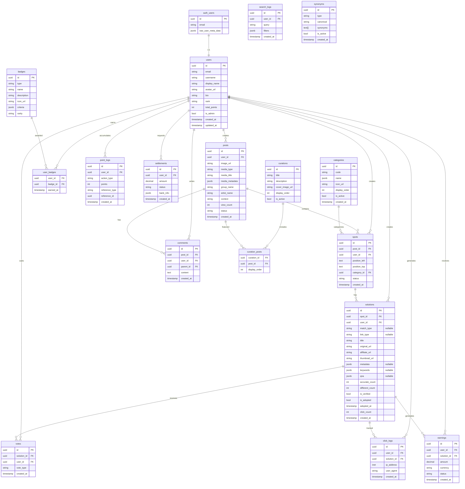
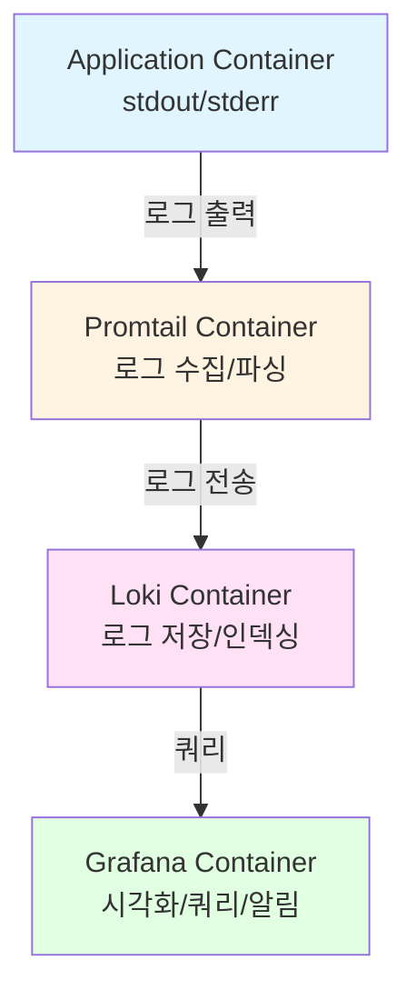

# DECODED - 기능 명세서 (Functional Specification)

**Version:** 1.20.0  
**Last Updated:** 2026.01.30  
**Status:** Draft

---

## 1. 프로젝트 개요

### 1.1 서비스 정의

DECODED는 AI 기술과 유저 집단지성을 결합하여 미디어(드라마, 영화, MV 등) 속 아이템을 발견(Discovery)하고, 유사 제품을 제안(Recommendation)하며, 구매로 전환(Conversion)시키는 글로벌 미디어 디스커버리 플랫폼입니다.

### 1.2 핵심 가치

- **Limitless**: K-Pop에서 글로벌 콘텐츠로, 패션에서 리빙/테크로 확장
- **Accessible**: 합리적인 가격의 대안(Alternative) 제시
- **Hype**: 매거진 같은 감각적인 비주얼 경험 제공

### 1.3 기술 스택

| 구분                  | 기술                                                             | 버전            | 비고                                                                                                  |
| --------------------- | ---------------------------------------------------------------- | --------------- | ----------------------------------------------------------------------------------------------------- |
| **Backend Framework** | [axum](https://crates.io/crates/axum)                            | 0.8.8           | Rust 기반 웹 프레임워크                                                                               |
| **ORM**               | [sea-orm](https://crates.io/crates/sea-orm)                      | 1.1.19          | PostgreSQL 직접 연결, [트랜잭션 지원](https://www.sea-ql.org/SeaORM/docs/advanced-query/transaction/) |
| **Database**          | Supabase (PostgreSQL)                                            | -               | PostgreSQL 클라우드 서비스                                                                            |
| **Authentication**    | Supabase Auth (GoTrue)                                           | -               | JWT 기반 인증                                                                                         |
| **Search Engine**     | [meilisearch-sdk](https://crates.io/crates/meilisearch-sdk)      | 0.32.0          | 전문 검색 엔진                                                                                        |
| **Storage**           | [aws-sdk-s3](https://crates.io/crates/aws-sdk-s3)                | 1.119.0         | Cloudflare R2 연동 (S3 호환)                                                                          |
| **LLM Service**       | Groq / Perplexity / Gemini                                       | -               | LLMClient Trait 기반 추상화. Gemini는 이미지 메타데이터 추출 전용                                     |
| **gRPC Client**       | tonic / prost                                                    | 0.14.2 / 0.14.3 | decoded-ai 서버와 통신하기 위한 gRPC 클라이언트                                                       |
| **Affiliate**         | [Rakuten Advertising](https://rakutenadvertising.com/affiliate/) | -               | 글로벌 제휴 마케팅 네트워크 (150k+ 파트너)                                                            |

### 1.4 주요 의존성 설명

#### Backend (axum)

```toml
[dependencies]
axum = "0.8.8"
tokio = { version = "1", features = ["full"] }
tower = "0.5"
tower-http = { version = "0.6", features = ["cors", "trace"] }
```

#### Database (sea-orm)

- **Supabase Rust Client가 없는 관계로 SeaORM을 활용하여 PostgreSQL에 직접 연결**
- 트랜잭션, 마이그레이션, 관계형 쿼리 모두 지원
- Connection Pool 관리 내장

```toml
[dependencies]
sea-orm = { version = "1.1.19", features = [
    "sqlx-postgres",
    "runtime-tokio-rustls",
    "macros"
] }
```

**트랜잭션 예시:**

```rust
use sea_orm::TransactionTrait;

db.transaction::<_, (), DbErr>(|txn| {
    Box::pin(async move {
        // 여러 DB 작업을 하나의 트랜잭션으로 묶음
        post::ActiveModel { ... }.save(txn).await?;
        spot::ActiveModel { ... }.save(txn).await?;
        Ok(())
    })
})
.await?;
```

#### Storage (aws-sdk-s3 for Cloudflare R2)

- Cloudflare R2는 S3 호환 API 제공
- `aws-sdk-s3` 크레이트로 R2에 연결 가능

```toml
[dependencies]
aws-sdk-s3 = "1.119.0"
aws-config = "1.5"
```

**Cloudflare R2 연결 설정:**

```rust
let config = aws_sdk_s3::Config::builder()
    .region(Region::new("auto"))
    .endpoint_url("https://<account-id>.r2.cloudflarestorage.com")
    .credentials_provider(credentials)
    .build();

let client = aws_sdk_s3::Client::from_conf(config);
```

#### Search (meilisearch-sdk)

```toml
[dependencies]
meilisearch-sdk = "0.32.0"
```

**Meilisearch 인덱스 설정:**

```rust
let client = meilisearch_sdk::Client::new("http://localhost:7700", Some("masterKey"));

// Posts 인덱스 생성 및 설정
let posts_index = client.index("posts");
posts_index.set_searchable_attributes(&["artist_name", "group_name", "media_title"]).await?;
posts_index.set_filterable_attributes(&["category_id", "context", "media_type"]).await?;
```

**동의어(Synonyms) 설정:**

> 아티스트명, 그룹명 등의 동의어 문제 해결을 위해 Meilisearch 동의어 기능을 활용합니다.
> DB에는 사용자 입력을 그대로 저장하고, 검색 시 동의어를 통해 통합된 결과를 제공합니다.

```rust
use serde_json::json;

// 앱 시작 시 또는 Admin API를 통한 동의어 설정
async fn setup_search_synonyms(client: &meilisearch_sdk::Client) -> Result<()> {
    let posts_index = client.index("posts");

    // 동의어 맵 설정
    posts_index.set_synonyms(&json!({
        // 아티스트명 동의어
        "Jennie": ["제니", "JENNIE", "jennie", "김제니"],
        "Rosé": ["로제", "Rose", "ROSÉ", "로제"],
        "Lisa": ["리사", "LISA", "lisa"],
        "Jisoo": ["지수", "JISOO", "jisoo", "김지수"],

        // 그룹명 동의어
        "BLACKPINK": ["블랙핑크", "blackpink", "BP", "블핑"],
        "BTS": ["방탄소년단", "bts", "Bangtan", "방탄"],
        "NewJeans": ["뉴진스", "newjeans", "뉴지스"],
        "IVE": ["아이브", "ive", "아이브"],

        // 장소/이벤트 동의어
        "ICN": ["인천공항", "Incheon Airport", "인천국제공항"],
        "LAX": ["LA공항", "Los Angeles Airport"],
        "Met Gala": ["메트 갈라", "MET", "메트갈라"],

        // 미디어/브랜드 동의어
        "APT.": ["apt", "Apt", "APT"],
        "Chanel": ["샤넬", "chanel", "CHANEL"]
    })).await?;

    Ok(())
}
```

**동의어 작동 방식:**

- 검색어 "제니" 입력 시 → "Jennie", "JENNIE", "jennie", "김제니"로도 자동 검색
- 검색어 "BP" 입력 시 → "BLACKPINK", "블랙핑크", "blackpink"로도 자동 검색
- DB에는 원본 그대로 저장되므로 데이터 무결성 유지
- 새로운 동의어는 Admin API를 통해 추가 가능 (재시작 불필요)

### 1.5 환경 변수 설정

**.env 예시:**

```bash
# Server
PORT=8000
HOST=0.0.0.0
RUST_LOG=info
ENV=development  # development | staging | production

# Logging
LOG_FORMAT=text  # text | json (프로덕션/스테이징: json, 개발: text)

# Database (Supabase PostgreSQL)
DATABASE_URL=postgresql://postgres:[password]@[project-ref].supabase.co:5432/postgres

# Supabase Auth
SUPABASE_URL=https://[project-ref].supabase.co
SUPABASE_ANON_KEY=eyJhbGc...
SUPABASE_SERVICE_ROLE_KEY=eyJhbGc...
SUPABASE_JWT_SECRET=your-jwt-secret

# Cloudflare R2
R2_ACCOUNT_ID=your-account-id
R2_ACCESS_KEY_ID=your-access-key
R2_SECRET_ACCESS_KEY=your-secret-key
R2_BUCKET_NAME=decoded-images

# Meilisearch
MEILISEARCH_URL=http://localhost:7700
MEILISEARCH_MASTER_KEY=your-master-key

# Groq AI
GROQ_API_KEY=your-groq-api-key

# decoded-ai gRPC 서버 (이미지 분석용)
DECODED_AI_GRPC_URL=http://localhost:50051

# Affiliate Links (Rakuten)
RAKUTEN_API_KEY=your-rakuten-api-key
RAKUTEN_PUBLISHER_ID=your-rakuten-publisher-id

# Grafana (프로덕션/스테이징)
GRAFANA_ADMIN_PASSWORD=your-secure-password
```

### 1.6 API 설계 원칙

- **도메인 기반 분리**: 각 기능 도메인별로 API 모듈화
- **버전 관리**: `/api/v1/`, `/api/v2/` 형태의 URL prefix 적용
- **RESTful**: 일관된 HTTP 메서드 및 상태 코드 사용

### 1.7 개발 가이드

구체적인 구현 패턴, 코드 컨벤션, 에러 처리 방법 등은 **[AGENT.md](./AGENT.md)** 문서를 참고하세요.

**주요 내용:**

- Axum State Pattern (DI 대체)
- 레이어 아키텍처 (Handler → Service → Repository)
- 트랜잭션 처리 방법
- 인증 및 권한 처리
- 에러 처리 전략
- 코드 컨벤션 및 네이밍 규칙
- 테스트 작성 가이드
- 외부 서비스 연동 패턴

### 1.8 Docker 및 배포 설정

decoded-api는 환경별(dev/staging/prod) Docker 컨테이너화를 지원합니다.

#### 디렉토리 구조

```
decoded-api/
├── .env.dev                        # 개발 환경변수
├── .env.staging                    # 스테이징 환경변수
├── .env.prod                       # 프로덕션 환경변수 (Git 제외)
├── .env.example                    # 환경변수 템플릿
├── docker/
│   ├── dev/
│   │   ├── Dockerfile              # 개발용 (single-stage, hot reload)
│   │   └── docker-compose.yml      # 개발 환경 구성 (Meilisearch 포함)
│   ├── staging/
│   │   ├── Dockerfile              # 스테이징용 (multi-stage)
│   │   └── docker-compose.yml      # 스테이징 환경 구성
│   ├── prod/
│   │   ├── Dockerfile              # 프로덕션용 (multi-stage, 최적화)
│   │   └── docker-compose.yml      # 프로덕션 환경 구성
│   ├── scripts/
│   │   └── entrypoint.sh           # 공통 엔트리포인트 스크립트
│   └── .dockerignore               # Docker 빌드 제외 파일
```

#### 환경별 차이점

| 항목             | Development    | Staging        | Production  |
| ---------------- | -------------- | -------------- | ----------- |
| 환경변수 파일    | `.env.dev`     | `.env.staging` | `.env.prod` |
| 빌드 방식        | Single-stage   | Multi-stage    | Multi-stage |
| 소스 마운트      | O (hot reload) | X              | X           |
| 로그 레벨        | debug          | info           | warn        |
| 리소스 제한      | 낮음 (256M)    | 중간 (512M)    | 높음 (1G)   |
| 포트             | 8000           | 8001           | 8080        |
| Meilisearch 포트 | 7700           | 7701           | 7702        |
| Git 추적         | O              | O              | X (보안)    |

#### 빌드 전략

**개발 환경 (Single-stage)**

- 빠른 빌드 및 시작 시간
- 소스코드 볼륨 마운트로 hot reload 지원
- cargo-watch 포함

**스테이징/프로덕션 환경 (Multi-stage)**

- Stage 1 (builder): Rust 컴파일 (~1.5GB)
- Stage 2 (runtime): 최소 실행 환경 (~50MB)
- 의존성 캐싱 최적화로 재빌드 시간 단축
- 비-root 유저로 실행

#### 마이그레이션 자동 실행

앱 시작 시 데이터베이스 마이그레이션이 자동으로 실행됩니다:

```rust
// src/main.rs
use migration::{Migrator, MigratorTrait};

// DB 연결 후 마이그레이션 실행
Migrator::up(&db_connection, None).await?;
```

멱등성이 보장되어 이미 실행된 마이그레이션은 스킵됩니다.

#### 서비스 구성

각 docker-compose.yml은 다음 서비스를 포함합니다:

1. **api**: decoded-api 애플리케이션
2. **meilisearch**: 검색 엔진 (환경별 독립 인스턴스)

#### 사용 방법

**개발 환경**

```bash
cd docker/dev
docker-compose up -d
docker-compose logs -f api
```

**스테이징 환경**

```bash
cd docker/staging
docker-compose up -d --build
```

**프로덕션 환경**

```bash
cd docker/prod
docker-compose up -d --build
```

#### 보안 고려사항

1. `.env.prod`는 Git에서 제외
2. 프로덕션 환경에서는 AWS Secrets Manager, Vault 등 사용 권장
3. 프로덕션 컨테이너는 비-root 유저로 실행
4. 환경별로 독립된 Docker 네트워크 사용

---

## 2. 사용자 역할 (User Roles)

### 2.1 역할 정의

| 역할        | 설명   | 주요 행동                                     |
| ----------- | ------ | --------------------------------------------- |
| **Spotter** | 질문자 | 미디어 속 아이템을 찾아달라고 요청하는 사용자 |
| **Solver**  | 해결사 | 아이템 정보를 찾아서 제공하는 사용자          |
| **Shopper** | 구매자 | 정보를 열람하고 구매하는 사용자               |

> 모든 사용자는 상황에 따라 세 가지 역할을 모두 수행할 수 있습니다.

### 2.2 등급 시스템 (Rank System)

| 등급            | 조건                  | 혜택                                            |
| --------------- | --------------------- | ----------------------------------------------- |
| **Member**      | 일반 가입자           | 기본 기능 이용                                  |
| **Contributor** | 활동 점수 200점 이상  | 수익 배분 자격 획득, Contributor 마크 표시      |
| **Expert**      | 활동 점수 1000점 이상 | 높은 수익 배분율, Expert 마크 표시, 높은 신뢰도 |

---

## 3. 핵심 데이터 구조 및 프로세스 (Core Structure & Flows)

### 3.0 핵심 데이터 계층 구조

```
Post (게시물)
├── image_url (이미지)
├── media_type (mv, drama, movie, youtube, variety, event, paparazzi, commercial)
├── media_title (드라마명, MV명 등)
├── media_metadata (platform, timestamp, season, episode 등 부가 정보)
├── group_name (그룹명)
├── artist_name (아티스트명)
├── context (공항, 무대, 뮤비 등)
│
└── Spots[] (이미지 위 개별 아이템들)
    ├── left, top (위치 좌표 %)
    ├── category (Fashion, Living, Tech, Beauty 등)
    ├── status (open, resolved)
    │
    └── Solutions[] (Solver들이 제공한 정보)
        ├── product_name, brand, price
        ├── original_url, affiliate_url
        ├── match_type (perfect, close)
        ├── votes (accurate, different)
        └── comments[]
```

### 3.1 Post 생성 프로세스 (Spotter Flow)

```
[1] 프론트엔드에서 이미지 선택
    - 이미지 File 객체를 프론트엔드에 유지
    ↓
[2] AI 이미지 분석 요청
    - POST /api/v1/posts/analyze
    - 요청: multipart/form-data (이미지 바이너리)
    - AI 처리: decoded-ai gRPC 서버의 AnalyzeImage RPC
    ↓
[3] AI 메타데이터 수신
    - subject: "인물명"
    - items: {
        "Wearables": [
          {"sub_category": "Headwear", "type": "baseball cap", "top": "25.5", "left": "30.0"},
          {"sub_category": "Tops", "type": "hoodie", "top": "50.0", "left": "45.0"}
        ],
        "Electronics": [
          {"sub_category": "Smartphone", "type": "iphone", "top": "60.0", "left": "70.0"}
        ]
      }
    - sub_category와 type은 필수 필드
    - 좌표값(top, left)은 이미지 크기와 무관한 상대적 퍼센트 (0-100%, 선택사항)
    ↓
[4] 사용자가 이미지에서 아이템 위치 직접 지정 + 메타데이터 확인
    - AI가 제안한 subject, items 확인/수정
    - 이미지 클릭하여 Spot 위치 지정 (left, top)
    - 각 Spot에 서브카테고리 선택
    ↓
[5] Post 생성 (이미지 업로드 + Spots 포함)
    - POST /api/v1/posts
    - 요청: multipart/form-data
      - image (binary)
      - data (JSON): {
          media_source,
          spots: [{ left, top, subcategory_code }],
          metadata: { subject, items }
        }
    - 백엔드: R2 업로드 → DB 저장
    ↓
[6] 백그라운드: SAM3 세그멘테이션 (Future Work)
    - post_id를 작업 큐에 추가
    - SAM3 gRPC 서버로 비동기 요청
    - 세그멘테이션 결과는 별도 저장 (사용자 응답과 분리)
```

**중요 변경사항:**

- 이미지는 프론트엔드에 유지하며, 분석 및 생성 시 각각 전송
- `/posts/upload` 엔드포인트는 제거됨
- AI는 메타데이터만 추출 (subject, items)
- Spot 좌표는 사용자가 직접 지정
- Post 생성 시 최소 1개 이상의 Spot이 포함되어야 함

#### 3.1.1 Future Work: SAM3 서버 연동 (gRPC)

> **⚠️ 현재 구현 계획 없음** - 향후 필요 시 구현 예정 (일정 미정)

Post 생성 완료 후, 백그라운드에서 SAM3(Segment Anything Model 3) 서버로 이미지를 전송하여 객체 세그멘테이션을 수행하는 기능입니다.

**전체 플로우:**

```
[1] Post 생성 완료 (POST /api/v1/posts)
    - 이미지 R2 업로드 완료
    - Post 및 Spots DB 저장 완료
    - 사용자에게 즉시 응답 반환
    ↓
[2] 백그라운드 작업 큐에 추가
    - post_id를 작업 큐에 추가 (Redis Queue 또는 메시지 큐)
    - 비동기 처리 시작 (사용자 응답과 분리)
    ↓
[3] SAM3 gRPC 클라이언트 호출
    - gRPC 연결: sam3-server:50051
    - 요청 메시지:
      {
        post_id: "uuid",
        image_url: "https://r2.../image.jpg",
        categories: ["Wearables", "Electronics"] // 힌트 (옵션)
      }
    ↓
[4] SAM3 서버 처리
    - 이미지 다운로드 (R2에서)
    - SAM3 모델로 세그멘테이션 수행
    - 객체별 마스크 및 바운딩 박스 추출
    ↓
[5] gRPC 스트리밍 응답 수신
    - 스트림으로 여러 객체 결과 수신
    - 각 객체별:
      {
        object_id: "obj_1",
        label: "Headwear",
        bbox: { left: 0.2, top: 0.1, width: 0.15, height: 0.2 },
        mask: [{x: 100, y: 50}, ...], // 마스크 좌표 배열
        confidence: 0.95
      }
    ↓
[6] 결과 저장 (옵션)
    - 옵션 A: spots 테이블에 AI 감지 결과 추가
      - status: "ai_detected" (사용자 지정과 구분)
      - source: "sam3"
    - 옵션 B: 별도 테이블 (segmentation_results)에 저장
      - post_id, object_id, bbox, mask, confidence
    ↓
[7] 실패 처리
    - gRPC 호출 실패 시 재시도 (최대 3회)
    - 재시도 실패 시 로그 기록 및 알림
    - 사용자 경험에는 영향 없음 (Post는 이미 생성됨)
```

**시퀀스 다이어그램:**

```
Frontend          Backend API        Queue          SAM3 gRPC Server
   |                  |                |                    |
   |-- POST /posts -->|                |                    |
   |                  |-- R2 Upload ->|                    |
   |                  |-- DB Save --->|                    |
   |<-- 201 Created --|                |                    |
   |                  |                |                    |
   |                  |-- Enqueue ---->|                    |
   |                  |                |                    |
   |                  |                |-- gRPC Call ------>|
   |                  |                |                    |
   |                  |                |                    |-- Download Image
   |                  |                |                    |-- Segment
   |                  |                |                    |
   |                  |                |<-- Stream Response-|
   |                  |                |                    |
   |                  |<-- Save Results|                    |
   |                  |                |                    |
```

**아키텍처:**

```
[Post 생성 완료]
    ↓
[백그라운드 작업]
    - post_id를 큐에 추가
    ↓
[SAM3 gRPC 서버로 요청]
    - 요청: post_id, image_url
    - SAM3 서버가 이미지 다운로드 → 세그멘테이션 수행
    ↓
[세그멘테이션 결과 수신 (gRPC 스트리밍)]
    - 감지된 객체별 마스크 좌표
    - 바운딩 박스 (left, top, width, height)
    - 신뢰도 (confidence)
    ↓
[결과 저장 (옵션)]
    - spots 테이블에 AI 감지 결과 추가 저장
    - 또는 별도 테이블에 세그멘테이션 메타데이터 저장
```

**gRPC 프로토콜 정의 (예시):**

```protobuf
service SAM3Service {
  rpc SegmentImage(SegmentRequest) returns (stream SegmentResponse);
}

message SegmentRequest {
  string post_id = 1;
  string image_url = 2;
  repeated string categories = 3; // 감지할 카테고리 힌트
}

message SegmentResponse {
  string object_id = 1;
  string label = 2;
  BoundingBox bbox = 3;
  repeated Point mask = 4;
  float confidence = 5;
}

message BoundingBox {
  float left = 1;
  float top = 2;
  float width = 3;
  float height = 4;
}

message Point {
  int32 x = 1;
  int32 y = 2;
}
```

**구현 위치:**

- `decoded-api/src/grpc/client/sam3_client.rs`: SAM3 gRPC 클라이언트
- `decoded-api/src/grpc/proto/sam3.proto`: 프로토콜 정의
- 백그라운드 작업: 배치 또는 메시지 큐 (Redis/RabbitMQ)

**고려사항:**

- SAM3 서버는 별도 Python 서버로 구성 (GPU 필요)
- 이미지 처리는 비동기/백그라운드로 수행
- 실패 시 재시도 로직 필요
- 사용자는 SAM3 결과를 기다리지 않음 (Post는 즉시 생성됨)

### 3.2 Solution 등록 프로세스 (Solver Flow)

```
[1] Post 내 Spot 확인
    - 요청된 아이템 위치 확인
    - 기존 Solution 정보 확인
    ↓
[2] 정보 입력
    - 상품명 (선택사항)
    - 브랜드 (선택사항)
    - 가격 (선택사항)
    - 구매 URL (필수)
    ↓
[3] 링크 처리
    - URL 메타데이터 추출 (미리보기용)
    - 제휴 링크 여부 확인
    - 제휴 링크 변환
    ↓
[4] Solution 등록
    - Solver 입력값 또는 추출된 메타데이터로 등록
    ↓
[채택 단계]
[5] Spotter가 Solution 채택 시 match_type 선택
    - Perfect Match: 정확히 동일한 제품 → 공식 메타데이터로 업데이트
    - Close Match: 유사한 대체 제품 → Solver 입력값 유지
```

### 3.3 검증 프로세스 (Verification Flow)

```
[1] Solution 정보 열람
    ↓
[2] 투표
    - 👍 정확해요 (Accurate)
    - 🤔 달라요 (Different)
    ↓
[3] 댓글/의견 작성 (선택)
    ↓
[4] 신뢰도 점수 반영
    - Verified 마크 부여 조건: '정확해요' 투표 5개 이상 & 정확도 80% 이상
```

### 3.4 구매 전환 프로세스 (Conversion Flow)

```
[1] Solution 상품 클릭
    ↓
[2] 클릭 로그 기록
    - User ID
    - Spot ID
    - Solution ID
    - Timestamp
    - Referrer
    ↓
[3] 제휴 링크로 리다이렉트
    ↓
[4] (외부) 구매 완료
    ↓
[5] 제휴사 콜백 수신 → 수익 기록
```

---

## 4. 기능 명세 (Feature Specification)

### 4.1 인증 및 사용자 관리 (Auth & User)

#### 4.1.1 인증 (Supabase Auth 활용)

> Supabase Auth(GoTrue)를 사용하므로, 인증 관련 기능은 Supabase Client SDK를 통해 처리합니다.
> 백엔드에서는 JWT 검증 및 사용자 정보 동기화만 담당합니다.

| 기능            | Supabase SDK                            | 백엔드 역할                                         |
| --------------- | --------------------------------------- | --------------------------------------------------- |
| 회원가입        | `supabase.auth.signUp()`                | `users` 테이블에 프로필 생성 (trigger 또는 webhook) |
| 로그인          | `supabase.auth.signInWithPassword()`    | JWT 검증                                            |
| 소셜 로그인     | `supabase.auth.signInWithOAuth()`       | JWT 검증 + 프로필 생성                              |
| 로그아웃        | `supabase.auth.signOut()`               | -                                                   |
| 토큰 갱신       | `supabase.auth.refreshSession()`        | -                                                   |
| 비밀번호 재설정 | `supabase.auth.resetPasswordForEmail()` | -                                                   |

**소셜 로그인 지원**: Google, Apple, Kakao

**백엔드 인증 미들웨어:**

- 모든 인증 필요 API에서 `Authorization: Bearer <access_token>` 헤더 검증
- Supabase JWT 직접 검증 (JWKS 기반 RS256/ES256): Supabase API 호출 없이 JWKS(JSON Web Key Set)를 사용하여 로컬에서 RS256 또는 ES256 알고리즘으로 JWT를 직접 검증
- JWKS는 `{SUPABASE_URL}/auth/v1/.well-known/jwks.json`에서 가져오며, 1시간 TTL로 in-memory 캐싱
- RS256 (RSA) 및 ES256 (EC) 알고리즘 지원
- Audience 검증: "authenticated" 또는 "anon" 허용
- `auth.users.id`를 기반으로 `users` 테이블과 연동

#### 4.1.2 사용자 프로필

| API            | Method | Endpoint                      | 설명                             |
| -------------- | ------ | ----------------------------- | -------------------------------- |
| 프로필 조회    | GET    | `/api/v1/users/{user_id}`     | 공개 프로필 정보                 |
| 내 프로필 조회 | GET    | `/api/v1/users/me`            | 상세 프로필 정보                 |
| 프로필 수정    | PATCH  | `/api/v1/users/me`            | 닉네임, 아바타 등 수정           |
| 활동 내역 조회 | GET    | `/api/v1/users/me/activities` | 작성한 Post, Spot, Solution 목록 |
| 통계 조회      | GET    | `/api/v1/users/me/stats`      | 활동 통계, 랭킹, 수익금          |

**Request (프로필 수정):**

```json
{
  "username": "string (optional)",
  "display_name": "string (optional)",
  "avatar_url": "string (optional)",
  "bio": "string (optional)"
}
```

**Response (내 프로필):**

```json
{
  "id": "uuid",
  "email": "user@example.com",
  "username": "string",
  "display_name": "string",
  "avatar_url": "string",
  "bio": "string",
  "rank": "Member | Contributor | Expert",
  "total_points": 450,
  "badges": [
    {
      "id": "uuid",
      "name": "First Solver",
      "icon_url": "string",
      "rarity": "common"
    }
  ],
  "stats": {
    "post_count": 12,
    "solution_count": 45,
    "adopted_count": 28,
    "verified_count": 15
  },
  "created_at": "timestamp"
}
```

**Response (활동 내역):**

```
GET /api/v1/users/me/activities?type=solutions&page=1&limit=20
```

```json
{
  "data": [
    {
      "id": "uuid",
      "type": "solution",
      "spot": {
        "id": "uuid",
        "post": {
          "id": "uuid",
          "image_url": "string",
          "artist_name": "Jennie"
        }
      },
      "product_name": "Chanel Jacket",
      "is_adopted": true,
      "is_verified": true,
      "created_at": "timestamp"
    }
  ],
  "pagination": { ... }
}
```

---

### 4.2 Post 관리 (Post)

#### 4.2.1 Post CRUD

| API            | Method | Endpoint                  | 설명                      |
| -------------- | ------ | ------------------------- | ------------------------- |
| Post 생성      | POST   | `/api/v1/posts`           | 새 Post 생성 (Spot 포함)  |
| Post 목록 조회 | GET    | `/api/v1/posts`           | 필터링, 페이지네이션 지원 |
| Post 상세 조회 | GET    | `/api/v1/posts/{post_id}` | Post 상세 + Spot 목록     |
| Post 수정      | PATCH  | `/api/v1/posts/{post_id}` | 작성자 본인만 가능        |
| Post 삭제      | DELETE | `/api/v1/posts/{post_id}` | 작성자 본인만 가능        |

**Request (Post 생성):**

```
Content-Type: multipart/form-data

Fields:
- image: binary (이미지 파일)
- data: JSON string
  {
    "media_source": {
      "type": "mv",
      "title": "APT.",
      "platform": "youtube",
      "timestamp": "01:23"
    },
    "group_name": "BLACKPINK",
    "artist_name": "Rosé",
    "context": "mv",
    "spots": [
      {
        "left": 45.5,
        "top": 30.2,
        "subcategory_code": "tops"
      },
      {
        "left": 60.0,
        "top": 15.0,
        "subcategory_code": "eyewear"
      }
    ],
    "metadata": {
      "subject": "Rosé",
      "items": {
        "Wearables": ["Tops", "Eyewear"]
      }
    }
  }
```

> **참고:**
>
> - 이미지는 multipart로 전송되며, Post 생성 시 R2에 업로드됩니다
> - `spots` 배열의 `subcategory_code`는 서브카테고리 코드 (예: "headwear", "tops", "smartphone")
> - API는 `subcategory_code`를 통해 `subcategory_id`를 조회하여 DB에 저장합니다

**Response (Post 생성):**

```json
{
  "id": "uuid",
  "user_id": "uuid",
  "image_url": "https://r2.../image.jpg",
  "media_source": { ... },
  "group_name": "BLACKPINK",
  "artist_name": "Rosé",
  "context": "mv",
  "spots": [
    {
      "id": "uuid",
      "position_left": "45.5",
      "position_top": "30.2",
      "subcategory": {
        "id": "uuid",
        "code": "tops",
        "name": { "ko": "상의", "en": "Tops" },
        "category": {
          "id": "uuid",
          "code": "wearables",
          "name": { "ko": "패션 아이템", "en": "Wearables" }
        }
      },
      "status": "open"
    }
  ],
  "view_count": 0,
  "status": "active",
  "created_at": "timestamp"
}
```

**Request (Post 목록 조회):**

```
GET /api/v1/posts?artist_name=Jennie&category=fashion&page=1&limit=20
```

**Query Parameters:**
| 파라미터 | 타입 | 설명 |
|----------|------|------|
| `artist_name` | string | 아티스트명 필터 |
| `group_name` | string | 그룹명 필터 |
| `context` | string | 상황 필터 (airport, mv 등) |
| `category` | string | Spot 카테고리 필터 |
| `user_id` | uuid | 특정 유저의 Post만 |
| `sort` | string | recent, popular, trending (trending_score 기준 정렬, NULL인 경우 created_at 기준) |
| `page` | number | 페이지 번호 |
| `limit` | number | 페이지당 개수 |

**Response (Post 목록):**

```json
{
  "data": [
    {
      "id": "uuid",
      "user": {
        "id": "uuid",
        "username": "string",
        "avatar_url": "string",
        "rank": "Contributor"
      },
      "image_url": "string",
      "media_source": { "type": "mv", "title": "APT." },
      "artist_name": "Rosé",
      "group_name": "BLACKPINK",
      "context": "mv",
      "spot_count": 3,
      "view_count": 1520,
      "comment_count": 24,
      "created_at": "timestamp"
    }
  ],
  "pagination": {
    "page": 1,
    "limit": 20,
    "total_count": 156,
    "total_pages": 8,
    "has_next": true
  }
}
```

**Response (Post 상세):**

```json
{
  "id": "uuid",
  "user": { ... },
  "image_url": "string",
  "media_source": { ... },
  "artist_name": "Rosé",
  "group_name": "BLACKPINK",
  "context": "mv",
  "spots": [
    {
      "id": "uuid",
      "position_left": "45.5",
      "position_top": "30.2",
      "category": {
        "id": "uuid",
        "code": "fashion",
        "name": { "ko": "패션", "en": "Fashion" }
      },
      "status": "resolved",
      "solution_count": 5,
      "top_solution": {
        "id": "uuid",
        "product_name": "Chanel Tweed Jacket",
        "brand": "Chanel",
        "price": { "amount": 8500000, "currency": "KRW" },
        "is_adopted": true,
        "is_verified": true
      }
    }
  ],
  "view_count": 1520,
  "comment_count": 24,
  "status": "active",
  "created_at": "timestamp",
  "updated_at": "timestamp"
}
```

#### 4.2.2 이미지 처리

| API                | Method | Endpoint                | 설명                                          |
| ------------------ | ------ | ----------------------- | --------------------------------------------- |
| AI 메타데이터 추출 | POST   | `/api/v1/posts/analyze` | decoded-ai gRPC 서버로 이미지 메타데이터 추출 |

**Request:**

```
Content-Type: multipart/form-data
- image: binary (이미지 파일)
```

**Response (AI 메타데이터):**

```json
{
  "subject": "Jennie",
  "items": {
    "Wearables": [
      {
        "sub_category": "Headwear",
        "type": "baseball cap",
        "top": "25.5",
        "left": "30.0"
      },
      {
        "sub_category": "Tops",
        "type": "hoodie",
        "top": "50.0",
        "left": "45.0"
      },
      {
        "sub_category": "Bottoms",
        "type": "jeans",
        "top": "70.0",
        "left": "50.0"
      }
    ],
    "Electronics": [
      {
        "sub_category": "Smartphone",
        "type": "iphone",
        "top": "60.0",
        "left": "70.0"
      }
    ],
    "Vehicles": [{ "sub_category": "Car", "type": "suv" }]
  }
}
```

**필드 설명:**

- `sub_category`: 서브카테고리 이름 (필수, 예: "Headwear", "Tops", "Smartphone")
- `type`: 아이템의 구체적인 타입 (필수, 예: "baseball cap", "hoodie", "iphone", "suv")
- `top`: 이미지 상단에서의 상대적 위치 (0% = 최상단, 100% = 최하단, 선택사항)
- `left`: 이미지 좌측에서의 상대적 위치 (0% = 최좌측, 100% = 최우측, 선택사항)
- 좌표값은 이미지 크기와 무관한 상대적 퍼센트 값 (0-100%)
- 아이템 위치를 정확히 파악할 수 없는 경우 `top`과 `left` 필드는 생략 가능

> **AI 분석 결과 처리 워크플로우:**
>
> 1. 프론트엔드가 이미지를 `/api/v1/posts/analyze`에 multipart로 전송
> 2. decoded-ai gRPC 서버의 AnalyzeImage RPC가 이미지 메타데이터 추출 (subject, items)
> 3. **프론트엔드는 이 정보를 사용자에게 제안**하여 확인을 받습니다
> 4. 사용자가 이미지에서 아이템 위치를 직접 클릭하여 Spot 지정
> 5. 사용자가 정보를 승인하거나 수정하면, **최종 확정된 정보 + 이미지**를 `/api/v1/posts` POST 요청에 포함하여 전송
> 6. 백엔드에서 R2 업로드 → DB 저장
>
> **중요:**
>
> - AI는 메타데이터와 각 아이템의 대략적인 위치 좌표를 추출 (선택사항)
> - 좌표값은 이미지 크기와 무관한 상대적 퍼센트 (0-100%)
> - 사용자는 AI가 제안한 좌표를 확인하거나 직접 클릭하여 Spot 위치를 지정할 수 있음
> - 이미지는 Post 생성 시점에 R2에 업로드
> - AI 분석 결과는 DB에 즉시 저장되지 않으며, 사용자 확인 후 Post 생성 시점에만 저장됩니다

**Post 데이터 구조:**

```json
{
  "id": "uuid",
  "user_id": "uuid",
  "image_url": "string (Cloudflare URL)",
  "media_source": {
    "type": "mv | drama | movie | youtube | variety | event | paparazzi | commercial",
    "title": "string",
    "platform": "netflix | youtube | disney+ | etc (optional)",
    "timestamp": "string (optional)",
    "season": "number (optional, for drama)",
    "episode": "number (optional, for drama/variety)",
    "year": "number (optional)"
  },
  "group_name": "string",
  "artist_name": "string",
  "context": "airport | stage | mv | red_carpet | etc",
  "view_count": "number",
  "status": "active | hidden",
  "created_at": "timestamp",
  "updated_at": "timestamp"
}
```

> **참고:**
>
> - `media_source` 객체는 API 응답 형태입니다.
> - DB에는 `type`과 `title`은 별도 컬럼, 나머지는 `media_metadata` JSONB에 저장됩니다.
> - 미디어 타입별로 다른 필드를 가질 수 있습니다 (유연한 구조).
> - `spots` 배열은 POST 상세 조회 시 포함됩니다. 목록 조회 시에는 `spot_count`만 포함할 수 있습니다.

---

### 4.3 Spot 관리 (Spot)

> Spot = Post 이미지 위의 개별 아이템 위치

#### 4.3.1 Spot CRUD

| API            | Method | Endpoint                        | 설명                 |
| -------------- | ------ | ------------------------------- | -------------------- |
| Spot 생성      | POST   | `/api/v1/posts/{post_id}/spots` | Post 내 Spot 추가    |
| Spot 목록 조회 | GET    | `/api/v1/posts/{post_id}/spots` | Post 내 모든 Spot    |
| Spot 상세 조회 | GET    | `/api/v1/spots/{spot_id}`       | Spot + Solution 목록 |
| Spot 수정      | PATCH  | `/api/v1/spots/{spot_id}`       | 위치/카테고리 수정   |
| Spot 삭제      | DELETE | `/api/v1/spots/{spot_id}`       | 작성자 본인만 가능   |

**Request (Spot 생성):**

```json
{
  "position_left": "45.5",
  "position_top": "30.2",
  "category_id": "uuid"
}
```

**Response (Spot 상세):**

```json
{
  "id": "uuid",
  "post_id": "uuid",
  "post": {
    "id": "uuid",
    "image_url": "string",
    "artist_name": "Jennie",
    "group_name": "BLACKPINK"
  },
  "user": {
    "id": "uuid",
    "username": "string"
  },
  "position_left": "45.5",
  "position_top": "30.2",
  "category": {
    "id": "uuid",
    "code": "fashion",
    "name": {
      "ko": "패션",
      "en": "Fashion"
    },
    "icon_url": "string",
    "color_hex": "#FF6B6B"
  },
  "status": "open | resolved",
  "solutions": [
    {
      "id": "uuid",
      "user": { ... },
      "match_type": "perfect",
      "product_name": "Chanel Tweed Jacket",
      "brand": "Chanel",
      "price": { "amount": 8500000, "currency": "KRW" },
      "thumbnail_url": "string",
      "vote_stats": { "accurate": 15, "different": 2 },
      "is_verified": true,
      "is_adopted": true,
      "created_at": "timestamp"
    }
  ],
  "solution_count": 5,
  "created_at": "timestamp"
}
```

> Spot 생성은 Post 작성자 외에 다른 사용자도 가능합니다. (Post 내 추가 아이템 발견 시)

---

### 4.4 Solution 관리 (Solution)

> Solution = Solver들이 Spot에 제공하는 상품 정보

#### 4.4.1 Solution CRUD

| API                | Method | Endpoint                            | 설명                         |
| ------------------ | ------ | ----------------------------------- | ---------------------------- |
| Solution 등록      | POST   | `/api/v1/spots/{spot_id}/solutions` | 상품 정보 등록               |
| Solution 목록 조회 | GET    | `/api/v1/spots/{spot_id}/solutions` | 채택 → 검증 → 정확도 순 정렬 |
| Solution 상세 조회 | GET    | `/api/v1/solutions/{solution_id}`   | Solution 상세 정보           |
| Solution 수정      | PATCH  | `/api/v1/solutions/{solution_id}`   | 작성자 본인만 가능           |
| Solution 삭제      | DELETE | `/api/v1/solutions/{solution_id}`   | 작성자 본인만 가능           |

**Request (Solution 등록):**

```json
{
  "original_url": "https://www.chanel.com/...",
  "product_name": "Chanel Tweed Jacket (선택사항)",
  "brand": "Chanel (선택사항)",
  "price": {
    "amount": 8500000,
    "currency": "KRW"
  },
  "description": "2024 F/W 컬렉션 (선택사항)"
}
```

> **참고:** `product_name`, `brand`, `price`는 선택사항입니다. 입력하지 않으면 URL 메타데이터 추출 결과가 사용됩니다.

**Response (Solution 등록):**

```json
{
  "id": "uuid",
  "spot_id": "uuid",
  "user": { ... },
  "match_type": null,
  "product_name": "Chanel Tweed Jacket",
  "brand": "Chanel",
  "price": { "amount": 8500000, "currency": "KRW" },
  "original_url": "https://www.chanel.com/...",
  "affiliate_url": "https://affiliate.link/...",
  "thumbnail_url": "https://og-image.../thumbnail.jpg",
  "description": "2024 F/W 컬렉션",
  "vote_stats": { "accurate": 0, "different": 0 },
  "is_verified": false,
  "is_adopted": false,
  "created_at": "timestamp"
}
```

> **참고:** Solution 등록 시점에는 `match_type`이 `null`입니다. Spotter가 채택할 때 match_type이 결정됩니다.

#### 4.4.2 링크 처리

| API                  | Method | Endpoint                              | 설명                    |
| -------------------- | ------ | ------------------------------------- | ----------------------- |
| 링크 메타데이터 추출 | POST   | `/api/v1/solutions/extract-metadata`  | OG 태그, 가격 정보 추출 |
| 제휴 링크 변환       | POST   | `/api/v1/solutions/convert-affiliate` | 제휴 링크로 변환        |

**Request (메타데이터 추출):**

```json
{
  "url": "https://www.musinsa.com/app/goods/3123456"
}
```

**Response:**

```json
{
  "url": "https://www.musinsa.com/app/goods/3123456",
  "title": "MATIN KIM 마뗑킴 로고 볼캡",
  "description": "...",
  "thumbnail_url": "https://image.musinsa.com/...",
  "price": {
    "amount": 59000,
    "currency": "KRW"
  },
  "brand": "MATIN KIM",
  "is_affiliate_supported": true
}
```

**메타데이터 추출 프로세스:**

1. **gRPC 기반 OG 데이터 추출 (decoded-ai 서버 - 동기)**
   - `extract-metadata` API 호출
   - `DecodedAIGrpcClient`를 통해 `decoded-ai` 서버의 `ExtractOGData` 호출
   - OG 데이터만 즉시 반환 (Fast)

2. **비동기 Gemini 분석 (decoded-ai 서버 - 백그라운드)**
   - Solution 생성 시 (`create_solution` 핸들러)
   - `decoded_ai_client.analyze_link` 호출하여 작업 큐에 추가
   - `decoded-ai`가 백그라운드에서 LinkTypeClassifier로 링크 타입 분류 (product/article/video/other)
   - 타입별 스키마로 Gemini API 호출 (QnA, keywords, metadata 추출)
   - 분석 완료 후 `decoded-api`의 gRPC 서버로 콜백 (`ProcessedBatchUpdate`)
   - DB에 `link_type`, `metadata`, `qna`, `keywords` 업데이트

**gRPC 통신 구조:**

- **클라이언트 (decoded-api -> decoded-ai)**: `DecodedAIGrpcClient` (`AnalyzeLink`, `ExtractOGData`)
- **서버 (decoded-api <- decoded-ai)**: `BackendGrpcServer` (`ProcessedBatchUpdate` 콜백 수신)
- **프로토콜**: `ai.proto` (AI 서비스), `backend.proto` (백엔드 콜백 서비스)
- **설정**: `DECODED_AI_GRPC_URL`, `GRPC_BACKEND_PORT` (기본값: 50052)
- **데이터베이스**: `solutions` 테이블에 `link_type`, `metadata`, `qna`, `keywords` 컬럼 (JSONB)
- **LinkMetadata 구조**: `link_type` 필드 추가, `og_*` 필드 제거, `metadata` map으로 타입별 동적 메타데이터 저장

**배치 결과 수신 구현 (ProcessedBatchUpdate):**

AI 서버에서 30초 주기로 최대 50개씩 배치 전송되는 링크 메타데이터를 안정적으로 수신하여 Solutions 엔티티에 저장합니다.

1. **Idempotency 처리**
   - `processed_batches` 테이블에 batch_id 기록
   - 동일 batch_id 재전송 시 중복 처리 방지
   - 재시도 시나리오에서 데이터 일관성 보장

2. **Bulk 처리 최적화**
   - N+1 쿼리 문제 해결: 1번의 Bulk SELECT + 트랜잭션 내 개별 UPDATE
   - 50개 배치 처리 시 성능 최적화 (50번 SELECT → 1번 SELECT)
   - HashMap 기반 O(1) 조회로 효율적인 매칭

3. **Status 기반 처리**
   - `success`: 모든 메타데이터 필드 업데이트 (link_type, description, qna, keywords, metadata)
   - `partial`: 존재하는 필드만 업데이트, keywords는 기존 데이터와 병합
   - `failed`: 메타데이터 저장 없음, `failed_batch_items` 테이블에 재시도 큐 저장

4. **자동 재시도 메커니즘**
   - 실패한 항목은 `failed_batch_items` 테이블에 저장
   - tokio-cron-scheduler로 5분마다 재시도 배치 실행 (cron: "0 */5 * * * *")
   - 지수적 백오프: 2초 → 4초 → 8초 (최대 3회)
   - 3회 실패 시 영구 실패 처리 (테이블에서 제거)

5. **트랜잭션 보장**
   - 전체 배치 처리를 트랜잭션으로 래핑
   - Idempotency 체크, 메타데이터 업데이트, 배치 이력 저장을 원자적으로 처리
   - 부분 실패 시 실패 항목만 재시도 큐에 저장, 성공 항목은 정상 처리

**관련 파일:**
- `src/services/backend_grpc/server.rs`: ProcessedBatchUpdate 구현
- `src/entities/processed_batches.rs`: Idempotency 엔티티
- `src/entities/failed_batch_items.rs`: 재시도 큐 엔티티
- `src/batch/retry_failed_items.rs`: 재시도 배치 작업
- `migration/src/m20260205_000001_create_processed_batches.rs`: Idempotency 테이블
- `migration/src/m20260205_000002_create_failed_batch_items.rs`: 재시도 큐 테이블

**설정 파일 (`config/metadata.toml`):**

```toml
[searxng]
api_url = "http://localhost:8080"
timeout_seconds = 30
enabled_hosts = ["29cm.co.kr", "www.musinsa.com"]  # 이미지 검색 사용할 호스트 목록

[gemini]
max_qa_pairs = 5
```

**Solution 데이터 구조:**

```json
{
  "id": "uuid",
  "spot_id": "uuid",
  "user_id": "uuid",
  "user": {
    "id": "uuid",
    "username": "string",
    "avatar_url": "string",
    "rank": "Member | Contributor | Expert"
  },
  "match_type": "perfect | close | null",
  "link_type": "product | article | video | other",
  "title": "string",
  "original_url": "string",
  "affiliate_url": "string",
  "thumbnail_url": "string",
  "description": "string",
  "metadata": {
    // 타입별 동적 메타데이터 (link_type에 따라 구조가 다름)
    // product: { price, currency, brand, material, origin, category, sub_category }
    // article: { author, published_date, reading_time, topics }
    // video: { channel, duration, view_count, upload_date }
    // other: { content_type }
  },
  "keywords": [
    // 다국어 키워드 (JP, TH, KR, EN)
    "키워드1",
    "Keyword2",
    "キーワード3",
    "คำหลัก4"
  ],
  "qna": [{ "question": "...", "answer": "..." }],
  "vote_stats": {
    "accurate": "number",
    "different": "number"
  },
  "is_verified": "boolean",
  "is_adopted": "boolean",
  "adopted_at": "timestamp | null",
  "click_count": "number",
  "purchase_count": "number",
  "created_at": "timestamp"
}
```

> **match_type 설명:**
>
> - `null`: Solution 등록 직후 상태 (아직 채택되지 않음)
> - `perfect`: Spotter가 채택 시 "정확히 동일한 제품"으로 선택. 공식 메타데이터로 자동 업데이트됨
> - `close`: Spotter가 채택 시 "유사한 대체 제품"으로 선택. Solver 입력값 유지
>
> Solution 목록 조회 시 정렬 우선순위: 1) 채택됨(`is_adopted`) → 2) 검증됨(`is_verified`) → 3) 정확도 투표 수

---

### 4.5 투표 및 채택 (Vote & Adopt)

#### 4.5.1 투표

> Solution에는 투표만 가능합니다. (댓글 X)

| API            | Method | Endpoint                                | 설명                 |
| -------------- | ------ | --------------------------------------- | -------------------- |
| 투표하기       | POST   | `/api/v1/solutions/{solution_id}/votes` | accurate / different |
| 투표 취소      | DELETE | `/api/v1/solutions/{solution_id}/votes` | 본인 투표 취소       |
| 투표 현황 조회 | GET    | `/api/v1/solutions/{solution_id}/votes` | 투표 통계            |

**Request (POST):**

```json
{
  "vote_type": "accurate | different"
}
```

**Response:**

```json
{
  "solution_id": "uuid",
  "vote_stats": {
    "accurate": 15,
    "different": 2
  },
  "my_vote": "accurate"
}
```

#### 4.5.2 채택

> Spotter(Post 작성자)가 자신의 Spot에 등록된 Solution 중 하나를 채택할 수 있습니다.
> 채택 시 Solution이 원본과 정확히 동일한지(Perfect Match) 또는 유사 대체품인지(Close Match)를 판단하여 선택합니다.

| API           | Method | Endpoint                                | 설명           |
| ------------- | ------ | --------------------------------------- | -------------- |
| Solution 채택 | POST   | `/api/v1/solutions/{solution_id}/adopt` | Spotter만 가능 |
| 채택 취소     | DELETE | `/api/v1/solutions/{solution_id}/adopt` | Spotter만 가능 |

**Request (채택):**

```json
{
  "match_type": "perfect | close"
}
```

**Response (채택):**

```json
{
  "solution_id": "uuid",
  "is_adopted": true,
  "match_type": "perfect",
  "adopted_at": "timestamp",
  "updated_fields": {
    "product_name": "공식 상품명",
    "brand": "공식 브랜드",
    "price": { "amount": 8500000, "currency": "KRW" },
    "thumbnail_url": "공식 이미지 URL"
  }
}
```

> **Perfect Match 선택 시:** URL에서 추출한 공식 메타데이터(상품명, 브랜드, 가격, 썸네일)로 Solution 정보가 자동 업데이트됩니다.
>
> **Close Match 선택 시:** Solver가 입력한 정보가 그대로 유지됩니다.

**채택 조건:**

- Post 작성자(Spotter)만 채택 가능
- 해당 Spot에 1개의 Solution만 채택 가능
- 채택 시 Solver에게 추가 포인트 지급 (+30점)
- 원본을 가장 잘 아는 Spotter가 match_type을 결정함으로써 데이터 품질 향상

---

### 4.6 댓글 (Comment)

> 댓글은 Post에만 작성 가능합니다.

| API            | Method | Endpoint                           | 설명               |
| -------------- | ------ | ---------------------------------- | ------------------ |
| 댓글 작성      | POST   | `/api/v1/posts/{post_id}/comments` | 댓글/대댓글 작성   |
| 댓글 목록 조회 | GET    | `/api/v1/posts/{post_id}/comments` | 대댓글 포함        |
| 댓글 수정      | PATCH  | `/api/v1/comments/{comment_id}`    | 작성자 본인만 가능 |
| 댓글 삭제      | DELETE | `/api/v1/comments/{comment_id}`    | 작성자 본인만 가능 |

**Request (댓글 작성):**

```json
{
  "content": "string",
  "parent_id": "uuid | null"
}
```

**Response (댓글 목록):**

```json
{
  "data": [
    {
      "id": "uuid",
      "user": {
        "id": "uuid",
        "username": "string",
        "avatar_url": "string",
        "rank": "Member | Contributor | Expert"
      },
      "content": "string",
      "parent_id": "uuid | null",
      "replies": [],
      "created_at": "timestamp",
      "updated_at": "timestamp"
    }
  ],
  "pagination": { ... }
}
```

---

### 4.7 피드 및 검색 (Feed & Search)

#### 4.7.1 홈 피드

| API           | Method | Endpoint                               | 설명                  |
| ------------- | ------ | -------------------------------------- | --------------------- |
| 홈 피드 조회  | GET    | `/api/v1/feed`                         | 개인화된 피드         |
| 트렌딩 조회   | GET    | `/api/v1/feed/trending`                | 실시간 인기 Post      |
| 큐레이션 조회 | GET    | `/api/v1/feed/curations`               | 에디터 추천 컬렉션    |
| 큐레이션 상세 | GET    | `/api/v1/feed/curations/{curation_id}` | 큐레이션 내 Post 목록 |

**Request (홈 피드):**

```
GET /api/v1/feed?page=1&limit=20
```

**Response:**

```json
{
  "data": [
    {
      "id": "uuid",
      "user": { "id": "uuid", "username": "string", "avatar_url": "string" },
      "image_url": "string",
      "media_source": { "type": "string", "title": "string" },
      "artist_name": "string",
      "group_name": "string",
      "context": "string",
      "spot_count": 3,
      "view_count": 1520,
      "comment_count": 12,
      "created_at": "timestamp"
    }
  ],
  "pagination": { "page": 1, "limit": 20, "total_count": 100, "has_next": true }
}
```

**트렌딩 알고리즘 요소:**

- 최근 24시간 조회수
- 최근 24시간 Solution 등록 수
- 최근 24시간 투표 수
- 시간 가중치 (최신일수록 높음)

#### 4.7.2 검색 (Meilisearch 기반)

> 검색은 Meilisearch를 활용하여 빠른 전문 검색(Full-text Search)과 타이포 허용(Typo Tolerance)을 지원합니다.
>
> **데이터 정규화 전략:**
>
> - `artist_name`, `group_name`, `media_title`, `context` 등의 필드는 DB에 사용자 입력을 그대로 저장합니다.
> - 동의어 문제("Jennie" vs "제니", "BLACKPINK" vs "블랙핑크" vs "BP")는 Meilisearch 동의어 기능으로 해결합니다.
> - 이를 통해 DB 구조는 심플하게 유지하면서도 검색 품질을 높입니다.
> - 새로운 아티스트/그룹의 동의어는 Admin API를 통해 실시간으로 추가 가능합니다.

| API         | Method | Endpoint                     | 설명                  |
| ----------- | ------ | ---------------------------- | --------------------- |
| 통합 검색   | GET    | `/api/v1/search`             | 키워드 기반 전체 검색 |
| 이미지 검색 | POST   | `/api/v1/search/image`       | AI 유사 이미지 검색   |
| 인기 검색어 | GET    | `/api/v1/search/popular`     | 인기 검색어 목록      |
| 최근 검색어 | GET    | `/api/v1/search/recent`      | 개인 최근 검색어      |
| 검색어 삭제 | DELETE | `/api/v1/search/recent/{id}` | 최근 검색어 삭제      |

**Request (통합 검색):**

```
GET /api/v1/search?q=jennie+airport&category=fashion&sort=popular&page=1&limit=20
```

**Query Parameters:**
| 파라미터 | 타입 | 필수 | 설명 |
|----------|------|------|------|
| `q` | string | ✓ | 검색어 (아티스트, 그룹, 브랜드, 미디어명 등) |
| `category` | string | | fashion, living, tech, beauty |
| `media_type` | string | | drama, movie, mv, youtube, variety |
| `context` | string | | airport, stage, mv, red_carpet 등 |
| `has_adopted` | boolean | | 채택된 Solution이 있는 Spot만 |
| `sort` | string | | recent, popular, solution_count (default: relevant) |
| `page` | number | | 페이지 번호 (default: 1) |
| `limit` | number | | 페이지당 개수 (default: 20, max: 50) |

**Response:**

```json
{
  "data": [
    {
      "id": "uuid",
      "type": "post",
      "image_url": "string",
      "artist_name": "Jennie",
      "group_name": "BLACKPINK",
      "context": "airport",
      "media_source": { "type": "variety", "title": "공항 직캠" },
      "spot_count": 5,
      "view_count": 3200,
      "highlight": {
        "artist_name": "<em>Jennie</em>",
        "group_name": "BLACKPINK"
      }
    }
  ],
  "facets": {
    "category": { "fashion": 45, "living": 12 },
    "context": { "airport": 30, "stage": 15, "mv": 12 }
  },
  "pagination": { ... },
  "query": "jennie airport",
  "took_ms": 12
}
```

**Meilisearch 인덱스 구성:**
| 인덱스 | 검색 대상 필드 | 필터 가능 필드 | 동의어 설정 |
|--------|---------------|---------------|------------|
| `posts` | artist_name, group_name, media_title | media_type, context, category_id | 아티스트/그룹/장소명 등 |
| `solutions` | product_name, brand | match_type, is_verified, is_adopted | 브랜드명 등 |

**동의어 예시:**

```json
{
  "Jennie": ["제니", "JENNIE", "jennie", "김제니"],
  "BLACKPINK": ["블랙핑크", "blackpink", "BP", "블핑"],
  "ICN": ["인천공항", "Incheon Airport", "인천국제공항"],
  "Chanel": ["샤넬", "chanel", "CHANEL"]
}
```

이렇게 하면 사용자가 "제니", "Jennie", "jennie" 중 어떤 것으로 검색해도 모든 관련 Post를 찾을 수 있습니다.

---

### 4.8 랭킹 및 뱃지 (Ranking & Badge)

#### 4.8.1 랭킹

| API             | Method | Endpoint                      | 설명                 |
| --------------- | ------ | ----------------------------- | -------------------- |
| 전체 랭킹 조회  | GET    | `/api/v1/rankings`            | 주간/월간 랭킹       |
| 카테고리별 랭킹 | GET    | `/api/v1/rankings/{category}` | 카테고리 전문가 랭킹 |
| 내 랭킹 조회    | GET    | `/api/v1/rankings/me`         | 내 순위 및 점수      |

**Request (전체 랭킹):**

```
GET /api/v1/rankings?period=weekly&page=1&limit=50
```

**Response:**

```json
{
  "data": [
    {
      "rank": 1,
      "user": {
        "id": "uuid",
        "username": "string",
        "avatar_url": "string",
        "rank": "Expert"
      },
      "total_points": 2850,
      "weekly_points": 320,
      "solution_count": 145,
      "adopted_count": 89,
      "verified_count": 67
    }
  ],
  "my_ranking": {
    "rank": 156,
    "total_points": 450,
    "weekly_points": 25
  },
  "pagination": { ... }
}
```

**활동 점수 계산:**
| 활동 | 점수 |
|------|------|
| Post 생성 | +5점 |
| Spot 생성 | +3점 |
| Solution 등록 | +10점 |
| Solution 채택됨 | +30점 |
| Solution Verified 획득 | +20점 |
| 받은 '정확해요' 투표 | +2점 |
| 투표 참여 | +1점 |
| Solution을 통한 구매 전환 | +50점 |

**등급 갱신**: 매주 월요일 00:00 (KST) 배치 처리

- **Member → Contributor**: 활동 점수 200점 이상
- **Contributor → Expert**: 활동 점수 1000점 이상

---

##### 4.8.1.1 카테고리별 랭킹 계산 로직

**카테고리별 포인트 집계:**

- 각 사용자의 Solution이 어느 카테고리 Spot에 등록되었는지 추적하여 카테고리별 포인트 계산
- JOIN 순서: `Solutions → Spots → Categories`
- 집계 대상 활동:
  - Solution 등록 (+10점)
  - Solution 채택됨 (+30점)
  - Solution Verified 획득 (+20점)
  - 받은 '정확해요' 투표 (+2점)

**카테고리별 랭킹 응답 예시:**

```json
{
  "category_code": "fashion",
  "data": [
    {
      "rank": 1,
      "user": {
        "id": "uuid",
        "username": "fashion_expert",
        "avatar_url": "string",
        "rank": "Expert"
      },
      "category_points": 850,
      "solution_count": 45,
      "adopted_count": 23
    }
  ],
  "pagination": { ... }
}
```

**구현 요구사항:**

- 카테고리별 포인트는 `point_logs` 테이블의 `ref_type`이 'solution'인 경우, Solution을 통해 Spot의 카테고리를 추적하여 집계
- 전체 랭킹(`total_points`)과 카테고리별 랭킹은 독립적으로 계산 (중복 집계 방지)

---

##### 4.8.1.2 트렌딩 알고리즘

**트렌딩 점수 산출 공식:**

```
Trending Score =
  (Solution 채택률 * 0.4) +
  (조회수 정규화 * 0.3) +
  (투표수 정규화 * 0.2) +
  (시간 가중치 * 0.1)
```

**가중치 상세:**

- **Solution 채택률 (40%)**: `adopted_count / solution_count` (최대 1.0)
- **조회수 정규화 (30%)**: 최근 7일간 조회수를 전체 최대 조회수로 나눈 값
- **투표수 정규화 (20%)**: 최근 7일간 '정확해요' 투표 수를 전체 최대 투표수로 나눈 값
- **시간 가중치 (10%)**: 최근 활동일 기준으로 감쇠 (7일 이내 1.0, 30일 이내 0.5, 그 이상 0.1)

**갱신 주기:**

- 배치 작업으로 6시간마다 트렌딩 점수 재계산
- 실시간 조회 시 캐시된 트렌딩 점수 사용
- 배치 작업은 Phase 17에서 구현 예정

**트렌딩 랭킹 API (Phase 17):**

```
GET /api/v1/rankings/trending?category={category}&period={period}
```

---

##### 4.8.1.3 성능 요구사항

**응답 시간 목표:**

- 전체 랭킹 조회: < 200ms (10K 사용자 기준)
- 카테고리별 랭킹: < 150ms (카테고리당 1K 사용자 기준)
- 내 랭킹 상세: < 100ms

**쿼리 최적화 요구사항:**

- N+1 쿼리 문제 해결 필수
  - Solutions 통계: JOIN 또는 서브쿼리로 일괄 조회
  - PointLogs 집계: 단일 쿼리로 기간별 포인트 계산
- 인덱스 활용:
  - `users.total_points DESC` (전체 랭킹)
  - `point_logs (user_id, created_at)` (기간별 포인트)
  - `solutions (user_id, is_adopted, is_verified)` (통계 집계)

**동시 접속 지원:**

- 10K+ 동시 사용자 지원
- 페이지네이션 필수 (기본: 50개/페이지, 최대: 100개/페이지)
- 캐싱 전략 (Phase 17 Redis 도입 후):
  - 전체 랭킹 Top 100: 5분 캐싱
  - 카테고리별 랭킹 Top 50: 10분 캐싱

**데이터 일관성:**

- `users.total_points`는 `point_logs`의 SUM과 항상 일치해야 함
- 포인트 적립 시 트랜잭션 내에서 `users.total_points` 업데이트
- 불일치 발생 시 배치 작업으로 재계산 (Phase 17)

---

#### 4.8.2 뱃지

| API            | Method | Endpoint                    | 설명                |
| -------------- | ------ | --------------------------- | ------------------- |
| 뱃지 목록 조회 | GET    | `/api/v1/badges`            | 전체 뱃지 목록      |
| 내 뱃지 조회   | GET    | `/api/v1/badges/me`         | 획득한 뱃지 목록    |
| 뱃지 상세 조회 | GET    | `/api/v1/badges/{badge_id}` | 뱃지 획득 조건 상세 |

**Response (내 뱃지):**

```json
{
  "data": [
    {
      "id": "uuid",
      "type": "specialist",
      "name": "IVE 패션 전문가",
      "description": "IVE 관련 Solution 30개 이상 등록",
      "icon_url": "string",
      "rarity": "rare",
      "earned_at": "timestamp",
      "progress": {
        "current": 35,
        "threshold": 30,
        "completed": true
      }
    }
  ],
  "available_badges": [
    {
      "id": "uuid",
      "name": "Home Deco Master",
      "progress": {
        "current": 28,
        "threshold": 50,
        "completed": false
      }
    }
  ]
}
```

**뱃지 유형:**

| 뱃지 타입       | 예시               | 획득 조건                                              |
| --------------- | ------------------ | ------------------------------------------------------ |
| Specialist      | "IVE 패션 전문가"  | 특정 셀럽 관련 Solution 30개 이상 + Verified 10개 이상 |
| Category Master | "Home Deco Master" | 특정 카테고리 Solution 50개 이상                       |
| Achievement     | "First Solver"     | 첫 Solution 등록                                       |
| Milestone       | "100 Solutions"    | 누적 Solution 100개 달성                               |

**뱃지 데이터 구조:**

```json
{
  "id": "uuid",
  "type": "specialist | category | achievement | milestone | explorer | shopper",
  "name": "string",
  "description": "string",
  "icon_url": "string",
  "criteria": {
    "type": "count | verified | adopted | artist | group | category | explorer_post | explorer_spot | shopper_solution",
    "target": "string",
    "threshold": "number"
  },
  "rarity": "common | rare | epic | legendary"
}
```

##### 4.8.2.1 뱃지 생성 방식 (하이브리드)

뱃지 시스템은 **하이브리드 방식**으로 운영됩니다:

**1. 초기 기본 뱃지 (시드 데이터)**

- 앱 시작 시 마이그레이션을 통해 자동 생성
- 모든 사용자에게 동일하게 적용되는 범용 뱃지
- 타입: Achievement, Milestone, Category, Explorer, Shopper

**2. 동적 뱃지 (Admin API)**

- 필요 시 관리자가 추가 생성
- 특정 아티스트/그룹에 특화된 뱃지
- 타입: Specialist

##### 4.8.2.2 초기 기본 뱃지 목록

**Achievement 타입**

| 뱃지명        | 조건             | 희귀도 |
| ------------- | ---------------- | ------ |
| First Solver  | 첫 Solution 등록 | common |
| First Post    | 첫 Post 생성     | common |
| First Spotter | 첫 Spot 생성     | common |

**Milestone 타입**

| 뱃지명         | 조건                 | 희귀도    |
| -------------- | -------------------- | --------- |
| 10 Solutions   | 누적 Solution 10개   | common    |
| 50 Solutions   | 누적 Solution 50개   | rare      |
| 100 Solutions  | 누적 Solution 100개  | rare      |
| 500 Solutions  | 누적 Solution 500개  | epic      |
| 1000 Solutions | 누적 Solution 1000개 | legendary |

**Category 타입**

각 카테고리별로 자동 생성:

| 뱃지명              | 조건                             | 희귀도 |
| ------------------- | -------------------------------- | ------ |
| {카테고리명} Master | 해당 카테고리 Solution 50개 이상 | rare   |

예시: "Fashion Master", "Living Master", "Tech Master", "Beauty Master"

**Explorer 타입** (탐색 활동)

Post/Spot 조회를 추적하는 뱃지:

| 뱃지명                           | 조건                                   | 희귀도 |
| -------------------------------- | -------------------------------------- | ------ |
| 탐험가 (Explorer)                | Post 20개 조회 또는 Spot 30개 조회     | common |
| 모험가 (Adventurer)              | Post 100개 조회 또는 Spot 150개 조회   | rare   |
| 여행자 (Traveler)                | Post 500개 조회 또는 Spot 750개 조회   | rare   |
| 탐험 마스터 (Exploration Master) | Post 2000개 조회 또는 Spot 3000개 조회 | epic   |

> **참고**: Explorer 뱃지를 위해 `view_logs` 테이블이 필요합니다. Post/Spot 상세 조회 시 로그인한 사용자의 조회 기록을 저장합니다.

**Shopper 타입** (구매 의도)

Solution 클릭을 추적하는 뱃지 (`click_logs` 테이블 활용):

| 뱃지명                          | 조건                 | 희귀도 |
| ------------------------------- | -------------------- | ------ |
| 쇼퍼 (Shopper)                  | Solution 10개 클릭   | common |
| 열정 쇼퍼 (Passionate Shopper)  | Solution 50개 클릭   | rare   |
| 마스터 쇼퍼 (Master Shopper)    | Solution 200개 클릭  | rare   |
| 전설의 쇼퍼 (Legendary Shopper) | Solution 1000개 클릭 | epic   |

##### 4.8.2.3 동적 뱃지 (Specialist)

관리자가 Admin API를 통해 추가하는 뱃지:

| 뱃지명                | 조건                                         | 희귀도 |
| --------------------- | -------------------------------------------- | ------ |
| IVE 패션 전문가       | IVE 관련 Solution 30개 + Verified 10개       | rare   |
| BLACKPINK 패션 전문가 | BLACKPINK 관련 Solution 30개 + Verified 10개 | rare   |

> 새로운 아티스트/그룹이 인기를 얻을 때 관리자가 추가 생성합니다.

##### 4.8.2.4 뱃지 자동 부여

뱃지는 배치 작업을 통해 자동으로 부여됩니다:

- **실행 주기**: 매일 03:00 (BadgeCheckBatch)
- **처리 방식**: 모든 사용자의 활동을 조회하여 뱃지 조건 충족 시 `user_badges` 테이블에 자동 부여
- **중복 방지**: 이미 획득한 뱃지는 스킵

---

### 4.9 정산 및 보상 (Settlement & Reward)

#### 4.9.1 클릭 추적

| API            | Method | Endpoint               | 설명                        |
| -------------- | ------ | ---------------------- | --------------------------- |
| 클릭 기록      | POST   | `/api/v1/clicks`       | Solution 클릭 로깅 (내부용) |
| 클릭 통계 조회 | GET    | `/api/v1/clicks/stats` | 내 Solution 클릭 통계       |

**Response (클릭 통계):**

```json
{
  "total_clicks": 1250,
  "unique_clicks": 890,
  "total_purchases": 45,
  "conversion_rate": 5.06,
  "monthly_stats": [
    {
      "month": "2026-01",
      "clicks": 320,
      "purchases": 12,
      "earnings": 45000
    }
  ]
}
```

**부정 클릭 방지:**

- 동일 User + Solution: 24시간 내 중복 클릭 무시
- IP 기반 Rate Limiting
- User Agent 검증

#### 4.9.2 수익 및 정산

> **⚠️ 구현 단계 구분:**
>
> **Phase 15 (현재 구현 범위):**
>
> - ✅ 클릭 추적 기능만 구현 (`POST /api/v1/clicks`, `GET /api/v1/clicks/stats`)
> - ✅ `earnings`, `settlements` 테이블 구조만 생성 (마이그레이션)
> - ⏸️ 수익/정산 API는 **임시 구현으로 제공** (API 엔드포인트는 존재하지만 실제 로직 미구현)
>   - 빈 데이터 반환 또는 "아직 지원하지 않음" 에러
>   - Phase 17에서 실제 로직 구현 예정
>
> **Phase 17 (현재 구현 계획 없음):**
>
> - ⚠️ **현재 구현 계획 없음** - 한동안 구현할 계획이 없습니다.
> - 향후 필요 시 구현 예정 (일정 미정)
> - ❌ 실제 수익 배분 로직 구현 (Contributor 40%, Expert 60%)
> - ❌ 제휴사 리포트 API 연동 또는 콜백 처리
> - ❌ 정산 배치 작업 (매월 10일)
> - ❌ 출금 신청/승인 프로세스
> - ❌ 수익/정산 API 실제 구현 (Phase 15 임시 구현 제거)

| API            | Method | Endpoint                            | 설명           | Phase 15           | Phase 17          |
| -------------- | ------ | ----------------------------------- | -------------- | ------------------ | ----------------- |
| 수익 현황 조회 | GET    | `/api/v1/earnings`                  | 월별 수익 내역 | ⏸️ 스텁            | ⚠️ 구현 계획 없음 |
| 정산 내역 조회 | GET    | `/api/v1/settlements`               | 정산 히스토리  | ⏸️ 스텁            | ⚠️ 구현 계획 없음 |
| 출금 신청      | POST   | `/api/v1/settlements/withdraw`      | 출금 요청      | ⏸️ 스텁 (400 에러) | ⚠️ 구현 계획 없음 |
| 출금 상태 조회 | GET    | `/api/v1/settlements/withdraw/{id}` | 출금 처리 상태 | ⏸️ 스텁 (404 에러) | ⚠️ 구현 계획 없음 |

**Request (출금 신청):**

```json
{
  "amount": 50000,
  "bank_code": "088",
  "account_number": "123456789012",
  "account_holder": "홍길동"
}
```

**Response (수익 현황):**

```json
{
  "total_earnings": 125000,
  "available_balance": 75000,
  "pending_settlement": 50000,
  "monthly_earnings": [
    {
      "month": "2026-01",
      "gross_earnings": 60000,
      "platform_fee": 24000,
      "net_earnings": 36000,
      "status": "settled"
    }
  ]
}
```

**수익 배분 구조 (현재 구현 계획 없음):**

> **⚠️ 현재 구현 계획 없음** - 향후 필요 시 구현 예정 (일정 미정)

| 등급        | 배분율 | 플랫폼 수수료       | 구현 단계         |
| ----------- | ------ | ------------------- | ----------------- |
| Member      | -      | 수익 배분 대상 아님 | ⚠️ 구현 계획 없음 |
| Contributor | 40%    | 60%                 | ⚠️ 구현 계획 없음 |
| Expert      | 60%    | 40%                 | ⚠️ 구현 계획 없음 |

**정산 주기**: 월 1회 (익월 15일 지급) - **⚠️ 현재 구현 계획 없음**
**최소 출금 금액**: 10,000원 - **⚠️ 현재 구현 계획 없음**

> **참고**: Phase 15에서는 수익 배분 로직이 구현되지 않습니다. 테이블 구조만 생성하고, 실제 수익 배분 및 정산은 현재 구현 계획이 없습니다. 향후 필요 시 구현 예정입니다 (일정 미정).

---

### 4.10 관리자 (Admin)

> 모든 Admin API는 `/api/v1/admin` prefix 사용

#### 4.10.1 콘텐츠 관리

| API                   | Method | Endpoint                              | 설명                |
| --------------------- | ------ | ------------------------------------- | ------------------- |
| Post 목록 (Admin)     | GET    | `/api/v1/admin/posts`                 | 전체 Post 관리      |
| Post 상태 변경        | PATCH  | `/api/v1/admin/posts/{id}/status`     | 숨김/공개/삭제 처리 |
| Solution 목록 (Admin) | GET    | `/api/v1/admin/solutions`             | 전체 Solution 관리  |
| Solution 상태 변경    | PATCH  | `/api/v1/admin/solutions/{id}/status` | 숨김/공개/삭제 처리 |

#### 4.10.2 카테고리 관리

| API                      | Method | Endpoint                               | 설명                          |
| ------------------------ | ------ | -------------------------------------- | ----------------------------- |
| 카테고리 목록 조회       | GET    | `/api/v1/categories`                   | 활성화된 카테고리 목록 (공개) |
| 카테고리 생성            | POST   | `/api/v1/admin/categories`             | 새 카테고리 추가 (Admin)      |
| 카테고리 수정            | PATCH  | `/api/v1/admin/categories/{id}`        | 카테고리 정보 수정 (Admin)    |
| 카테고리 순서 변경       | PUT    | `/api/v1/admin/categories/order`       | 노출 순서 조정 (Admin)        |
| 카테고리 활성화/비활성화 | PATCH  | `/api/v1/admin/categories/{id}/status` | 활성화 상태 변경 (Admin)      |

**Response (카테고리 목록 - 공개 API):**

```json
{
  "data": [
    {
      "id": "uuid",
      "code": "fashion",
      "name": {
        "ko": "패션",
        "en": "Fashion",
        "ja": "ファッション"
      },
      "icon_url": "https://cdn.../fashion.svg",
      "color_hex": "#FF6B6B",
      "display_order": 1
    },
    {
      "id": "uuid",
      "code": "living",
      "name": {
        "ko": "리빙",
        "en": "Living"
      },
      "icon_url": "https://cdn.../living.svg",
      "color_hex": "#4ECDC4",
      "display_order": 2
    }
  ]
}
```

**Request (카테고리 생성 - Admin):**

```json
{
  "code": "food",
  "name": {
    "ko": "푸드",
    "en": "Food",
    "ja": "フード"
  },
  "icon_url": "https://cdn.../food.svg",
  "color_hex": "#FFE66D",
  "description": {
    "ko": "음식 및 요리 관련 아이템",
    "en": "Food and cooking items"
  }
}
```

#### 4.10.3 검색 동의어 관리

| API              | Method | Endpoint                      | 설명                              |
| ---------------- | ------ | ----------------------------- | --------------------------------- |
| 동의어 목록 조회 | GET    | `/api/v1/admin/synonyms`      | 전체 동의어 매핑 (Admin)          |
| 동의어 추가      | POST   | `/api/v1/admin/synonyms`      | 새 동의어 추가 (Admin)            |
| 동의어 수정      | PATCH  | `/api/v1/admin/synonyms/{id}` | 동의어 수정 (Admin)               |
| 동의어 삭제      | DELETE | `/api/v1/admin/synonyms/{id}` | 동의어 삭제 (Admin)               |
| 동의어 동기화    | POST   | `/api/v1/admin/synonyms/sync` | Meilisearch에 동의어 반영 (Admin) |

**Response (동의어 목록):**

```json
{
  "data": [
    {
      "id": "uuid",
      "type": "artist",
      "canonical": "Jennie",
      "synonyms": ["제니", "JENNIE", "jennie", "김제니"],
      "created_at": "timestamp",
      "updated_at": "timestamp"
    },
    {
      "id": "uuid",
      "type": "group",
      "canonical": "BLACKPINK",
      "synonyms": ["블랙핑크", "blackpink", "BP", "블핑"],
      "created_at": "timestamp",
      "updated_at": "timestamp"
    }
  ]
}
```

**Request (동의어 추가):**

```json
{
  "type": "artist",
  "canonical": "Rosé",
  "synonyms": ["로제", "Rose", "ROSÉ", "박채영"]
}
```

> **참고:** 동의어 추가/수정 후 `/api/v1/admin/synonyms/sync` API를 호출하여 Meilisearch에 반영해야 합니다. 이는 서버 재시작 없이 즉시 적용됩니다.

#### 4.10.4 큐레이션 관리

| API                | Method | Endpoint                        | 설명             |
| ------------------ | ------ | ------------------------------- | ---------------- |
| 큐레이션 생성      | POST   | `/api/v1/admin/curations`       | 새 큐레이션 생성 |
| 큐레이션 수정      | PATCH  | `/api/v1/admin/curations/{id}`  | 큐레이션 편집    |
| 큐레이션 순서 변경 | PUT    | `/api/v1/admin/curations/order` | 노출 순서 조정   |
| 큐레이션 삭제      | DELETE | `/api/v1/admin/curations/{id}`  | 큐레이션 삭제    |

#### 4.10.5 일괄 업로드

> **⚠️ 현재 구현 계획 없음** - 향후 필요 시 구현 예정 (일정 미정)
>
> **구현 전 필요 사항:**
>
> - CSV/Excel 파일 컬럼 구조 명세 필요 (어떤 데이터를 업로드할지에 따라)
> - 각 데이터 타입별 필수/선택 컬럼 정의
> - 예시 CSV 파일 형식 문서화
> - 데이터 검증 규칙 정의

| API              | Method | Endpoint                             | 설명                  | 구현 상태         |
| ---------------- | ------ | ------------------------------------ | --------------------- | ----------------- |
| Bulk Upload      | POST   | `/api/v1/admin/bulk-upload`          | CSV/Excel 일괄 업로드 | ⚠️ 구현 계획 없음 |
| Upload 상태 조회 | GET    | `/api/v1/admin/bulk-upload/{job_id}` | 업로드 진행 상태      | ⚠️ 구현 계획 없음 |

#### 4.10.6 정산 관리

> **⚠️ 현재 구현 계획 없음** - 향후 필요 시 구현 예정 (일정 미정)
>
> **참고**: 정산 관리 기능은 Phase 17.6 (수익 배분 및 정산)과 연관되어 있습니다. Phase 17.6에서 실제 수익 배분 및 정산 로직이 구현된 후에 Admin 정산 관리 기능을 구현할 예정입니다.

| API            | Method | Endpoint                         | 설명           | 구현 상태         |
| -------------- | ------ | -------------------------------- | -------------- | ----------------- |
| 출금 신청 목록 | GET    | `/api/v1/admin/withdrawals`      | 출금 신청 내역 | ⚠️ 구현 계획 없음 |
| 출금 승인/반려 | PATCH  | `/api/v1/admin/withdrawals/{id}` | 출금 처리      | ⚠️ 구현 계획 없음 |

#### 4.10.7 대시보드

| API          | Method | Endpoint                           | 설명                   |
| ------------ | ------ | ---------------------------------- | ---------------------- |
| KPI 대시보드 | GET    | `/api/v1/admin/dashboard`          | DAU, MAU, 주요 지표    |
| 인기 키워드  | GET    | `/api/v1/admin/dashboard/keywords` | 카테고리별 인기 키워드 |
| 트래픽 분석  | GET    | `/api/v1/admin/dashboard/traffic`  | 트래픽 통계            |

#### 4.10.8 뱃지 관리

| API                    | Method | Endpoint                    | 설명                          |
| ---------------------- | ------ | --------------------------- | ----------------------------- |
| 뱃지 목록 조회 (Admin) | GET    | `/api/v1/admin/badges`      | 전체 뱃지 관리용 목록 (Admin) |
| 뱃지 생성              | POST   | `/api/v1/admin/badges`      | 새 뱃지 추가 (Admin)          |
| 뱃지 수정              | PATCH  | `/api/v1/admin/badges/{id}` | 뱃지 정보 수정 (Admin)        |
| 뱃지 삭제              | DELETE | `/api/v1/admin/badges/{id}` | 뱃지 삭제 (Admin)             |

**Request (뱃지 생성 - Admin):**

```json
{
  "type": "specialist",
  "name": "IVE 패션 전문가",
  "description": "IVE 관련 Solution 30개 이상 + Verified 10개 이상 등록",
  "icon_url": "https://cdn.../ive-specialist.svg",
  "criteria": {
    "type": "artist",
    "target": "IVE",
    "threshold": 30,
    "verified_threshold": 10
  },
  "rarity": "rare"
}
```

**Response (뱃지 생성 성공):**

```json
{
  "id": "uuid",
  "type": "specialist",
  "name": "IVE 패션 전문가",
  "description": "IVE 관련 Solution 30개 이상 + Verified 10개 이상 등록",
  "icon_url": "https://cdn.../ive-specialist.svg",
  "criteria": {
    "type": "artist",
    "target": "IVE",
    "threshold": 30,
    "verified_threshold": 10
  },
  "rarity": "rare",
  "created_at": "timestamp",
  "updated_at": "timestamp"
}
```

**Request (뱃지 수정 - Admin):**

```json
{
  "name": "IVE 스타일 전문가",
  "description": "IVE 관련 Solution 50개 이상 + Verified 15개 이상 등록",
  "criteria": {
    "type": "artist",
    "target": "IVE",
    "threshold": 50,
    "verified_threshold": 15
  },
  "rarity": "epic"
}
```

**Response (뱃지 목록 조회 - Admin):**

```json
{
  "data": [
    {
      "id": "uuid",
      "type": "specialist",
      "name": "IVE 패션 전문가",
      "description": "IVE 관련 Solution 30개 이상 등록",
      "icon_url": "https://cdn.../ive-specialist.svg",
      "criteria": {
        "type": "artist",
        "target": "IVE",
        "threshold": 30,
        "verified_threshold": 10
      },
      "rarity": "rare",
      "created_at": "timestamp",
      "updated_at": "timestamp"
    }
  ],
  "pagination": {
    "page": 1,
    "page_size": 50,
    "total_items": 25,
    "total_pages": 1
  }
}
```

**뱃지 타입 제약:**

- Admin API를 통해서는 주로 **Specialist** 타입 뱃지를 생성합니다.
- Achievement, Milestone, Category, Explorer, Shopper 타입 뱃지는 시드 데이터로 생성되지만, 필요 시 Admin API로 추가 생성 가능합니다.

**뱃지 삭제 시 주의사항:**

- 이미 사용자가 획득한 뱃지(`user_badges` 테이블에 레코드 존재)는 삭제할 수 없습니다.
- 삭제 시도 시 `400 Bad Request` 반환: "이미 사용자가 획득한 뱃지는 삭제할 수 없습니다."

---

## 5. 데이터베이스 스키마

### 5.0 ERD (Entity Relationship Diagram)



### 5.1 Supabase Auth 연동

> Supabase Auth의 `auth.users` 테이블과 연동. 사용자 가입 시 trigger로 `public.users` 프로필 생성.

```sql
-- auth.users 가입 시 프로필 자동 생성 트리거
CREATE OR REPLACE FUNCTION public.handle_new_user()
RETURNS TRIGGER AS $$
BEGIN
    INSERT INTO public.users (id, email, username)
    VALUES (
        NEW.id,
        NEW.email,
        COALESCE(NEW.raw_user_meta_data->>'username', split_part(NEW.email, '@', 1))
    );
    RETURN NEW;
END;
$$ LANGUAGE plpgsql SECURITY DEFINER;

CREATE TRIGGER on_auth_user_created
    AFTER INSERT ON auth.users
    FOR EACH ROW EXECUTE FUNCTION public.handle_new_user();
```

### 5.2 ~ 5.4 상세 스키마

> **상세 내용은 [SCHEMA.md](./SCHEMA.md) 참조**

**테이블 목록:**

- `users` - 사용자 프로필
- `posts` - 게시물 (이미지 + 메타데이터)
- `categories` - 아이템 카테고리
- `spots` - 이미지 내 아이템 위치
- `solutions` - 상품 정보
- `votes` - 투표
- `comments` - 댓글
- `badges`, `user_badges` - 뱃지 시스템
- `point_logs` - 포인트 로그
- `click_logs` - 클릭 로그
- `earnings`, `settlements` - 수익/정산
- `curations`, `curation_posts` - 큐레이션
- `search_logs` - 검색 로그
- `synonyms` - 검색 동의어

---

## 6. 배치 작업 (Batch Jobs)

### 6.1 정기 배치

> **기술 스택**: `tokio-cron-scheduler = "0.13"` 사용
>
> **실행 방식**: Axum 서버와 동일 프로세스에서 백그라운드 실행, Cron 표현식으로 스케줄링

| 배치명                | 주기        | 실행 시간   | 설명                                                                                                                                                                                                                                                                                                                  |
| --------------------- | ----------- | ----------- | --------------------------------------------------------------------------------------------------------------------------------------------------------------------------------------------------------------------------------------------------------------------------------------------------------------------- |
| RankUpdateBatch       | 매주 월요일 | 00:00 (KST) | 사용자 등급 자동 업그레이드. `users.total_points` 기준으로 등급 갱신 (Member 0점 → Contributor 200점 이상 → Expert 1000점 이상). 활동 점수 누적에 따라 자동으로 등급이 상승합니다.                                                                                                                                    |
| BadgeCheckBatch       | 매일        | 03:00       | 뱃지 획득 조건 자동 체크 및 부여. 사용자 활동 통계(Solution 수, Verified 수, 채택 수 등)를 조회하여 `badges.criteria` JSONB와 비교하고, 조건 충족 시 `user_badges` 테이블에 자동 부여. 뱃지 유형: Specialist(특정 아티스트/그룹), Category Master(특정 카테고리), Achievement(마일스톤), Milestone(누적 Solution 수). |
| TrendingCalcBatch     | 매시간      | 매 정시     | 트렌딩 점수 재계산. 최근 24시간 이내 게시물 대상으로 점수 계산: (조회수 × 1) + (Solution 수 × 5) + (투표 수 × 3) + 시간 가중치(0~24시간 전 → 100~0점 선형 감소). 계산된 점수는 `posts.trending_score` 컬럼에 저장됩니다.                                                                                              |
| ClickAggregationBatch | 매일        | 02:00       | 클릭 로그 집계 및 통계 업데이트. `click_logs` 테이블에서 클릭 데이터를 집계하여 Solution별 클릭 카운트(`solutions.click_count`)를 업데이트하고, 통계 테이블을 갱신합니다.                                                                                                                                             |
| SettlementBatch       | 매월 10일   | 00:00       | 월간 수익 집계 및 정산 처리 (⚠️ 현재 구현 계획 없음). 전월 1일 ~ 말일 기간의 수익을 집계하고, 정산 처리 및 출금 신청 승인 후 `settlements` 테이블에 정산 기록을 생성합니다. 향후 필요 시 구현 예정 (일정 미정).                                                                                                       |

### 6.2 Solution Verified 자동 판정

```
조건: accurate_count >= 5 AND (accurate_count / (accurate_count + different_count)) >= 0.8
실행: 투표 시마다 실시간 체크
```

### 6.3 Spot 상태 자동 변경

```
조건: Verified Solution이 1개 이상 존재
변경: status = 'open' → 'resolved'
```

---

## 7. 확장 고려사항

### 7.1 미디어 포맷 확장

- **Phase 1**: 이미지 (jpg, png, webp)
- **Phase 2**: 동영상 (mp4) - 특정 프레임 추출 기능
- **Phase 3**: 스크린샷 URL 직접 입력

### 7.2 AI 기능 확장

- **Phase 1**: 객체 탐지 + 크롭
- **Phase 2**: 유사 상품 자동 추천
- **Phase 3**: 자연어 기반 검색 ("제니가 공항에서 입었던 코트")

### 7.3 다국어 지원

- 초기: 한국어, 영어
- 확장: 일본어, 중국어, 스페인어

---

## 8. 부록

### 8.1 HTTP 상태 코드

| 코드 | 설명                         |
| ---- | ---------------------------- |
| 200  | 성공                         |
| 201  | 생성 성공                    |
| 400  | 잘못된 요청                  |
| 401  | 인증 필요                    |
| 403  | 권한 없음                    |
| 404  | 리소스 없음                  |
| 409  | 충돌 (중복 등)               |
| 422  | 처리 불가 (유효성 검증 실패) |
| 429  | 요청 과다                    |
| 500  | 서버 오류                    |

### 8.2 에러 응답 형식

```json
{
  "error": {
    "code": "ERROR_CODE",
    "message": "Human readable message",
    "details": {}
  }
}
```

### 8.3 페이지네이션 응답 형식

```json
{
  "data": [],
  "pagination": {
    "page": 1,
    "limit": 20,
    "total_count": 100,
    "total_pages": 5,
    "has_next": true,
    "has_prev": false
  }
}
```

---

## 1.9 LLM Client 구현

> **상세 구현은 [LLM_IMPLEMENTATION.md](./LLM_IMPLEMENTATION.md) 참조**

**개요:**

- Provider: Groq (텍스트/링크), Perplexity (링크 검색)
- Content Type별 라우팅: LLMRouter가 자동 선택
- 프롬프트 관리: Tera 템플릿 사용
- **이미지 분석**: decoded-ai gRPC 서버의 `AnalyzeImage` RPC 사용

**환경 변수:**

```bash
GROQ_API_KEY=your-groq-api-key
GROQ_MODEL=llama-3.3-70b-versatile  # optional
PERPLEXITY_API_KEY=your-perplexity-api-key
PERPLEXITY_MODEL=sonar  # optional

# decoded-ai gRPC 서버 (이미지 분석용)
DECODED_AI_GRPC_URL=http://localhost:50051
```

**주요 특징:**
| 특징 | 설명 |
|------|------|
| Trait 기반 추상화 | `LLMClient` trait으로 모든 Provider 통합 |
| Content Type 라우팅 | Link, Image, Text별 최적 Provider 자동 선택 |
| URL 기반 선택 | YouTube → Groq (속도), 일반 URL → Perplexity (웹 검색) |
| 이미지 분석 | decoded-ai gRPC 서버의 AnalyzeImage RPC로 메타데이터 추출 (subject, items) |
| 다국어 지원 | 로케일 코드에 따른 응답 언어 제어 |

---

## 1.10 로그 수집 및 집계 시스템

> **목적**: 프로덕션 환경에서 애플리케이션 로그를 중앙 집계하고, 조회/시각화/알림이 가능한 로그 수집 시스템을 구축합니다.

### 1.10.1 기술 스택

| 구성 요소     | 기술     | 버전   | 역할                              |
| ------------- | -------- | ------ | --------------------------------- |
| **로그 수집** | Promtail | latest | Docker 컨테이너 로그 수집 및 파싱 |
| **로그 저장** | Loki     | latest | 로그 저장 및 인덱싱               |
| **시각화**    | Grafana  | latest | 로그 조회, 대시보드, 알림         |

### 1.10.2 아키텍처



**데이터 흐름:**

1. 애플리케이션 컨테이너가 stdout/stderr로 로그 출력
2. Promtail이 Docker 컨테이너 로그를 수집하고 파싱
3. Promtail이 Loki로 로그 전송
4. Grafana가 Loki에서 로그를 조회하여 시각화

### 1.10.3 로그 포맷

**프로덕션 환경**: JSON 포맷 (구조화된 로그)

- Rust `tracing` 라이브러리의 JSON 출력 사용
- 환경 변수: `LOG_FORMAT=json`

**개발 환경**: 텍스트 포맷 (가독성 우선)

- 환경 변수: `LOG_FORMAT=text`

**구조화된 로그 필드:**

- `level`: 로그 레벨 (info, warn, error 등)
- `message`: 로그 메시지
- `target`: 로그 소스 (모듈 경로)
- `request_id`: 요청 추적용 UUID
- `service`: 서비스명 ("decoded-api")
- `environment`: 환경 ("production", "staging", "development")
- `method`: HTTP 메서드 (요청 로그)
- `uri`: 요청 URI (요청 로그)
- `status`: HTTP 상태 코드 (요청 로그)
- `duration_ms`: 응답 시간 (밀리초)

### 1.10.4 보관 정책

| 환경     | 보관 기간 | 스토리지 예상량     |
| -------- | --------- | ------------------- |
| 프로덕션 | 30일      | ~30GB (1GB/일 기준) |
| 스테이징 | 7일       | ~7GB (1GB/일 기준)  |
| 개발     | 1일       | ~1GB (선택적)       |

### 1.10.5 성능 고려사항

**리소스 사용량:**

- Loki: 메모리 ~512MB (프로덕션)
- Promtail: 메모리 ~256MB
- Grafana: 메모리 ~256MB
- 총 추가 리소스: ~1GB

**로그 볼륨:**

- 예상 로그 볼륨: 1GB/일 (중간 트래픽 기준)
- 30일 보관 시 약 30GB 스토리지 필요

**쿼리 성능:**

- 인덱스 라벨 최적화 (과도한 라벨 지양)
- 자주 조회하는 필드만 라벨로 설정
- 스트림 라벨: `container_name`, `level`, `service`

### 1.10.6 보안 고려사항

**네트워크 격리:**

- 로그 스택은 내부 Docker 네트워크만 사용
- Grafana 포트는 리버스 프록시로 보호 (향후)

**인증:**

- 초기: Grafana 기본 인증만 사용
- 환경 변수: `GF_SECURITY_ADMIN_PASSWORD` (프로덕션 비밀번호)
- 향후: OAuth 또는 LDAP 통합 가능

**민감 정보 마스킹:**

- 로그에 비밀번호, 토큰 등 민감 정보 포함 금지
- 필요 시 로그 필터링 규칙 추가

### 1.10.7 환경 변수 설정

**.env 예시:**

```bash
# Logging
LOG_FORMAT=text  # text | json (프로덕션: json, 개발: text)
LOG_LEVEL=info   # debug | info | warn | error

# Grafana (프로덕션)
GF_SECURITY_ADMIN_PASSWORD=your-secure-password
```

### 1.10.8 Grafana 대시보드

**기본 대시보드:**

- **Application Logs**: 애플리케이션 로그 조회
- **Error Logs**: 에러 로그 집계 및 분석
- **Request Metrics**: 요청 메트릭 (응답 시간, 상태 코드 분포)
- **Batch Jobs**: 배치 작업 로그 모니터링

**LogQL 쿼리 예시:**

```logql
# 에러 로그 조회
{container="decoded-api-prod", level="error"}

# 특정 요청 ID 추적
{container="decoded-api-prod"} | json | request_id="abc-123"

# 느린 요청 조회 (500ms 이상)
{container="decoded-api-prod"} | json | duration_ms > 500

# 배치 작업 로그
{container="decoded-api-prod"} | json | target=~"batch.*"
```

### 1.10.9 향후 확장 가능성

1. **분산 추적**
   - OpenTelemetry 통합
   - Jaeger 또는 Tempo 추가

2. **메트릭 수집**
   - Prometheus 추가
   - 애플리케이션 메트릭 수집

3. **알림 통합**
   - Grafana Alerting
   - Slack/Email/PagerDuty 연동

---

## 변경 이력

| 버전   | 날짜       | 작성자 | 변경 내용                                                                                                                                                                                                                                                                                                                                                                                                                                                                                                                                              |
| ------ | ---------- | ------ | ------------------------------------------------------------------------------------------------------------------------------------------------------------------------------------------------------------------------------------------------------------------------------------------------------------------------------------------------------------------------------------------------------------------------------------------------------------------------------------------------------------------------------------------------------ |
| 1.22.0 | 2026.02.05 | -      | MediaSourceDto 단순화 및 AI 기반 메타데이터 추출 계획 추가. MediaSourceDto를 media_type + description 두 필드로 단순화. platform, timestamp, season, episode, year 등 구체적 필드 제거. 유저가 자연어로 미디어 정보를 입력하면 향후 AI가 description에서 title과 metadata를 자동 추출하는 구조로 변경. 현재는 media_title과 media_metadata를 NULL로 저장하며, AI 분석 기능은 향후 구현 예정. posts 테이블의 media_title 컬럼을 nullable로 변경하는 마이그레이션 추가. |
| 1.21.0 | 2026.02.05 | -      | Gemini 클라이언트 제거 및 이미지 분석 gRPC 전환. 이미지 분석 기능이 decoded-ai gRPC 서버의 AnalyzeImage RPC로 완전히 이전됨. LLM Client에서 Gemini Provider 제거, 환경 변수에서 GEMINI_API_KEY 및 GEMINI_MODEL 제거. 이미지 분석 프로세스(3.1)에서 Gemini API → decoded-ai gRPC 서버로 변경. QA 생성 배치 작업 제거 (이미 decoded-ai 서버에서 처리). 프로토콜 변경에 따른 서비스 및 도메인 업데이트.                                                                                               |
| 1.20.0 | 2026.01.30 | -      | LinkMetadata 타입 정리 및 link*type 지원. solutions 테이블에 `link_type` 컬럼 추가 (product/article/video/other). backend.proto에서 `og*\*`필드 제거,`link_type`필드 추가. AI 서버에서 ProductDetails 제거, 범용`metadata` Dict로 변경. LinkTypeClassifier로 링크 타입 자동 분류 후 타입별 스키마로 메타데이터 추출. 프론트엔드에서 타입별 UI 구분 가능.                                                   |
| 1.19.0 | 2026.01.27 | -      | AI 데이터 구조 개선 및 다국어 지원. solutions 테이블 스키마 변경 (`ai_metadata` -> `metadata`, `keywords` 추가). Gemini 프롬프트 업데이트 (다국어 키워드 추출: 일본어, 태국어, 한국어, 영어). gRPC LinkMetadata 스키마 변경 (`content_metadata` -> `metadata`, `qa_pairs` -> `qna`).                                                                                                                       |
| 1.18.2 | 2026.01.19 | -      | 메타데이터 추출을 decoded-ai gRPC 서버로 전환. `DecodedAIGrpcClient` 구현 (tonic 0.14.2, prost 0.14.3). `extract_og_and_metadata` helper 함수 추가. `MetadataResponse`에 `site_name`, `image` 필드 추가. Docker에서 searxng 서비스 제거. 테스트용 라우터 `/api/v1/test/extract-metadata` 추가 (인증 불필요)                                                                                                |
| 1.18.1 | 2026.01.12 | -      | 메타데이터 추출 서비스 개선: HTML 스크래핑 실패 시 SearXNG 웹 검색으로 자동 fallback 기능 추가. SearXNG 클라이언트에 `search_web` 메서드 추가로 일반 웹 검색을 통한 메타데이터 추출 지원. MetadataService에 DI 패턴 적용 및 Clone 가능한 구조로 메모리 효율성 향상. WebScraper 디코딩 개선 (Accept-Encoding 헤더 제거, UTF-8 안전 변환). 테스트 코드 추가                                                  |
| 1.18.0 | 2026.01.11 | -      | 메타데이터 추출 및 QA 생성 기능 추가. `POST /solutions/extract-metadata` API에 OG 태그 파싱(봇 UA + Fallback) 및 조건부 SearXNG 이미지 검색 실구현. solutions 테이블에 `ai_metadata` JSONB 컬럼 추가. 배치 작업으로 Gemini API(urlContext + googleSearch + responseSchema) 활용한 QA pair 생성. TOML 설정 파일(`config/metadata.toml`)로 SearXNG 사용 호스트 목록 관리, 파일 감지(notify)로 핫 리로드 지원 |
| 1.17.0 | 2026.01.10 | -      | 이미지 분석 API 응답 구조 변경: name 필드를 sub_category로 변경, type 필드 추가 (필수). sub_category는 서브카테고리 이름, type은 아이템의 구체적인 타입(예: hoodie, iphone). 하위 호환성 고려하지 않음 (breaking change)                                                                                                                                                                                   |
| 1.16.0 | 2026.01.10 | -      | 이미지 분석 API 응답에 좌표값(top, left) 추가. 각 아이템의 이미지 내 위치를 상대적 퍼센트(0-100%)로 반환. 좌표값은 선택사항이며, 이미지 크기와 무관한 상대적 위치를 나타냄                                                                                                                                                                                                                                 |
| 1.15.0 | 2026.01.10 | -      | SAM3 gRPC 서버 연동 섹션 (3.1.1) 추가. 전체 플로우, 시퀀스 다이어그램, gRPC 프로토콜 정의, 구현 위치 및 고려사항 명시. Post 생성 프로세스에 백그라운드 SAM3 세그멘테이션 단계 추가                                                                                                                                                                                                                         |
| 1.14.0 | 2026.01.10 | -      | 이미지 업로드 플로우 변경 및 카테고리 구조 재설계. `/posts/upload` 제거, 프론트엔드 이미지 유지 방식 적용. AI 분석을 Gemini 으로 변경 (메타데이터만 추출). categories + subcategories 2단계 구조로 변경. Spot이 서브카테고리 참조. 5개 메인 카테고리 (Wearables, Electronics, Vehicles, Living, Beauty) 및 서브카테고리 정의                                                                               |
| 1.13.0 | 2026.01.09 | -      | 로그 수집 및 집계 시스템 섹션 (1.10) 추가. Loki + Grafana + Promtail 아키텍처, 보관 정책, 보안/성능 고려사항, Grafana 대시보드 명세 추가                                                                                                                                                                                                                                                                   |
| 1.12.0 | 2026.01.08 | -      | 배치 작업 섹션 (6.1) 상세 명세 추가. 각 배치 작업별 목적, 실행 주기, 로직, 구현 위치 명시. SettlementBatch는 '현재 구현 계획 없음'으로 표시                                                                                                                                                                                                                                                                |
| 1.11.0 | 2026.01.08 | -      | 정산 관리 섹션 (4.10.6)에 '현재 구현 계획 없음' 명시. Phase 17.6 (수익 배분 및 정산) 구현 후에 Admin 정산 관리 기능 구현 예정                                                                                                                                                                                                                                                                              |
| 1.10.0 | 2026.01.08 | -      | Bulk Upload 섹션 (4.10.5)에 '현재 구현 계획 없음' 명시. 구현 전 필요 사항 추가 (CSV 컬럼 구조 명세, 데이터 타입별 필수/선택 컬럼 정의, 예시 파일 형식 문서화, 검증 규칙 정의). 향후 필요 시 구현 예정 (일정 미정)                                                                                                                                                                                          |
| 1.9.0  | 2026.01.08 | -      | Phase 15 구현 범위 명확화. 수익 배분 및 정산 로직은 현재 구현 계획 없음으로 명시 (섹션 4.9.2). Phase 15에서는 클릭 추적 기능만 구현하고, 수익 배분/정산은 향후 필요 시 구현 예정 (일정 미정). 임시 구현 API(Placeholder) 제공                                                                                                                                                                              |
| 1.8.0  | 2026.01.08 | -      | 문서 최적화 및 모듈화. LLM 섹션을 [LLM_IMPLEMENTATION.md](./LLM_IMPLEMENTATION.md)로 분리 (~1,100줄 제거), 스키마를 [SCHEMA.md](./SCHEMA.md)로 분리 (~355줄 제거). 섹션 4.10.4 큐레이션 관리 중복 제거 (~8줄 제거). 총 ~1,450줄 삭감으로 문서 크기 ~40% 감소                                                                                                                                               |
| 1.7.0  | 2026.01.08 | -      | Rankings 섹션 (4.8.1) 상세 명세 추가. 카테고리별 랭킹 계산 로직, 트렌딩 알고리즘 공식, 성능 요구사항(응답 시간, 쿼리 최적화, 동시 접속) 명시                                                                                                                                                                                                                                                               |
| 1.6.0  | 2026.01.06 | -      | Docker 및 배포 설정 추가 (섹션 1.8). 환경별(dev/staging/prod) Dockerfile 및 docker-compose 구성. Multi-stage build 전략, 마이그레이션 자동 실행, 환경변수 관리 방법 명시                                                                                                                                                                                                                                   |
| 1.5.0  | 2026.01.05 | -      | LLM Client 구현 상세 명세 추가. LLMClient Trait, GroqClient, PerplexityClient, LLMRouter 구현 가이드. 프롬프트 관리 시스템 추가 (Tera 템플릿 기반)                                                                                                                                                                                                                                                         |
| 1.4.0  | 2026.01.04 | -      | 검색 동의어 전략 추가 (Meilisearch Synonyms 활용). synonyms 테이블 추가. Admin API에 동의어 관리 기능 추가                                                                                                                                                                                                                                                                                                 |
| 1.3.0  | 2026.01.04 | -      | media_source를 하이브리드 구조로 변경 (media_type, media_title은 별도 컬럼, 나머지는 media_metadata JSONB). GIN 인덱스 추가                                                                                                                                                                                                                                                                                |
| 1.2.0  | 2026.01.04 | -      | 카테고리를 별도 테이블로 분리 (categories). 다국어 지원, Admin 관리 기능 추가. position 필드 타입을 TEXT로 변경                                                                                                                                                                                                                                                                                            |
| 1.1.0  | 2026.01.04 | -      | Solution match_type 결정 주체를 Solver에서 Spotter로 변경. Perfect Match 선택 시 공식 메타데이터 자동 업데이트 로직 추가                                                                                                                                                                                                                                                                                   |
| 1.0.0  | 2026.01.04 | -      | 초안 작성                                                                                                                                                                                                                                                                                                                                                                                                  |
