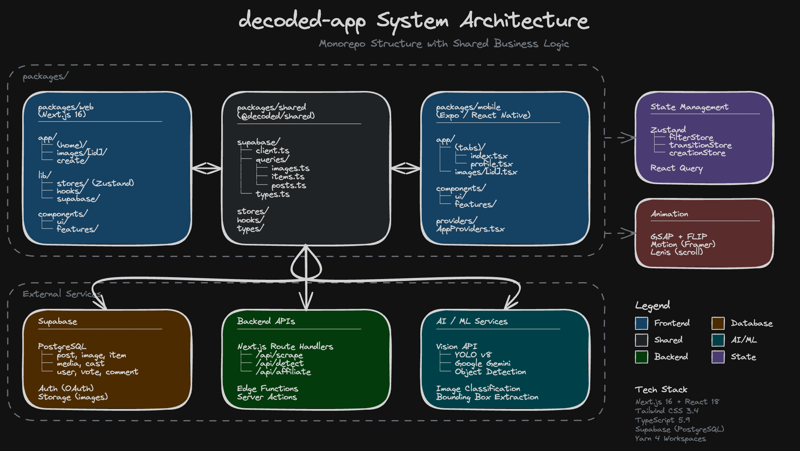
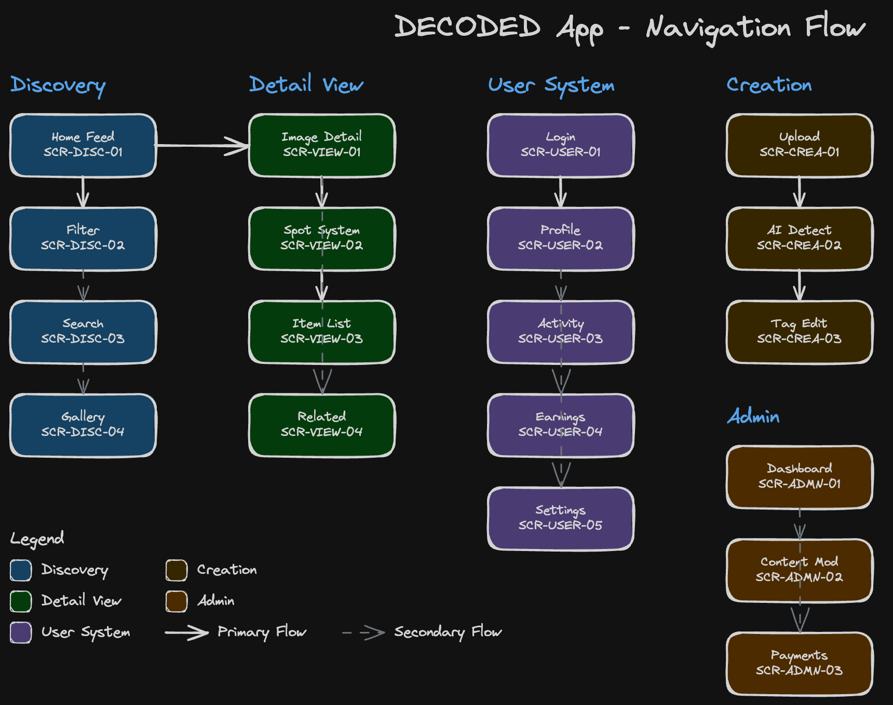

# System Architecture

> Version: 1.0.0
> Last Updated: 2026-01-14
> Purpose: 시스템 아키텍처 개요 및 컴포넌트 의존성

---

## Overview

Decoded는 K-콘텐츠 패션 발견 플랫폼으로, 모노레포 구조의 Next.js 웹 앱과 Expo 모바일 앱으로 구성됩니다.

---

## 1. System Architecture Diagram



```
┌─────────────────────────────────────────────────────────────────────────────────┐
│                              CLIENT LAYER                                        │
├─────────────────────────────────────────────────────────────────────────────────┤
│                                                                                  │
│   ┌─────────────────────────────────────────────────────────────────────────┐   │
│   │                           packages/web                                   │   │
│   │                                                                          │   │
│   │   ┌──────────────┐  ┌──────────────┐  ┌──────────────┐                 │   │
│   │   │   Next.js    │  │    React     │  │  TypeScript  │                 │   │
│   │   │   16.0.7     │  │   18.3.1     │  │    5.9.3     │                 │   │
│   │   │              │  │              │  │              │                 │   │
│   │   │ • App Router │  │ • Components │  │ • Type-safe  │                 │   │
│   │   │ • SSR/SSG    │  │ • Hooks      │  │ • Interfaces │                 │   │
│   │   │ • API Routes │  │ • Context    │  │ • Generics   │                 │   │
│   │   └──────────────┘  └──────────────┘  └──────────────┘                 │   │
│   │                                                                          │   │
│   │   ┌──────────────┐  ┌──────────────┐  ┌──────────────┐                 │   │
│   │   │   Tailwind   │  │    Zustand   │  │ React Query  │                 │   │
│   │   │   3.4.18     │  │    4.5.7     │  │   5.90.11    │                 │   │
│   │   │              │  │              │  │              │                 │   │
│   │   │ • Utility    │  │ • 전역 상태  │  │ • 서버 상태  │                 │   │
│   │   │ • Design     │  │ • Filter     │  │ • Caching    │                 │   │
│   │   │   System     │  │ • Search     │  │ • Mutations  │                 │   │
│   │   └──────────────┘  └──────────────┘  └──────────────┘                 │   │
│   │                                                                          │   │
│   │   ┌──────────────┐  ┌──────────────┐  ┌──────────────┐                 │   │
│   │   │    GSAP      │  │    Motion    │  │    Lenis     │                 │   │
│   │   │   3.13.0     │  │   12.23.12   │  │    1.3.15    │                 │   │
│   │   │              │  │              │  │              │                 │   │
│   │   │ • FLIP       │  │ • Gestures   │  │ • Smooth     │                 │   │
│   │   │ • ScrollTrig │  │ • Transitions│  │   Scroll     │                 │   │
│   │   │ • Timeline   │  │ • Spring     │  │ • Virtual    │                 │   │
│   │   └──────────────┘  └──────────────┘  └──────────────┘                 │   │
│   │                                                                          │   │
│   └─────────────────────────────────────────────────────────────────────────┘   │
│                                                                                  │
│   ┌─────────────────────────────────────────────────────────────────────────┐   │
│   │                         packages/shared                                  │   │
│   │                                                                          │   │
│   │   ┌──────────────┐  ┌──────────────┐  ┌──────────────┐                 │   │
│   │   │    Hooks     │  │    Stores    │  │   Queries    │                 │   │
│   │   │              │  │              │  │              │                 │   │
│   │   │ • useImages  │  │ • filter     │  │ • images     │                 │   │
│   │   │ • useDebounce│  │ • search     │  │ • items      │                 │   │
│   │   │              │  │ • hierarchic │  │ • adapter    │                 │   │
│   │   └──────────────┘  └──────────────┘  └──────────────┘                 │   │
│   │                                                                          │   │
│   └─────────────────────────────────────────────────────────────────────────┘   │
│                                                                                  │
│   ┌─────────────────────────────────────────────────────────────────────────┐   │
│   │                         packages/mobile                                  │   │
│   │                                                                          │   │
│   │   ┌──────────────┐  ┌──────────────┐  ┌──────────────┐                 │   │
│   │   │    Expo      │  │ React Native │  │  Reanimated  │                 │   │
│   │   │   SDK 54     │  │    0.81      │  │      4       │                 │   │
│   │   │              │  │              │  │              │                 │   │
│   │   │ • Router 6   │  │ • iOS/Andro  │  │ • 60fps      │                 │   │
│   │   │ • Notif      │  │ • Native UI  │  │ • Gestures   │                 │   │
│   │   │ • ImagePick  │  │              │  │              │                 │   │
│   │   └──────────────┘  └──────────────┘  └──────────────┘                 │   │
│   │                                                                          │   │
│   └─────────────────────────────────────────────────────────────────────────┘   │
│                                                                                  │
└─────────────────────────────────────────────────────────────────────────────────┘
                                       │
                                       │ HTTPS
                                       ▼
┌─────────────────────────────────────────────────────────────────────────────────┐
│                             SUPABASE BACKEND                                     │
├─────────────────────────────────────────────────────────────────────────────────┤
│                                                                                  │
│   ┌──────────────────────┐  ┌──────────────────────┐  ┌────────────────────┐   │
│   │      PostgreSQL      │  │       Storage        │  │        Auth        │   │
│   │                      │  │                      │  │                    │   │
│   │  Tables:             │  │  Buckets:            │  │  Providers:        │   │
│   │  • image             │  │  • uploads           │  │  • Kakao           │   │
│   │  • post              │  │  • cropped           │  │  • Google          │   │
│   │  • item              │  │                      │  │  • Apple           │   │
│   │  • post_image        │  │                      │  │                    │   │
│   │  • (future) user     │  │                      │  │  Sessions:         │   │
│   │  • (future) vote     │  │                      │  │  • JWT tokens      │   │
│   │  • (future) comment  │  │                      │  │  • Refresh tokens  │   │
│   │                      │  │                      │  │                    │   │
│   └──────────────────────┘  └──────────────────────┘  └────────────────────┘   │
│                                                                                  │
│   ┌──────────────────────┐  ┌──────────────────────┐                           │
│   │      Edge Functions   │  │       Realtime       │                           │
│   │      (Future)         │  │       (Future)       │                           │
│   │                      │  │                      │                           │
│   │  • AI Detection      │  │  • Live updates      │                           │
│   │  • Scraper           │  │  • Notifications     │                           │
│   │  • Click tracking    │  │                      │                           │
│   │                      │  │                      │                           │
│   └──────────────────────┘  └──────────────────────┘                           │
│                                                                                  │
└─────────────────────────────────────────────────────────────────────────────────┘
                                       │
                                       │ (Future Integration)
                                       ▼
┌─────────────────────────────────────────────────────────────────────────────────┐
│                            EXTERNAL SERVICES                                     │
├─────────────────────────────────────────────────────────────────────────────────┤
│                                                                                  │
│   ┌──────────────────────┐  ┌──────────────────────┐  ┌────────────────────┐   │
│   │     Vision API       │  │   Scraper Engine     │  │  Affiliate APIs    │   │
│   │     (TBD)            │  │                      │  │                    │   │
│   │                      │  │  • Product info      │  │  • Musinsa         │   │
│   │  • Object detection  │  │  • Price extraction  │  │  • 29CM            │   │
│   │  • Brand recognition │  │  • Image scraping    │  │  • Farfetch        │   │
│   │  • Fashion tagging   │  │                      │  │  • SSENSE          │   │
│   │                      │  │                      │  │                    │   │
│   └──────────────────────┘  └──────────────────────┘  └────────────────────┘   │
│                                                                                  │
└─────────────────────────────────────────────────────────────────────────────────┘
```

---

## 2. Monorepo Structure

```
decoded-app/
├── packages/
│   ├── web/                          # Next.js 웹 앱
│   │   ├── app/                      # App Router pages
│   │   │   ├── page.tsx              # Home
│   │   │   ├── layout.tsx            # Root layout
│   │   │   ├── images/[id]/          # Image detail
│   │   │   ├── @modal/               # Parallel route (modal)
│   │   │   └── lab/                  # Experimental
│   │   │
│   │   ├── lib/                      # App-specific code
│   │   │   ├── components/           # React components
│   │   │   │   ├── detail/           # Detail view components
│   │   │   │   ├── filter/           # Filter components
│   │   │   │   ├── grid/             # Grid components
│   │   │   │   └── ui/               # Base UI components
│   │   │   │
│   │   │   ├── hooks/                # Custom hooks
│   │   │   ├── stores/               # Zustand stores
│   │   │   ├── supabase/             # Supabase client
│   │   │   └── utils/                # Utilities
│   │   │
│   │   └── public/                   # Static assets
│   │
│   ├── shared/                       # 공유 코드 (web + mobile)
│   │   ├── hooks/                    # Shared hooks
│   │   ├── stores/                   # Shared stores
│   │   ├── supabase/                 # Supabase queries
│   │   │   └── queries/              # Query functions
│   │   ├── types/                    # Shared types
│   │   └── data/                     # Mock data
│   │
│   └── mobile/                       # Expo 모바일 앱 (초기 구조)
│       ├── app/                      # Expo Router
│       └── components/               # Mobile components
│
├── docs/                             # 문서
│   ├── architecture/                 # 아키텍처 문서
│   ├── database/                     # DB 스키마 문서
│   ├── design-system/                # 디자인 시스템
│   ├── testing/                      # 테스트 문서
│   ├── performance/                  # 성능 가이드
│   ├── adr/                          # 아키텍처 결정 기록
│   └── ai-playbook/                  # AI 도구 가이드
│
├── specs/                            # 기능 명세
│   ├── feature-spec/                 # 기능별 명세서
│   └── 001-scroll-animation/         # Feature spec
│
├── __tests__/                        # 테스트 파일
│
├── package.json                      # Yarn workspaces root
├── yarn.lock                         # Yarn 4 lock file
└── .yarnrc.yml                       # Yarn 설정 (node-modules linker)
```

---

## 3. Component Dependency Graph



### 3.1 Home Page Dependencies

```
┌─────────────────────────────────────────────────────────────────────────────────┐
│                           HOME PAGE DEPENDENCY GRAPH                             │
├─────────────────────────────────────────────────────────────────────────────────┤
│                                                                                  │
│   app/page.tsx (SSR)                                                            │
│        │                                                                         │
│        ├──▶ fetchLatestImages() [Server]                                        │
│        │                                                                         │
│        └──▶ HomeClient.tsx (Client)                                             │
│                  │                                                               │
│                  ├──▶ useInfiniteFilteredImages()                               │
│                  │         │                                                     │
│                  │         └──▶ fetchUnifiedImages()                            │
│                  │                   │                                           │
│                  │                   └──▶ Supabase                              │
│                  │                                                               │
│                  ├──▶ Header.tsx                                                │
│                  │         │                                                     │
│                  │         ├──▶ FilterTabs.tsx                                  │
│                  │         │         │                                           │
│                  │         │         └──▶ filterStore (Zustand)                 │
│                  │         │                                                     │
│                  │         ├──▶ SearchInput.tsx                                 │
│                  │         │         │                                           │
│                  │         │         └──▶ searchStore (Zustand)                 │
│                  │         │                                                     │
│                  │         └──▶ ThemeToggle.tsx                                 │
│                  │                   │                                           │
│                  │                   └──▶ next-themes                           │
│                  │                                                               │
│                  └──▶ ThiingsGrid.tsx                                           │
│                            │                                                     │
│                            ├──▶ CardCell.tsx                                    │
│                            │         │                                           │
│                            │         └──▶ transitionStore (FLIP)                │
│                            │                                                     │
│                            └──▶ useScrollAnimation()                            │
│                                      │                                           │
│                                      └──▶ IntersectionObserver                  │
│                                                                                  │
└─────────────────────────────────────────────────────────────────────────────────┘
```

### 3.2 Detail Page Dependencies

```
┌─────────────────────────────────────────────────────────────────────────────────┐
│                          DETAIL PAGE DEPENDENCY GRAPH                            │
├─────────────────────────────────────────────────────────────────────────────────┤
│                                                                                  │
│   Desktop (Modal):                                                              │
│   app/@modal/(.)images/[id]/page.tsx                                            │
│        │                                                                         │
│        └──▶ ImageDetailModal.tsx                                                │
│                  │                                                               │
│                  ├──▶ transitionStore (FLIP state)                              │
│                  │                                                               │
│                  └──▶ ImageDetailContent.tsx ◀───┐                              │
│                                                  │                               │
│   Mobile/Direct:                                 │ (공유)                        │
│   app/images/[id]/page.tsx                       │                               │
│        │                                         │                               │
│        └──▶ ImageDetailPage.tsx ─────────────────┘                              │
│                                                                                  │
│   ImageDetailContent.tsx                                                        │
│        │                                                                         │
│        ├──▶ useImageById()                                                      │
│        │         │                                                               │
│        │         └──▶ fetchImageById() → Supabase                               │
│        │                                                                         │
│        ├──▶ HeroSection.tsx                                                     │
│        │         │                                                               │
│        │         └──▶ GSAP (Ken Burns, Parallax)                                │
│        │                                                                         │
│        ├──▶ InteractiveShowcase.tsx                                             │
│        │         │                                                               │
│        │         ├──▶ useNormalizedItems()                                      │
│        │         │                                                               │
│        │         └──▶ ItemDetailCard.tsx                                        │
│        │                                                                         │
│        ├──▶ ShopGrid.tsx                                                        │
│        │         │                                                               │
│        │         └──▶ 수평 캐러셀                                               │
│        │                                                                         │
│        └──▶ RelatedImages.tsx                                                   │
│                  │                                                               │
│                  └──▶ useRelatedImagesByAccount()                               │
│                                                                                  │
└─────────────────────────────────────────────────────────────────────────────────┘
```

---

## 4. Module Responsibility Matrix

| Module | Responsibility | Key Files | Dependencies |
|--------|---------------|-----------|--------------|
| **App Router** | 라우팅, SSR, 레이아웃 | `app/**/*.tsx` | Next.js |
| **Components** | UI 렌더링, 인터랙션 | `lib/components/**` | React, Tailwind |
| **Hooks** | 재사용 로직, 데이터 페칭 | `lib/hooks/**` | React Query |
| **Stores** | 전역 상태 관리 | `lib/stores/**` | Zustand |
| **Queries** | Supabase 데이터 액세스 | `shared/supabase/queries/**` | Supabase |
| **Utils** | 헬퍼 함수 | `lib/utils/**` | - |
| **Types** | 타입 정의 | `shared/types/**` | TypeScript |

---

## 5. Data Flow Architecture

### 5.1 Read Flow (Query)

```
┌─────────────────────────────────────────────────────────────────────────────────┐
│                              READ DATA FLOW                                      │
├─────────────────────────────────────────────────────────────────────────────────┤
│                                                                                  │
│   Component                                                                      │
│       │                                                                          │
│       │ useInfiniteFilteredImages({ filter, search, limit })                    │
│       ▼                                                                          │
│   React Query                                                                    │
│       │                                                                          │
│       │ queryKey: ["images", "infinite", { filter, search, limit }]             │
│       │                                                                          │
│       │ ┌─────────────────────────────────────────────────────────────────┐     │
│       │ │ Cache Check                                                      │     │
│       │ │                                                                  │     │
│       │ │  staleTime > 0?  ──YES──▶  Return cached data                   │     │
│       │ │       │                                                          │     │
│       │ │      NO                                                          │     │
│       │ │       │                                                          │     │
│       │ │       ▼                                                          │     │
│       │ │  Background refetch (if not fresh)                              │     │
│       │ └─────────────────────────────────────────────────────────────────┘     │
│       │                                                                          │
│       │ queryFn: fetchUnifiedImages()                                           │
│       ▼                                                                          │
│   Supabase Client                                                                │
│       │                                                                          │
│       │ SELECT * FROM post_image                                                │
│       │ JOIN image ON ...                                                        │
│       │ JOIN post ON ...                                                         │
│       │ WHERE account = filter                                                  │
│       │ ORDER BY created_at DESC                                                │
│       │ LIMIT 50                                                                │
│       ▼                                                                          │
│   PostgreSQL                                                                     │
│       │                                                                          │
│       │ Query execution                                                         │
│       ▼                                                                          │
│   Response                                                                       │
│       │                                                                          │
│       │ Transform: normalizeImage()                                             │
│       ▼                                                                          │
│   Component Update                                                               │
│                                                                                  │
└─────────────────────────────────────────────────────────────────────────────────┘
```

### 5.2 State Update Flow

```
┌─────────────────────────────────────────────────────────────────────────────────┐
│                           STATE UPDATE FLOW                                      │
├─────────────────────────────────────────────────────────────────────────────────┤
│                                                                                  │
│   User Action (Filter Click)                                                    │
│       │                                                                          │
│       ▼                                                                          │
│   FilterTabs.tsx                                                                │
│       │                                                                          │
│       │ onClick={() => setFilter('blackpinkk.style')}                          │
│       ▼                                                                          │
│   filterStore (Zustand)                                                         │
│       │                                                                          │
│       │ state.activeFilter = 'blackpinkk.style'                                │
│       │                                                                          │
│       │ Subscribers notified                                                    │
│       ▼                                                                          │
│   useInfiniteFilteredImages()                                                   │
│       │                                                                          │
│       │ queryKey changed: ["images", "infinite", { filter: "blackpinkk..." }]  │
│       │                                                                          │
│       │ React Query detects key change                                          │
│       ▼                                                                          │
│   Automatic Refetch                                                             │
│       │                                                                          │
│       │ fetchUnifiedImages({ filter: 'blackpinkk.style' })                     │
│       ▼                                                                          │
│   ThiingsGrid re-render                                                         │
│       │                                                                          │
│       │ New data displayed                                                      │
│       ▼                                                                          │
│   UI Updated                                                                    │
│                                                                                  │
└─────────────────────────────────────────────────────────────────────────────────┘
```

---

## 6. Technology Stack Detail

### 6.1 Frontend Technologies

| Category | Technology | Version | Purpose |
|----------|------------|---------|---------|
| Framework | Next.js | 16.0.7 | App Router, SSR, API Routes |
| UI Library | React | 18.3.1 | Component rendering |
| Language | TypeScript | 5.9.3 | Type safety |
| Styling | Tailwind CSS | 3.4.18 | Utility-first CSS |
| State (Client) | Zustand | 4.5.7 | Global state |
| State (Server) | React Query | 5.90.11 | Server state, caching |
| Animation | GSAP | 3.13.0 | Complex animations |
| Animation | Motion | 12.23.12 | Declarative animations |
| Scroll | Lenis | 1.3.15 | Smooth scroll |
| Theme | next-themes | 0.4.6 | Dark mode |

### 6.2 Backend Technologies

| Category | Technology | Purpose |
|----------|------------|---------|
| Database | Supabase (PostgreSQL) | Primary data store |
| Auth | Supabase Auth | OAuth providers |
| Storage | Supabase Storage | Image uploads |
| Hosting | Vercel (TBD) | Web deployment |

### 6.3 Development Tools

| Category | Technology | Version | Purpose |
|----------|------------|---------|---------|
| Package Manager | Yarn | 4.9.2 | Monorepo workspaces |
| Linting | ESLint | 9.39.1 | Code quality |
| Formatting | Prettier | 3.6.2 | Code formatting |
| Testing | Playwright | - | E2E testing |

---

## 7. Security Architecture

### 7.1 Authentication Flow

```
┌─────────────────────────────────────────────────────────────────────────────────┐
│                           OAUTH AUTHENTICATION FLOW                              │
├─────────────────────────────────────────────────────────────────────────────────┤
│                                                                                  │
│   Client                  Supabase Auth              OAuth Provider              │
│      │                         │                           │                     │
│      │  1. signInWithOAuth()   │                           │                     │
│      │ ─────────────────────▶ │                           │                     │
│      │                         │                           │                     │
│      │  2. Redirect URL        │                           │                     │
│      │ ◀───────────────────── │                           │                     │
│      │                         │                           │                     │
│      │  3. Redirect to Provider                            │                     │
│      │ ───────────────────────────────────────────────────▶│                     │
│      │                         │                           │                     │
│      │  4. User authenticates                              │                     │
│      │                         │                           │                     │
│      │  5. Callback with code                              │                     │
│      │ ◀───────────────────────────────────────────────────│                     │
│      │                         │                           │                     │
│      │  6. Exchange code       │                           │                     │
│      │ ─────────────────────▶ │ ─────────────────────────▶│                     │
│      │                         │                           │                     │
│      │                         │  7. Tokens                │                     │
│      │                         │ ◀─────────────────────────│                     │
│      │                         │                           │                     │
│      │  8. Session created     │                           │                     │
│      │ ◀───────────────────── │                           │                     │
│      │                         │                           │                     │
│      │  9. JWT stored in cookie│                           │                     │
│      │                         │                           │                     │
│                                                                                  │
└─────────────────────────────────────────────────────────────────────────────────┘
```

### 7.2 Security Measures

| Area | Measure | Implementation |
|------|---------|----------------|
| Authentication | OAuth 2.0 | Supabase Auth (Kakao, Google, Apple) |
| Authorization | RLS | Supabase Row Level Security |
| Data Validation | Server-side | API Route validation |
| XSS Prevention | React | Automatic escaping |
| CSRF | Next.js | SameSite cookies |

---

## Related Documents

- [data-pipeline.md](./data-pipeline.md) - 데이터 파이프라인
- [state-management.md](./state-management.md) - 상태 관리
- [../database/01-schema-usage.md](../database/01-schema-usage.md) - DB 스키마
- [../specs/feature-spec/README.md](../../specs/feature-spec/README.md) - 기능 명세
