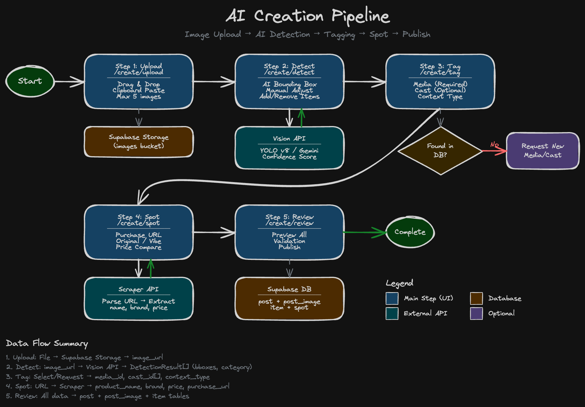
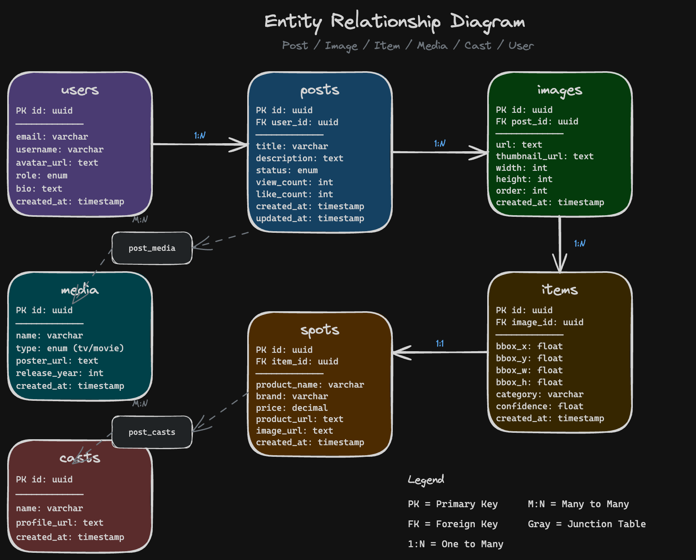
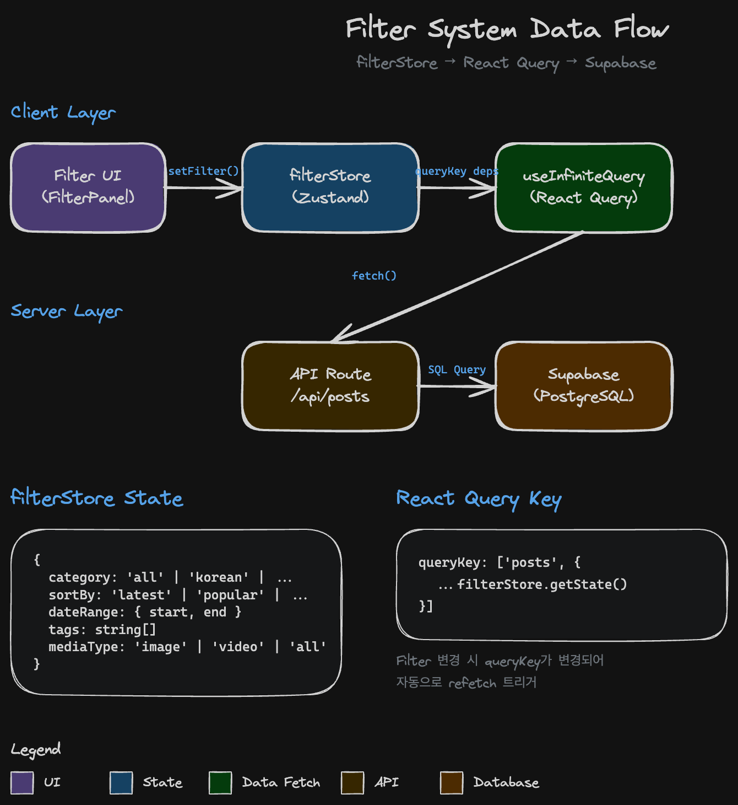

# Data Pipeline

> Version: 1.0.0
> Last Updated: 2026-01-14
> Purpose: 데이터 수집, 변환, 캐싱 파이프라인 문서화

---

## Overview

이 문서는 Decoded 앱의 데이터 흐름을 설명합니다. 외부 소스에서 데이터 수집, DB 저장, 프론트엔드 표시까지의 전체 파이프라인을 다룹니다.

---

## 1. Data Collection Pipeline

### 1.1 Ingestion Flow



```
┌─────────────────────────────────────────────────────────────────────────────────┐
│                          DATA INGESTION PIPELINE                                 │
├─────────────────────────────────────────────────────────────────────────────────┤
│                                                                                  │
│   ┌─────────────────┐                                                           │
│   │  Instagram      │                                                           │
│   │  Posts          │                                                           │
│   └────────┬────────┘                                                           │
│            │                                                                     │
│            │ Scraper (Backend Service)                                          │
│            ▼                                                                     │
│   ┌─────────────────────────────────────────────────────────────────────────┐   │
│   │                        IMAGE STORAGE                                     │   │
│   │                                                                          │   │
│   │   S3 / Supabase Storage                                                 │   │
│   │   └── Original images saved                                             │   │
│   │   └── image_url generated                                               │   │
│   │                                                                          │   │
│   └─────────────────────────────────┬───────────────────────────────────────┘   │
│                                     │                                            │
│                                     ▼                                            │
│   ┌─────────────────────────────────────────────────────────────────────────┐   │
│   │                      AI DETECTION PIPELINE                               │   │
│   │                                                                          │   │
│   │   ┌─────────────────┐  ┌─────────────────┐  ┌─────────────────┐        │   │
│   │   │ Object Detection │  │ Brand Detection │  │ Price Extraction│        │   │
│   │   │                 │  │                 │  │                 │        │   │
│   │   │ • Fashion items │  │ • Brand names   │  │ • Price values  │        │   │
│   │   │ • Bounding boxes│  │ • Logos         │  │ • Currency      │        │   │
│   │   │ • Categories    │  │ • Confidence    │  │ • Links         │        │   │
│   │   └────────┬────────┘  └────────┬────────┘  └────────┬────────┘        │   │
│   │            │                    │                    │                  │   │
│   │            └────────────────────┼────────────────────┘                  │   │
│   │                                 │                                        │   │
│   │                                 ▼                                        │   │
│   │                    Cropped Images Generated                             │   │
│   │                    └── cropped_image_path                               │   │
│   │                                                                          │   │
│   └─────────────────────────────────┬───────────────────────────────────────┘   │
│                                     │                                            │
│                                     ▼                                            │
│   ┌─────────────────────────────────────────────────────────────────────────┐   │
│   │                         SUPABASE DATABASE                                │   │
│   │                                                                          │   │
│   │   Tables:                                                               │   │
│   │   • image  - 원본 이미지 메타데이터                                     │   │
│   │   • post   - 소셜 미디어 포스트 정보                                    │   │
│   │   • item   - 감지된 아이템 정보                                         │   │
│   │   • post_image - 포스트-이미지 연결                                     │   │
│   │                                                                          │   │
│   └─────────────────────────────────────────────────────────────────────────┘   │
│                                                                                  │
└─────────────────────────────────────────────────────────────────────────────────┘
```

### 1.2 Database Schema Relationships



```
┌─────────────────────────────────────────────────────────────────────────────────┐
│                            ENTITY RELATIONSHIP DIAGRAM                           │
├─────────────────────────────────────────────────────────────────────────────────┤
│                                                                                  │
│   ┌──────────────────────┐         ┌──────────────────────┐                    │
│   │        post          │         │       image          │                    │
│   ├──────────────────────┤         ├──────────────────────┤                    │
│   │ id (PK)              │         │ id (PK)              │                    │
│   │ account              │    ┌───▶│ image_hash           │                    │
│   │ article              │    │    │ image_url            │                    │
│   │ metadata[]           │    │    │ with_items           │                    │
│   │ ts                   │    │    │ status               │                    │
│   │ created_at           │    │    │ created_at           │                    │
│   └──────────┬───────────┘    │    └──────────┬───────────┘                    │
│              │                │               │                                 │
│              │ 1:N            │               │ 1:N                             │
│              ▼                │               ▼                                 │
│   ┌──────────────────────┐    │    ┌──────────────────────┐                    │
│   │     post_image       │────┘    │        item          │                    │
│   ├──────────────────────┤         ├──────────────────────┤                    │
│   │ post_id (FK) ────────┼─────────│ id (PK)              │                    │
│   │ image_id (FK) ───────┤         │ image_id (FK) ───────┤                    │
│   │ item_locations (JSON)│         │ product_name         │                    │
│   │ curated_item_ids     │         │ brand                │                    │
│   │ created_at           │         │ price                │                    │
│   └──────────────────────┘         │ center (JSON)        │                    │
│                                    │ bboxes (JSON)        │                    │
│                                    │ citations[]          │                    │
│                                    │ metadata[]           │                    │
│                                    │ status               │                    │
│                                    │ created_at           │                    │
│                                    └──────────────────────┘                    │
│                                                                                  │
│   관계:                                                                         │
│   • post 1:N post_image (한 포스트에 여러 이미지)                              │
│   • image 1:N post_image (한 이미지가 여러 포스트에)                           │
│   • image 1:N item (한 이미지에 여러 아이템)                                   │
│                                                                                  │
└─────────────────────────────────────────────────────────────────────────────────┘
```

---

## 2. Data Transformation Pipeline

### 2.1 Transformation Functions

```
┌─────────────────────────────────────────────────────────────────────────────────┐
│                         DATA TRANSFORMATION PIPELINE                             │
├─────────────────────────────────────────────────────────────────────────────────┤
│                                                                                  │
│   Supabase Query Result                                                         │
│         │                                                                        │
│         │ Raw database rows                                                     │
│         ▼                                                                        │
│   ┌─────────────────────────────────────────────────────────────────────────┐   │
│   │ normalizeImage()                                                         │   │
│   │ File: shared/supabase/queries/images-adapter.ts                         │   │
│   │                                                                          │   │
│   │ Input:  DbImageRow                                                       │   │
│   │ Output: ImageWithPostId                                                  │   │
│   │                                                                          │   │
│   │ Transformations:                                                         │   │
│   │ • id → id                                                               │   │
│   │ • image_url → imageUrl                                                  │   │
│   │ • with_items → withItems                                                │   │
│   │ • created_at → createdAt                                                │   │
│   │ • (join) post.account → postAccount                                     │   │
│   │ • (join) post_image.created_at → postImageCreatedAt                     │   │
│   │                                                                          │   │
│   └─────────────────────────────────┬───────────────────────────────────────┘   │
│                                     │                                            │
│                                     ▼                                            │
│   ┌─────────────────────────────────────────────────────────────────────────┐   │
│   │ normalizeItem()                                                          │   │
│   │ File: packages/web/lib/hooks/useNormalizedItems.ts                      │   │
│   │                                                                          │   │
│   │ Input:  DbItemRow + post_image.item_locations                           │   │
│   │ Output: UiItem                                                           │   │
│   │                                                                          │   │
│   │ Transformations:                                                         │   │
│   │ • item.center OR item_locations[id] → position                          │   │
│   │ • product_name → productName                                            │   │
│   │ • cropped_image_path → croppedImageUrl                                  │   │
│   │ • bboxes → boundingBoxes                                                │   │
│   │ • citations → purchaseUrls                                              │   │
│   │                                                                          │   │
│   └─────────────────────────────────┬───────────────────────────────────────┘   │
│                                     │                                            │
│                                     ▼                                            │
│   React Component                                                                │
│         │                                                                        │
│         │ Normalized data ready for rendering                                   │
│         ▼                                                                        │
│   UI Display                                                                    │
│                                                                                  │
└─────────────────────────────────────────────────────────────────────────────────┘
```

### 2.2 Type Definitions

```typescript
// Database Types (from Supabase)
interface DbImageRow {
  id: string;
  image_hash: string;
  image_url: string | null;
  with_items: boolean;
  status: 'pending' | 'extracted' | 'skipped' | 'extracted_metadata';
  created_at: string;
}

interface DbItemRow {
  id: number;
  image_id: string;
  product_name: string | null;
  brand: string | null;
  price: string | null;
  center: [number, number] | null;
  bboxes: number[][] | null;
  citations: string[] | null;
  metadata: string[] | null;
  status: string | null;
  created_at: string;
}

// Normalized Types (for UI)
interface ImageWithPostId {
  id: string;
  imageUrl: string;
  withItems: boolean;
  status: string;
  createdAt: string;
  postId: string;
  postSource: 'post' | 'legacy';
  postAccount: string;
  postImageCreatedAt: string;
  postCreatedAt: string;
}

interface UiItem {
  id: number;
  imageId: string;
  productName: string;
  brand: string;
  price: string;
  position: { x: number; y: number };
  boundingBoxes: BoundingBox[];
  purchaseUrls: string[];
  croppedImageUrl: string;
}
```

---

## 3. Query Functions

### 3.1 Core Query Functions

| Function | File | Input | Output | Purpose |
|----------|------|-------|--------|---------|
| `fetchLatestImages` | `images.ts` | limit | ImageRow[] | 최신 이미지 조회 (SSR) |
| `fetchImageById` | `images.ts` | id | ImageDetail | 단일 이미지 + 관계 조회 |
| `fetchUnifiedImages` | `images-adapter.ts` | options | ImagePage | 통합 이미지 조회 (필터/검색) |
| `fetchOrphanImages` | `images-orphan.ts` | options | ImageRow[] | 고아 이미지 조회 |
| `fetchRelatedImagesByAccount` | `images.ts` | account, excludeId | ImageRow[] | 관련 이미지 조회 |

### 3.2 fetchUnifiedImages 상세

```
┌─────────────────────────────────────────────────────────────────────────────────┐
│                          fetchUnifiedImages() FLOW                               │
├─────────────────────────────────────────────────────────────────────────────────┤
│                                                                                  │
│   Input Parameters:                                                             │
│   {                                                                             │
│     filter: 'all' | 'newjeanscloset' | 'blackpinkk.style',                     │
│     search: string,                                                             │
│     limit: 50,                                                                  │
│     cursor: string | null,                                                      │
│     deduplicateByImageId: boolean                                              │
│   }                                                                             │
│                                                                                  │
│         │                                                                        │
│         ▼                                                                        │
│   ┌─────────────────────────────────────────────────────────────────────────┐   │
│   │ Step 1: Query post_image with filters                                    │   │
│   │                                                                          │   │
│   │ SELECT pi.*, p.account, p.created_at as post_created_at,                │   │
│   │        i.* FROM post_image pi                                           │   │
│   │ JOIN image i ON pi.image_id = i.id                                      │   │
│   │ JOIN post p ON pi.post_id = p.id                                        │   │
│   │ WHERE p.account = :filter (if not 'all')                                │   │
│   │ ORDER BY pi.created_at DESC                                             │   │
│   │ LIMIT :limit                                                            │   │
│   │                                                                          │   │
│   └─────────────────────────────────┬───────────────────────────────────────┘   │
│                                     │                                            │
│                                     ▼                                            │
│   ┌─────────────────────────────────────────────────────────────────────────┐   │
│   │ Step 2: Fetch orphan images (if filter is 'all')                        │   │
│   │                                                                          │   │
│   │ SELECT * FROM image                                                      │   │
│   │ WHERE id NOT IN (SELECT image_id FROM post_image)                       │   │
│   │ ORDER BY created_at DESC                                                │   │
│   │                                                                          │   │
│   └─────────────────────────────────┬───────────────────────────────────────┘   │
│                                     │                                            │
│                                     ▼                                            │
│   ┌─────────────────────────────────────────────────────────────────────────┐   │
│   │ Step 3: Merge and deduplicate                                           │   │
│   │                                                                          │   │
│   │ • Combine post_image results with orphan images                         │   │
│   │ • If deduplicateByImageId: remove duplicate image_ids                   │   │
│   │ • Sort by created_at                                                    │   │
│   │                                                                          │   │
│   └─────────────────────────────────┬───────────────────────────────────────┘   │
│                                     │                                            │
│                                     ▼                                            │
│   Output:                                                                       │
│   {                                                                             │
│     items: ImageWithPostId[],                                                   │
│     nextCursor: string | null,                                                  │
│     hasMore: boolean,                                                           │
│     stats: { fromPostImage: number, fromOrphans: number }                      │
│   }                                                                             │
│                                                                                  │
└─────────────────────────────────────────────────────────────────────────────────┘
```

---

## 4. React Query Caching Strategy



### 4.1 Cache Configuration

```typescript
// lib/react-query/client.ts

const queryClient = new QueryClient({
  defaultOptions: {
    queries: {
      staleTime: 60 * 1000,           // 1분 동안 fresh
      gcTime: 5 * 60 * 1000,          // 5분 후 garbage collection
      retry: 1,                        // 1회 재시도
      refetchOnWindowFocus: false,     // 포커스 시 refetch 안함
    },
  },
});
```

### 4.2 Query Key Structure

```
┌─────────────────────────────────────────────────────────────────────────────────┐
│                           QUERY KEY HIERARCHY                                    │
├─────────────────────────────────────────────────────────────────────────────────┤
│                                                                                  │
│   ["images"]                                                                    │
│       │                                                                          │
│       ├── ["images", "infinite", { filter, search, limit }]                     │
│       │       │                                                                  │
│       │       └── 무한 스크롤 이미지 목록                                        │
│       │           • useInfiniteFilteredImages()                                 │
│       │           • fetchUnifiedImages()                                        │
│       │                                                                          │
│       ├── ["images", "latest", { limit }]                                       │
│       │       │                                                                  │
│       │       └── 최신 이미지 (SSR 초기 데이터)                                  │
│       │           • fetchLatestImages()                                         │
│       │                                                                          │
│       └── ["image", id]                                                         │
│               │                                                                  │
│               └── 단일 이미지 상세                                              │
│                   • useImageById()                                              │
│                   • fetchImageById()                                            │
│                                                                                  │
│   ["related", account, excludeId]                                               │
│       │                                                                          │
│       └── 관련 이미지                                                           │
│           • useRelatedImagesByAccount()                                         │
│           • fetchRelatedImagesByAccount()                                       │
│                                                                                  │
└─────────────────────────────────────────────────────────────────────────────────┘
```

### 4.3 Cache Invalidation Patterns

| Trigger | Invalidated Keys | Action |
|---------|------------------|--------|
| Filter 변경 | `["images", "infinite", *]` | 자동 refetch |
| Search 입력 | `["images", "infinite", *]` | debounced refetch |
| 새 이미지 업로드 | `["images"]` | 전체 invalidate |
| 이미지 수정 | `["image", id]` | 해당 키만 invalidate |

---

## 5. Data Flow Hooks

### 5.1 useInfiniteFilteredImages

```typescript
// lib/hooks/useImages.ts

export function useInfiniteFilteredImages(options: {
  filter: FilterType;
  search: string;
  limit?: number;
  initialData?: ImagePage;
}) {
  const { filter, search, limit = 50, initialData } = options;

  return useInfiniteQuery({
    queryKey: ['images', 'infinite', { filter, search, limit }],
    queryFn: ({ pageParam }) =>
      fetchUnifiedImages({
        filter,
        search,
        limit,
        cursor: pageParam,
        deduplicateByImageId: true,
      }),
    initialPageParam: null,
    getNextPageParam: (lastPage) =>
      lastPage.hasMore ? lastPage.nextCursor : undefined,
    initialData: initialData
      ? { pages: [initialData], pageParams: [null] }
      : undefined,
    staleTime: 60 * 1000,
  });
}
```

### 5.2 Hook → Store → Query 연결

```
┌─────────────────────────────────────────────────────────────────────────────────┐
│                        HOOK-STORE-QUERY CONNECTION                               │
├─────────────────────────────────────────────────────────────────────────────────┤
│                                                                                  │
│   Component                                                                      │
│       │                                                                          │
│       │ const filter = useFilterStore(state => state.activeFilter)              │
│       │ const search = useSearchStore(state => state.debouncedQuery)            │
│       │                                                                          │
│       │ const { data, fetchNextPage } = useInfiniteFilteredImages({             │
│       │   filter,                                                                │
│       │   search,                                                                │
│       │ });                                                                      │
│       │                                                                          │
│       │ // Store 변경 시 자동으로 queryKey 변경 → refetch                       │
│       │                                                                          │
│       ▼                                                                          │
│   ┌─────────────────────────────────────────────────────────────────────────┐   │
│   │                                                                          │   │
│   │   filterStore.setFilter('blackpinkk.style')                             │   │
│   │        │                                                                 │   │
│   │        │ Zustand state update                                           │   │
│   │        ▼                                                                 │   │
│   │   Component re-render (filter value changed)                            │   │
│   │        │                                                                 │   │
│   │        │ useInfiniteFilteredImages called with new filter               │   │
│   │        ▼                                                                 │   │
│   │   React Query detects queryKey change                                   │   │
│   │        │                                                                 │   │
│   │        │ ["images", "infinite", { filter: "blackpinkk.style", ... }]   │   │
│   │        ▼                                                                 │   │
│   │   Cache miss → fetchUnifiedImages()                                     │   │
│   │        │                                                                 │   │
│   │        │ New data fetched                                               │   │
│   │        ▼                                                                 │   │
│   │   Component re-render with new data                                     │   │
│   │                                                                          │   │
│   └─────────────────────────────────────────────────────────────────────────┘   │
│                                                                                  │
└─────────────────────────────────────────────────────────────────────────────────┘
```

---

## 6. Error Handling

### 6.1 Error Types

| Error Type | HTTP Code | Handling | UI Response |
|------------|-----------|----------|-------------|
| Network Error | - | Retry 1회 | "연결 확인" + 재시도 버튼 |
| Not Found | 404 | No retry | EmptyState 표시 |
| Server Error | 500 | Retry 1회 | "잠시 후 다시" 메시지 |
| Auth Error | 401 | No retry | 로그인 리다이렉트 |

### 6.2 Error Boundary

```typescript
// Error handling in useInfiniteFilteredImages
const { data, error, isError } = useInfiniteFilteredImages({...});

if (isError) {
  // ErrorState component 표시
  return <ErrorState error={error} onRetry={refetch} />;
}
```

---

## 7. Performance Optimizations

### 7.1 Implemented Optimizations

| Optimization | Description | File |
|--------------|-------------|------|
| Cursor Pagination | Offset 대신 cursor 사용 | `images-adapter.ts` |
| Deduplication | 중복 이미지 제거 옵션 | `images-adapter.ts` |
| SSR Initial Data | 서버에서 초기 데이터 로드 | `app/page.tsx` |
| Stale Time | 1분간 캐시 유지 | `react-query/client.ts` |
| Keep Previous | 필터 변경 시 이전 데이터 유지 | `useImages.ts` |

### 7.2 Query Optimization Tips

```typescript
// 불필요한 refetch 방지
staleTime: 60 * 1000,
refetchOnWindowFocus: false,

// 이전 데이터 유지 (깜빡임 방지)
placeholderData: keepPreviousData,

// 선택적 필드 로드
select: (data) => data.pages.flatMap(page => page.items),
```

---

## Related Documents

- [README.md](./README.md) - 시스템 아키텍처
- [state-management.md](./state-management.md) - 상태 관리
- [../database/01-schema-usage.md](../database/01-schema-usage.md) - DB 스키마
- [../database/03-data-flow.md](../database/03-data-flow.md) - DB 데이터 흐름
