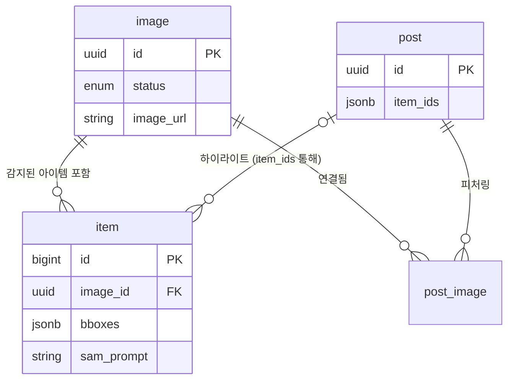

# 데이터베이스 스키마 사용 가이드

> **최종 업데이트:** 2025-12-18
> **정보 출처:** `db MCP` 스냅샷 + `Supabase` 마이그레이션

> **Related Documentation**
> - TypeScript 타입 정의: [specs/shared/data-models.md](../../specs/shared/data-models.md)

## 0. 범위 & 목적

> **참고:** 이 문서는 `image`, `item`, `post`의 **도메인 레벨 사용법**을 요약합니다. 모든 컬럼을 나열하지 않고 파이프라인과 프론트엔드에 중요한 필드에 집중합니다.

이 문서는 `image`, `item`, `post` 테이블의 **현재 사용 패턴**을 설명합니다.
다음 내용에 집중합니다:

- 어떤 파이프라인이 데이터를 채우는지
- 프론트엔드/백엔드가 어떻게 소비하는지
- `enum`과 `jsonb` 필드의 의미론적 의미

스키마의 도메인 로직을 이해하기 위해 이 가이드를 사용하세요. 단순한 컬럼 목록이 아닙니다.

---

## 1. 테이블: `image`

업로드된 패션 이미지와 처리 상태를 저장하는 주 테이블입니다.

### 1.1 주요 컬럼 & Enum

- **`id`**: `uuid` (PK)
- **`status`**: `enum image_status`
  - `pending`: 업로드 직후 초기 상태
  - `extracted`: 아이템이 성공적으로 감지되고 추출됨
  - `skipped`: 이미지가 처리되었으나 아이템이 없거나 유효하지 않음
  - `extracted_metadata`: **(신규)** 메타데이터(태그, 색상 등)가 추출되었으나 아이템 감지는 아직 대기 중이거나 별도 처리
- **`with_items`**: `boolean` - 이 이미지에 아이템이 연결되었는지 표시하는 플래그
- **`image_url`**: `text` - 업로드된 이미지의 공개 URL

### 1.2 사용 흐름

1.  **업로드**: 사용자가 이미지 업로드 -> `pending` 레코드 생성
2.  **AI 파이프라인**:
    - 이미지 분석
    - 상태를 `extracted_metadata` 또는 `extracted`로 업데이트
    - 아이템이 발견되면 `item` 테이블 채움
    - `with_items = true` 설정
3.  **프론트엔드**:
    - `useLatestImages`가 `created_at` 순으로 이미지를 가져옴
    - enum에 따라 상태 배지 표시

### 1.3 예시 쿼리 (Supabase Client)

```typescript
// lib/supabase/queries/images.ts

// 아이템이 있거나 처리된 최신 이미지 가져오기
const { data, error } = await supabase
  .from("image")
  .select("*, item(*)") // 아이템과 조인
  .not("image_url", "is", null)
  .order("created_at", { ascending: false })
  .limit(20);
```

---

## 2. 테이블: `item`

`image` 내에서 감지된 개별 패션 아이템을 저장합니다.

### 2.1 주요 컬럼

- **`image_id`**: `uuid` (FK -> `image.id`)
- **`product_name`** / **`brand`**: `text` - 기본 메타데이터
- **`sam_prompt`**: `text` - 이 아이템을 위치시키기 위해 SAM(Segment Anything Model)에 사용된 프롬프트
- **`bboxes`**: `jsonb` - 감지된 아이템의 바운딩 박스 배열
  - 구조: `Array<{ x: number, y: number, w: number, h: number }>` (정규화된 0-1 좌표)
- **`scores`**: `jsonb` - 감지/세그먼테이션의 신뢰도 점수
- **`ambiguity`**: `boolean` - AI가 감지에 불확실한 경우 `true`
- **`cropped_image_path`**: `text` - 이 특정 아이템의 크롭된 버전 경로
- **`status`**: `text` (기본값: `'active'`) - 아이템 상태 (예: 검수에 사용 가능)
- **`description`**: `text` - 아이템에 대한 선택적 설명이나 메모

### 2.2 TypeScript 타입 정의 (앱 레벨)

`jsonb` 필드가 종종 `any`나 `Json` 타입이 되므로, 사용을 위한 특정 인터페이스를 정의합니다:

```typescript
export interface BBox {
  x: number;
  y: number;
  w: number;
  h: number;
}

export type ItemWithParsedData = Database["public"]["Tables"]["item"]["Row"] & {
  bboxes: BBox[] | null;
  scores: number[] | null;
};
```

### 2.3 예시 쿼리

```typescript
// lib/supabase/queries/items.ts

const { data } = await supabase
  .from("item")
  .select("*")
  .eq("image_id", imageId)
  .order("created_at", { ascending: true });
```

### 2.4 아이템 이미지 필드 매핑

**중요**: `cropped_image_path` 필드는 데이터베이스 아이템을 UI 컴포넌트로 변환할 때 명시적으로 매핑해야 합니다.

| DB 컬럼               | TypeScript 타입 (DbItem) | 변환 함수          | UI 타입 (UiItem)           | 컴포넌트 Prop   |
| --------------------- | ------------------------ | ------------------ | -------------------------- | --------------- |
| `cropped_image_path`  | `string \| null`         | `normalizeItem()`  | `imageUrl: string \| null` | `item.imageUrl` |

**변환 위치**: `lib/components/detail/types.ts:normalizeItem()`

```typescript
export function normalizeItem(item: DbItem): UiItem {
  return {
    ...item,
    imageUrl: item.cropped_image_path || null, // 명시적 매핑
    // ... 기타 정규화된 필드
  };
}
```

**이것이 중요한 이유**:

- 데이터베이스는 `snake_case` 사용 (`cropped_image_path`)
- UI 컴포넌트는 `camelCase` 사용 (`imageUrl`)
- 이 매핑은 데이터가 올바르게 흐르도록 `normalizeItem()`에서 발생해야 함
- 이 매핑이 누락되면 아이템 이미지가 표시되지 않음

**참고**: 전체 데이터 흐름 문서는 `docs/database/03-data-flow.md` 참조

---

## 3. 테이블: `post`

여러 아이템을 피처링하는 소셜 포스트를 나타냅니다.

### 3.1 주요 컬럼

- **`item_ids`**: `jsonb`
  - 이 포스트에 표시된 `item` 레코드 참조를 저장
  - 구조: `string[]` (`item.id` 배열). 현재 스키마는 아이템 키에 `string` 사용
  - **비정규화 헬퍼 컬럼**: `post.item_ids`는 post가 직접 다루는 대표 item id 목록을 denormalized 형태로 저장한 컬럼이다.
  - **정보 출처**: 실제 정규 관계는 `post_image`, `image`, `item`으로 표현된다. 이 컬럼은 쿼리 최적화를 위한 편의 컬럼이며, `post_image`가 source of truth로 사용될 수 있다.
  - **데이터 정합성**: 따라서 Post 생성/수정 로직 구현 시 `item_ids`와 실제 관계 테이블 간의 데이터 정합성을 맞추는 작업이 필수적이다.
- **`article`**: `text` - 포스트의 선택적 기사 내용이나 설명

### 3.2 사용법

- 하나의 포스트가 여러 감지된 아이템을 하이라이트하는 "Shop the look" 스타일 포스트를 렌더링하는 데 사용됩니다.

---

## 4. 테이블: `post_image`

포스트와 이미지를 연결하는 조인 테이블로, 아이템 위치에 대한 추가 메타데이터를 포함합니다.

### 4.1 주요 컬럼

- **`post_id`**: `uuid` (FK -> `post.id`) - 포스트 참조
- **`image_id`**: `uuid` (FK -> `image.id`) - 이미지 참조
- **`created_at`**: `timestamptz` - 포스트-이미지 연결이 생성된 시점
- **`item_locations`**: `jsonb` - 포스트 컨텍스트에서 이 특정 이미지 내 아이템의 위치/좌표 데이터를 저장. 아이템의 원본 감지 좌표와 다를 수 있음.
- **`item_locations_updated_at`**: `timestamptz` - 아이템 위치가 마지막으로 업데이트된 시점

### 4.2 사용법

- **주요 목적**: 포스트와 이미지 간의 다대다(N:M) 관계
- **아이템 위치**: 포스트 큐레이터가 표시용 아이템 위치를 조정하거나 확인할 때, 이 좌표는 원본 `item.center` 데이터를 수정하지 않고 `item_locations`에 저장됨
- **타임스탬프 추적**: `item_locations_updated_at`은 수동 조정이 언제 이루어졌는지 추적

---

## 5. 엔티티 관계도 (ERD)



---

## 6. 검증을 위한 `db MCP` 사용

현재 스키마 상태가 불확실할 때 MCP 도구를 사용하여 라이브 데이터베이스 정의를 확인하세요.

**지침:**

1.  Cursor Agent에게 요청: "List tables image, item, post using db mcp"
    - 도구: `mcp_supabase-decoded-ai_list_tables`
2.  출력에서 확인할 것:
    - 새 컬럼
    - 변경된 enum 값
    - 외래 키 제약조건

> **규칙:** 이 문서를 업데이트할 때 항상 새로운 MCP 스냅샷과 대조하여 검증하세요.

---

## 7. 변경 이력

- **2025-12-18**: MCP 검증을 통해 발견된 누락 필드 추가:
  - `item.description` (text, nullable)
  - `post.article` (text, nullable)
  - `post_image.item_locations` (jsonb, nullable)
  - `post_image.item_locations_updated_at` (timestamptz, nullable)
  - `post_image` 테이블에 대한 전용 섹션 추가
- **2025-12-11**: 초기 버전 (`image`, `item`, `post`에 대한 `db MCP` 기반 스냅샷)
