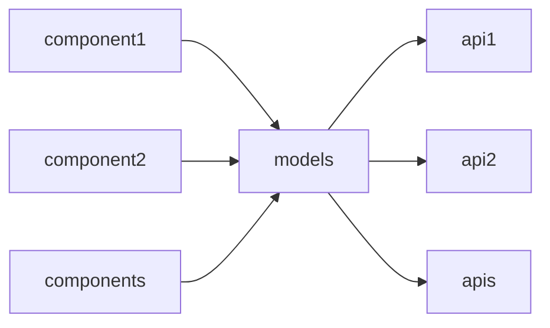

# Decoded AI

## 주요 디렉토리 설명

- `src/api/`: FastAPI 기반 API 엔드포인트
- `src/components/`: 재사용 가능한 독립적인 컴포넌트들, 각 컴포넌트 설정
- `src/models/`: ML 모델 구현체 각 모델별 데이터, 학습 코드 포함
- `src/database/`: 데이터베이스 연결 및 쿼리 처리
- `src/utils/`: 공통으로 사용되는 유틸리티 함수들



## Dependencies
- poetry 1.8.4 버전으로 설치

```bash
poetry install
poetry shell
```

## Add new model

You can create a new model with the following command:

```bash
poe create_model <model_name>
```

Example:

```bash
# 얼굴 분류 모델 생성
poe create_model face_classification

# 메타데이터 추출 모델 생성
poe create_model get_metadata
```

The structure of the created model:

```
src/
├── models/<model_name>/
│   ├── README.md          # 모델 설명
│   ├── __init__.py        # 모델 export
│   ├── model.py           # 주요 로직
│   ├── config.py          # 설정
│   ├── data/              # 모델 데이터
│   └── tests/
│       ├── __init__.py
│       ├── fixtures/      # 테스트 데이터
│       └── test_model.py
└── components/<model_name>/
    ├── __init__.py        # 컴포넌트 export
    ├── registry.py        # 컴포넌트 레지스트리
    └── config_registry.py # 설정 레지스트리
```

## Add new component

Components are configured for each model, and you can create a new component with the following command:

```bash
poe create_component <model_name> <component_name>
```

⚠️ The model name must already exist.

Example:

```bash
# face_classification 모델의 detector 컴포넌트 생성
poe create_component face_classification detector

# get_metadata 모델의 metadata_extractor 컴포넌트 생성
poe create_component get_metadata metadata_extractor
```

The structure of the created component:

```
src/components/<model_name>/<component_name>/
├── README.md          # 컴포넌트 설명
├── __init__.py        # 컴포넌트 export
├── component.py       # 주요 로직
├── config.py          # 설정
└── tests/
    ├── __init__.py
    ├── fixtures/      # 테스트 데이터
    └── test_component.py
```

# test

pytest.ini 파일에서
로깅과 capture 설정이 되어 있으므로

test시에도 pytest가 아닌 poe 명령어를 사용하여 테스트 하는 것을 권장합니다.

## 완성된 모델 테스트

- [Face_Classification](src/models/face_classification/README.md)

```bash
poe test src/models/face_classification/tests/test_model.py
poe test src/models/face_classification/tests/test_embedding_generator.py
```

- [Get_Metadata](src/models/get_metadata/README.md)

```bash
poe test src/models/get_metadata/tests/test_model.py
```

## 완성된 component 테스트

### Face_Classification 모델

- [Face_Detection](src/components/face_classification/face_detection/README.md)

```bash
poe test src/components/face_classification/face_detection/tests/test_detector.py
```

- [Feature Extraction](src/components/face_classification/feature_extraction/README.md)

```bash
poe test src/components/face_classification/feature_extraction/tests/test_extractor.py
```

- [Embedding](src/components/face_classification/embedding/tests/test_embedding.py)

```bash
poe test src/components/face_classification/embedding/tests/test_embedding.py
poe test src/components/face_classification/embedding/tests/test_trainer.py
```

- [Segmentation](src/components/segmentation/tests/test_segmentation.py)

```bash
poe test src/components/segmentation/tests/test_segmentation.py
```

### Metadata Extraction 모델

- [Metadata Extractor](src/components/get_metadata/metadata_extractor/tests/test_component.py)

```bash
poe test src/components/metadata_extraction/metadata_extractor/tests/test_component.py
```

- [Image Extractor](src/components/get_metadata/image_extractor/tests/test_component.py)

```bash
poe test src/components/metadata_extraction/image_extractor/tests/test_component.py
```
