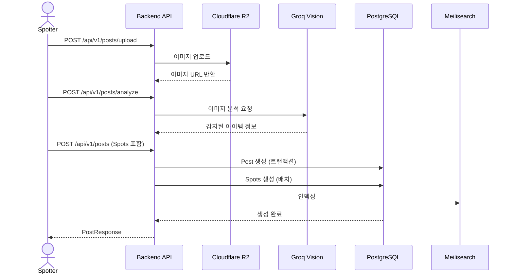
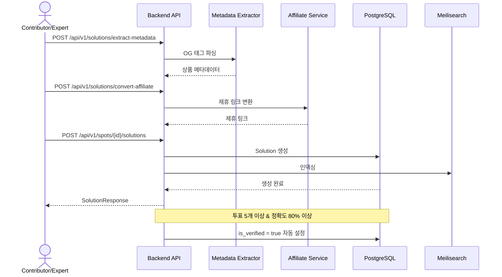
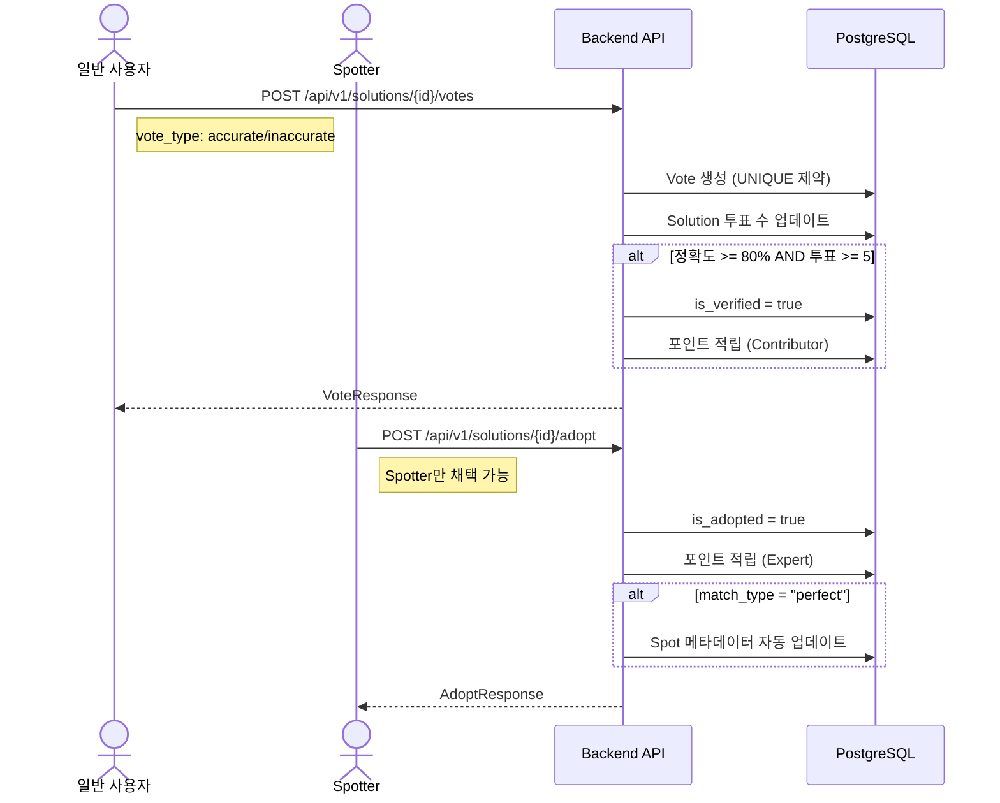
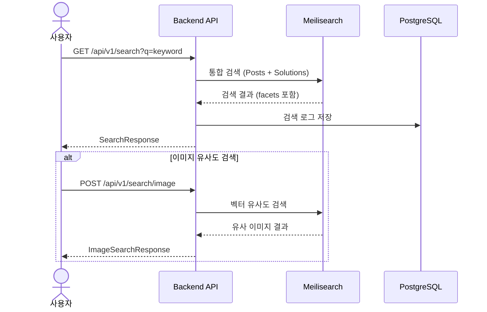

# DECODED Backend API

**DECODED**는 패션/뷰티 콘텐츠에서 특정 아이템을 찾아주는 크라우드소싱 기반 커뮤니티 플랫폼입니다.

## 프로젝트 문서

- [REQUIREMENT.md](./REQUIREMENT.md) - 요구사항 명세서 (기능 정의, DB 스키마, API 명세)
- [AGENT.md](./AGENT.md) - 개발 가이드 (코딩 컨벤션, 패턴, 아키텍처)
- [PLAN.md](./PLAN.md) - 구현 계획서 (Phase별 태스크, 커밋 이력)
- [PROPOSAL.md](./PROPOSAL.md) - 프로젝트 제안서 (비즈니스 모델, 수익화)
- [docs/TESTING.md](./docs/TESTING.md) - 테스트 실행·DB 요구사항·품질 게이트
- [docs/GIT_WORKFLOW.md](./docs/GIT_WORKFLOW.md) - Git 훅·브랜치 정책

### 빠른 온보딩 (`just`)

[`just`](https://github.com/casey/just) 설치 후 저장소 루트에서:

```bash
just dev    # pre-push 훅 + .env.dev 준비 + docker/dev (API :8000, Meilisearch :7700)
# 동일: just setup
```

수동 절차는 [docs/GIT_WORKFLOW.md](./docs/GIT_WORKFLOW.md)와 루트 [`justfile`](./justfile)을 참고하세요.

## 기술 스택

| Category | Technology | Version |
|----------|-----------|---------|
| **Language** | Rust | 1.81+ |
| **Web Framework** | Axum | 0.8.8 |
| **Runtime** | Tokio | 1.36 |
| **ORM** | SeaORM | 1.1.19 |
| **Database** | PostgreSQL (Supabase) | 15+ |
| **Search** | Meilisearch | 1.0+ |
| **Storage** | Cloudflare R2 (S3-compatible) | - |
| **AI** | Groq Vision API | - |

## 프로젝트 통계

- **총 라인 수**: ~26,945 lines (Rust)
- **파일 수**: 167 files
- **도메인**: 16 domains (users, categories, posts, spots, solutions, comments, votes, feed, rankings, badges, earnings, search, admin, post_magazines, post_likes, saved_posts)
- **마지막 업데이트**: 2026-03-26

## 빠른 시작

### 1. 사전 요구사항

```bash
# Rust 설치 (rustup)
curl --proto '=https' --tlsv1.2 -sSf https://sh.rustup.rs | sh

# SeaORM CLI 설치
cargo install sea-orm-cli

# Git pre-push / scripts/pre-push.sh — 라이선스·advisory (`deny.toml`), 커버리지 10% 미만 실패 (lib, 엔티티 제외; 미설치 시 push 불가)
cargo install cargo-deny
cargo install cargo-tarpaulin
```

### 2. 환경 변수 설정

```bash
# .env 파일 생성
cp .env.example .env

# .env 파일을 열어서 실제 값으로 수정
# - DATABASE_URL (Supabase PostgreSQL)
# - SUPABASE_* (Auth 관련)
# - R2_* (Cloudflare R2)
# - MEILISEARCH_* (검색 엔진)
# - GROQ_API_KEY (AI 이미지 분석)
```

### 3. 데이터베이스 마이그레이션

```bash
# 마이그레이션 실행
sea-orm-cli migrate up

# 마이그레이션 상태 확인
sea-orm-cli migrate status

# (필요시) Entity 자동 생성
sea-orm-cli generate entity -o entity/src --lib
```

### 4. 개발 서버 실행

```bash
# 개발 모드 실행 (기본 포트: 8000)
cargo run

# 또는 포트 지정
PORT=8000 cargo run

# 또는 watch 모드 (cargo-watch 설치 필요)
cargo watch -x run
```

서버 실행 후:
- Health Check: `http://localhost:8000/health`
- Swagger UI: `http://localhost:8000/swagger-ui`

## 프로젝트 구조

```
decoded-api/
├── src/
│   ├── main.rs              # 엔트리포인트
│   ├── lib.rs               # 라이브러리 루트
│   ├── config.rs            # 설정 (AppConfig, AppState)
│   ├── error.rs             # 에러 처리
│   ├── middleware/          # 미들웨어 (auth, cors, logger)
│   ├── domains/             # 도메인별 비즈니스 로직
│   │   ├── users/
│   │   ├── posts/
│   │   ├── spots/
│   │   ├── solutions/
│   │   ├── votes/
│   │   └── ...
│   ├── services/            # 외부 서비스 연동 (Trait 기반)
│   │   ├── storage.rs       # Cloudflare R2
│   │   ├── search.rs        # Meilisearch
│   │   ├── ai.rs            # Groq Vision
│   │   └── ...
│   ├── batch/               # 배치 작업 (랭킹, 트렌딩 등)
│   └── utils/               # 유틸리티
├── migration/               # SeaORM 마이그레이션
├── entity/                  # SeaORM Entity (자동 생성)
├── AGENT.md                 # 개발 가이드
├── PLAN.md                  # 구현 계획서
└── README.md                # 이 파일
```

## 주요 플로우

### 1. 게시물 생성 플로우 (Spotter)



### 2. 솔루션 등록 및 검증 플로우 (Contributor/Expert)



### 3. 투표 및 채택 플로우



### 4. 검색 플로우



## 테스트

```bash
# 전체 테스트 실행
cargo test

# 특정 모듈 테스트
cargo test domains::users

# 통합 테스트만 실행
cargo test --test '*'
```

## 코드 품질 체크

```bash
# 포맷 체크
cargo fmt --check

# 포맷 자동 수정
cargo fmt

# 빌드 체크
cargo check

# Clippy 린트
cargo clippy -- -D warnings
```

## 커밋 전 필수 체크리스트

**모든 커밋 전에 반드시 실행:**

```bash
cargo fmt --check    # 포맷 체크
cargo check          # 빌드 체크
```

자세한 내용은 [AGENT.md - 1.0 Git 커밋 규칙](./AGENT.md#10-git-커밋-전-필수-체크리스트-️)을 참고하세요.

## 배포

decoded-api는 환경별(dev/staging/prod) Docker 컨테이너화를 지원합니다.

### Docker를 사용한 배포

#### 초기 설정

```bash
# 1. 환경변수 파일 생성
cp .env.example .env.dev
cp .env.example .env.staging
cp .env.example .env.prod

# 2. 각 파일 수정 (실제 값 입력)
vim .env.dev
vim .env.staging
vim .env.prod
```

#### 개발 환경 실행

```bash
# docker/dev 디렉토리에서
cd docker/dev
docker-compose up -d

# 또는 프로젝트 루트에서
docker-compose -f docker/dev/docker-compose.yml up -d

# 로그 확인
docker-compose -f docker/dev/docker-compose.yml logs -f api

# 중지
docker-compose -f docker/dev/docker-compose.yml down
```

**개발 환경 특징:**
- 소스코드 볼륨 마운트 (hot reload)
- 포트: API 8000, Meilisearch 7700
- 로그 레벨: debug

#### 스테이징 환경 배포

```bash
cd docker/staging
docker-compose up -d --build

# 또는 프로젝트 루트에서
docker-compose -f docker/staging/docker-compose.yml up -d --build
```

**스테이징 환경 특징:**
- Multi-stage build (최적화)
- 포트: API 8001, Meilisearch 7701
- 리소스 제한: 512M
- 로그 레벨: info

#### 프로덕션 환경 배포

```bash
cd docker/prod
docker-compose up -d --build

# 또는 프로젝트 루트에서
docker-compose -f docker/prod/docker-compose.yml up -d --build
```

**프로덕션 환경 특징:**
- Multi-stage build (최대 최적화)
- 포트: API 8080, Meilisearch 7702
- 리소스 제한: 1G
- 로그 레벨: warn
- 비-root 유저로 실행
- 헬스체크 포함

#### 빌드만 수행

```bash
# 개발 이미지
docker build -f docker/dev/Dockerfile -t decoded-api:dev .

# 프로덕션 이미지
docker build -f docker/prod/Dockerfile -t decoded-api:prod .
```

### 기본 배포 (Docker 없이)

```bash
# Release 빌드
cargo build --release

# 바이너리 위치
./target/release/decoded-api
```

### 마이그레이션

데이터베이스 마이그레이션은 앱 시작 시 자동으로 실행됩니다. 수동으로 실행하려면:

```bash
sea-orm-cli migrate up
sea-orm-cli migrate status
```

### 환경별 차이점

| 항목 | Development | Staging | Production |
|------|-------------|---------|------------|
| 포트 | 8000 | 8001 | 8080 |
| 로그 | debug | info | warn |
| 소스 마운트 | O | X | X |
| 리소스 | 256M | 512M | 1G |

자세한 내용은 [REQUIREMENT.md - 섹션 1.8](./REQUIREMENT.md#18-docker-및-배포-설정)을 참고하세요.

## 로그 수집 시스템

decoded-api는 Loki + Grafana + Promtail을 사용한 로그 수집 및 집계 시스템을 제공합니다.

### 아키텍처

```
Application Container (stdout/stderr)
    ↓
Promtail (로그 수집/파싱)
    ↓
Loki (로그 저장/인덱싱)
    ↓
Grafana (시각화/쿼리)
```

### 접근 방법

**프로덕션 환경:**
- Grafana UI: `http://localhost:3000`
- 기본 계정: `admin` / 비밀번호: `.env.prod`의 `GRAFANA_ADMIN_PASSWORD`

**스테이징 환경:**
- Grafana UI: `http://localhost:3001`
- 기본 계정: `admin` / 비밀번호: `.env.staging`의 `GRAFANA_ADMIN_PASSWORD`

### 기본 대시보드

Grafana에 다음 대시보드가 자동으로 로드됩니다:

1. **Application Logs**: 애플리케이션 로그 조회
2. **Error Logs**: 에러 로그 집계 및 분석
3. **Request Metrics**: 요청 메트릭 (응답 시간, 상태 코드 분포)
4. **Batch Jobs**: 배치 작업 로그 모니터링

### LogQL 쿼리 예시

```logql
# 에러 로그 조회
{container="decoded-api-prod", level="error"}

# 특정 요청 ID 추적
{container="decoded-api-prod"} | json | request_id="abc-123-def"

# 느린 요청 조회 (500ms 이상)
{container="decoded-api-prod"} | json | duration_ms > 500

# 배치 작업 로그
{container="decoded-api-prod"} | json | target=~"batch.*"

# 특정 엔드포인트 에러
{container="decoded-api-prod", level="error"} | json | uri=~"/api/v1/posts.*"
```

### 로그 포맷

**프로덕션/스테이징**: JSON 포맷 (구조화된 로그)
- 환경 변수: `LOG_FORMAT=json`

**개발**: 텍스트 포맷 (가독성 우선)
- 환경 변수: `LOG_FORMAT=text`

### 보관 정책

- 프로덕션: 30일
- 스테이징: 7일

자세한 내용은 [REQUIREMENT.md - 섹션 1.10](./REQUIREMENT.md#110-로그-수집-및-집계-시스템)을 참고하세요.

## API 문서

서버 실행 후 다음 엔드포인트에서 확인 가능:

- **Swagger UI**: `http://localhost:8000/swagger-ui` ✅
- **OpenAPI JSON**: `http://localhost:8000/api-docs/openapi.json` ✅

**기능:**
- 인터랙티브 API 테스트 가능
- 실시간 요청/응답 확인
- OpenAPI 3.1.0 표준 준수
- 코드와 문서 자동 동기화 (utoipa)

또는 [REQUIREMENT.md - API 명세](./REQUIREMENT.md)를 참고하세요.

## 개발 도구

### 유용한 Cargo 확장

```bash
# Watch 모드 (파일 변경 시 자동 재시작)
cargo install cargo-watch
cargo watch -x run

# 더 나은 에러 메시지
cargo install cargo-expand

# 코드 커버리지
cargo install cargo-tarpaulin
cargo tarpaulin --out Html
```

### VSCode 추천 확장

- `rust-analyzer` - Rust 언어 서버
- `crates` - Cargo.toml 의존성 관리
- `Better TOML` - TOML 파일 지원
- `Error Lens` - 인라인 에러 표시

## 기여 가이드

1. **코딩 컨벤션**: [AGENT.md](./AGENT.md) 참고
2. **구현 계획**: [PLAN.md](./PLAN.md)에서 진행 중인 태스크 확인
3. **커밋 메시지**: `feat(phase-X): 작업 내용` 형식
4. **필수 체크**: 커밋 전 `cargo fmt --check` + `cargo check`

## 연락처

- GitHub: [https://github.com/decodedcorp/backend](https://github.com/decodedcorp/backend)
- Email: [decodedapp@gmail.com](mailto:decodedapp@gmail.com)

## 라이센스

[MIT License](./LICENSE) (예정)

