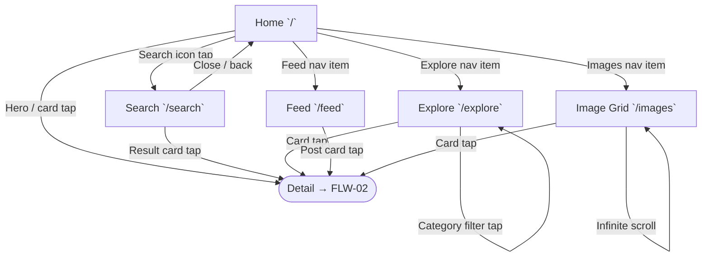

# FLW-01: Content Discovery Flow

> Journey: Home → Search / Explore / Feed → Image Grid → Detail | Updated: 2026-02-19
> Cross-ref: [FLW-02 Detail Flow](FLW-02-detail.md) (exit point)

## Journey

User enters the app at Home and discovers content through Search, Explore category filtering, Feed timeline, or Image Grid. Any content card click exits this flow and enters the Detail flow (FLW-02).

## Flow Diagram

## Transition Table

| From | Trigger | To | Store Changes | Data Fetched |
|------|---------|----|---------------|--------------|
| Home `/` | Search icon tap | Search `/search` | `searchStore.resetAll()` | — |
| Home `/` | Explore nav item | Explore `/explore` | — | `GET /api/v1/categories` |
| Home `/` | Feed nav item | Feed `/feed` | — | `GET /api/v1/posts?sort=recent` |
| Home `/` | Images nav item | Image Grid `/images` | — | `GET /api/v1/posts` (paginated) |
| Home `/` | Hero / trending card tap | Detail `/images/[id]` or `/posts/[id]` | `transitionStore.setTransition(id, state, rect)` | — (detail loads independently) |
| Search `/search` | Type query | Search `/search` | `searchStore.setQuery(q)` → debounce → `setDebouncedQuery(q)` | `GET /api/v1/posts?q=...` (via React Query) |
| Search `/search` | Tab switch | Search `/search` | `searchStore.setActiveTab(tab)` + page reset | results refetch for new tab |
| Search `/search` | Filter apply | Search `/search` | `searchStore.setFilters(filters)` + page reset | results refetch |
| Search `/search` | Result card tap | Detail `/images/[id]` or `/posts/[id]` | `transitionStore.setTransition(id, state, rect)` | — |
| Search `/search` | Close / back | Home `/` | `searchStore.resetAll()` | — |
| Explore `/explore` | Category tab tap | Explore `/explore` | `filterStore.setActiveFilter(key)` | `GET /api/v1/posts?category=...` |
| Explore `/explore` | Card tap | Detail `/images/[id]` or `/posts/[id]` | `transitionStore.setTransition(id, state, rect)` | — |
| Feed `/feed` | Post card tap | Detail `/posts/[id]` | — | — |
| Image Grid `/images` | Scroll to bottom | Image Grid `/images` | — | `GET /api/v1/posts?page=N+1` (infinite) |
| Image Grid `/images` | Card tap | Detail `/images/[id]` | `transitionStore.setTransition(id, state, rect)` | — |

## Entry Points

| Route | Entry Source | Notes |
|-------|-------------|-------|
| `/` | App launch, nav logo tap | Always reachable |
| `/search` | Search icon (any nav bar) | Full-screen overlay |
| `/explore` | Nav bar Explore item | Category grid |
| `/feed` | Nav bar Feed item | Auth-conditional (shows login prompt if guest) |
| `/images` | Nav bar Images item | Infinite scroll grid |

## Exit Points

All card taps in this flow exit to FLW-02 (Detail):
- Image card → `/images/[id]`
- Post card → `/posts/[id]`

## Store References

- `searchStore` — `packages/shared/stores/searchStore.ts` → see `specs/_shared/store-map.md`
- `filterStore` — `packages/shared/stores/filterStore.ts` → see `specs/_shared/store-map.md`
- `transitionStore` — `packages/web/lib/stores/transitionStore.ts` → see `specs/_shared/store-map.md`
