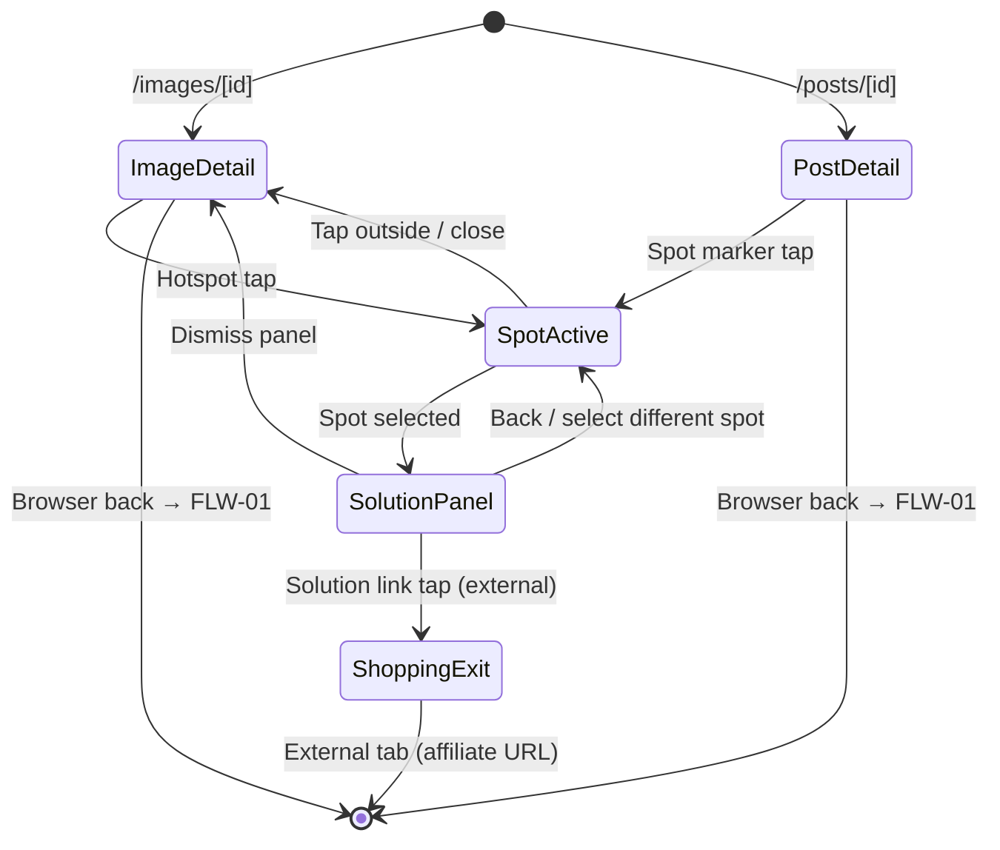

# FLW-02: Content Detail Flow

> Journey: Detail View → Spot Selection → Item/Solution → Shopping Exit | Updated: 2026-02-19
> Cross-ref: [FLW-01 Discovery](FLW-01-discovery.md) (entry), [FLW-03 Creation](FLW-03-creation.md) (forward)

## Journey

User arrives at a detail page (Image or Post) from the Discovery flow (FLW-01). Within the page, they interact with hotspot markers to explore detected items, view solution panels, and optionally click through to shop. This flow is interaction-state-based within a single page, not a navigation sequence.

## Flow Diagram

## Transition Table

| From | Trigger | To | Store Changes | Data Fetched |
|------|---------|----|---------------|--------------|
| FLW-01 (any card) | Card tap | Image Detail `/images/[id]` | `transitionStore.setTransition(id, state, rect, imgSrc)` | `GET /api/v1/posts/[postId]/spots` |
| FLW-01 (any card) | Card tap | Post Detail `/posts/[id]` | — | `GET /api/v1/posts/[postId]/spots` |
| Image Detail | Page mount | Image Detail (FLIP plays) | transitionStore read → FLIP animation → `transitionStore.reset()` | — |
| Image Detail | Hotspot tap | Spot Active (within page) | `transitionStore.selectedId` = spotId | `GET /api/v1/spots/[spotId]/solutions` |
| Post Detail | Spot marker tap | Spot Active (within page) | `transitionStore.selectedId` = spotId | `GET /api/v1/spots/[spotId]/solutions` |
| Spot Active | Solutions loaded | Solution Panel (within page) | — | solutions in React Query cache |
| Solution Panel | Solution link tap | Shopping Exit (external tab) | — | `POST /api/v1/solutions/convert-affiliate` (affiliate URL conversion) |
| Solution Panel | Back / close | Image Detail or Post Detail | `transitionStore.selectedId` = null | — |
| Any | Browser back | FLW-01 entry screen | `transitionStore.reset()` | — |

## Interaction States (within `/images/[id]`)

| State | Description | Active UI |
|-------|-------------|-----------|
| idle | Page loaded, no spot selected | Hotspot markers visible on image |
| spot-selected | Hotspot tapped | Hotspot highlighted, SolutionPanel opens |
| solution-loading | Solutions fetching | Panel shows skeleton |
| solution-ready | Solutions loaded | SpotDetail panel with solution list |
| shopping-exit | Solution link tapped | New tab opens with affiliate/product URL |

## Entry Points

| From | Via | Route |
|------|-----|-------|
| FLW-01 Home `/` | Hero / trending card | `/images/[id]` or `/posts/[id]` |
| FLW-01 Search `/search` | Result card | `/images/[id]` or `/posts/[id]` |
| FLW-01 Explore `/explore` | Category grid card | `/images/[id]` or `/posts/[id]` |
| FLW-01 Feed `/feed` | Feed post card | `/posts/[id]` |
| FLW-01 Image Grid `/images` | Image grid card | `/images/[id]` |

## Exit Points

| Destination | Trigger | Notes |
|-------------|---------|-------|
| FLW-01 (back) | Browser back | Returns to previous discovery screen |
| External shop | Solution link tap | Affiliate-converted URL, new tab |
| FLW-03 Creation | "Upload" / "Add content" (auth required) | User initiates content creation from detail context |

## Store References

- `transitionStore` — `packages/web/lib/stores/transitionStore.ts` → see `specs/_shared/store-map.md`
  - `setTransition(id, state, rect, imgSrc)`: called from grid before navigation
  - `reset()`: called after FLIP animation completes on detail page

## API References

- `GET /api/v1/posts/[postId]/spots` — load hotspot positions → see `specs/_shared/api-contracts.md`
- `GET /api/v1/spots/[spotId]/solutions` — load solution list for selected spot
- `POST /api/v1/solutions/convert-affiliate` — convert product URL to affiliate link
