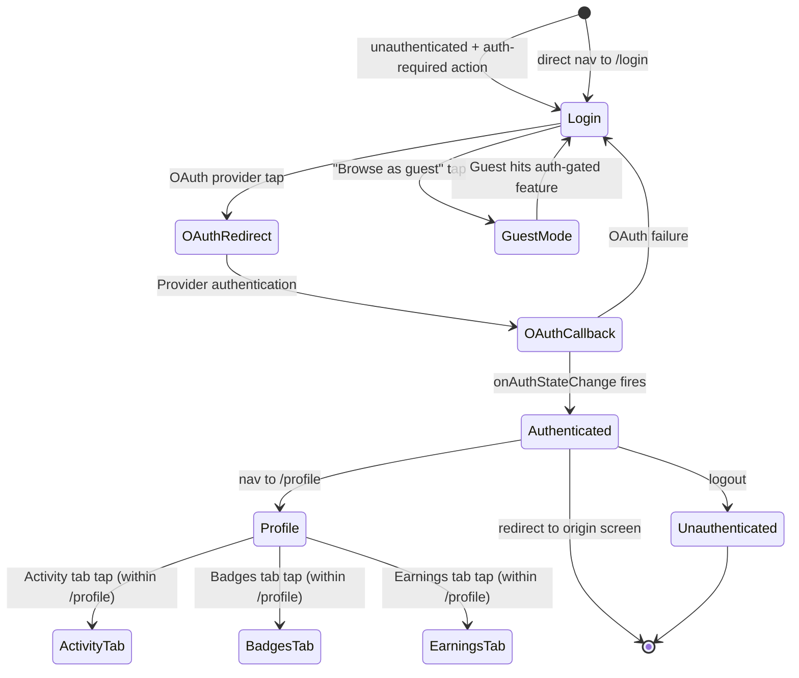

# FLW-04: User Authentication Flow

> Journey: Login → Profile → Activity → Earnings | Updated: 2026-02-19
> Cross-ref: [FLW-03 Creation](FLW-03-creation.md) (auth gate), [FLW-01 Discovery](FLW-01-discovery.md) (post-login redirect)

## Journey

User authenticates via OAuth (Kakao, Google, Apple) or enters guest mode for limited browsing. After login, profile data loads from the user API. Profile sections surface activity history, contribution stats, and earnings. Guest mode gates auth-required features and prompts upgrade.

## Flow Diagram



## Transition Table

| From | Trigger | To | Store Changes | Data Fetched |
|------|---------|----|---------------|--------------|
| Any screen (unauthenticated) | Auth-required action | Login `/login` | — | — |
| Login `/login` | OAuth provider tap (Kakao/Google/Apple) | OAuth provider redirect | `authStore.loadingProvider = provider` + `isLoading = true` | `signInWithOAuth(provider)` |
| OAuth provider | User authenticates | Callback → `onAuthStateChange` | `authStore.setUser(supabaseUser)` → fetches `isAdmin` | `GET /api/v1/users/me` (admin check) |
| Auth callback | `isInitialized = true` | Post-login destination | `authStore.user = User`, `isAdmin = bool`, `isLoading = false` | — |
| Auth callback | OAuth failure | Login `/login` | `authStore.error = message`, `isLoading = false` | — |
| Login `/login` | "Browse as guest" | Guest Mode (any discovery screen) | `authStore.isGuest = true` | — |
| Guest Mode | Auth-gated feature tap | Login `/login` | — | — |
| Authenticated | Nav to `/profile` | Profile `/profile` | `profileStore` hydration begins | `GET /api/v1/users/me` + `GET /api/v1/users/me/stats` |
| Profile `/profile` | Activity tab tap | Profile (Activity tab) | `profileStore` activity data | `GET /api/v1/users/me/activities` |
| Profile `/profile` | Logout tap | Unauthenticated → Home `/` | `authStore.logout()` → clears user + isAdmin + isGuest | — |

## authStore State Transitions

```
uninitialized
  → initialize() called on app start
  → isInitialized = true
    → user: null    (no session → unauthenticated)
    → user: User    (session found → authenticated)

unauthenticated
  → signInWithOAuth(provider) → isLoading = true, loadingProvider = provider
  → [OAuth redirect to provider]
  → [provider callback → onAuthStateChange fires]
  → setUser(supabaseUser) → user = User, isAdmin fetched
  → isLoading = false, loadingProvider = null

authenticated
  → logout() → user = null, isAdmin = false, isGuest = false

any state
  → guestLogin() → isGuest = true
```

See `specs/_shared/store-map.md` authStore section for full field definitions and selectors.

## Auth-Conditional Navigation

| Feature | Unauthenticated | Guest | Authenticated |
|---------|----------------|-------|---------------|
| Discovery (`/`, `/explore`, `/images`) | Full access | Full access | Full access |
| Feed (`/feed`) | Redirect to `/login` | Limited view | Full access |
| Upload (`/request/upload`) | Redirect to `/login` | Redirect to `/login` | Full access |
| Profile (`/profile`) | Redirect to `/login` | Redirect to `/login` | Full access |
| Spot solution submit | Redirect to `/login` | Redirect to `/login` | Full access |
| Admin routes | Blocked | Blocked | `isAdmin = true` only |

## Profile Data Loading

On `/profile` mount (authenticated):
1. `GET /api/v1/users/me` → `profileStore.setUserFromApi(response)`
2. `GET /api/v1/users/me/stats` → `profileStore.setStatsFromApi(response)`
3. `GET /api/v1/users/me/activities` (on Activity tab) → activity list

See `specs/_shared/store-map.md` profileStore section for data shape.

## API References

From `specs/_shared/api-contracts.md`:

| Endpoint | When Called | Auth |
|----------|-------------|------|
| `GET /api/v1/users/me` | Profile mount + auth callback | Required |
| `GET /api/v1/users/me/stats` | Profile stats section | Required |
| `GET /api/v1/users/me/activities` | Activity tab | Required |
| `PATCH /api/v1/users/me` | Profile edit (future) | Required |
