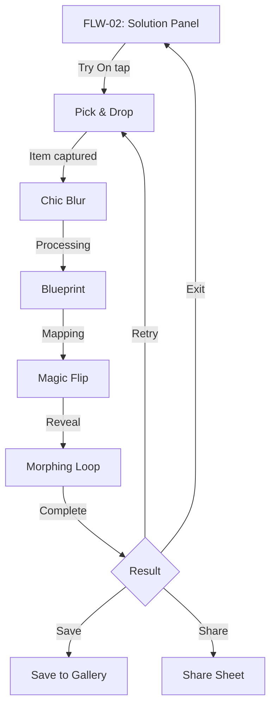

> STATUS: DRAFT — not approved for implementation. This flow is a provisional outline pending service direction approval. Do not reference in screen specs until status changes to FINAL.

# FLW-05: VTON Virtual Try-On Flow (DRAFT)

> Journey: Item Selection → Virtual Fitting → Result | Updated: 2026-02-19
> Cross-ref: [FLW-02 Detail](FLW-02-detail.md) (entry — user picks item from detail to try on)
> Status: DRAFT — no codebase implementation exists

## Journey (Provisional)

User selects a detected item from a detail view (FLW-02) and initiates a virtual try-on experience. The fitting process moves through a cinematic multi-stage sequence before revealing the final result.

## Flow Diagram (Provisional)



## VTON Stages (Provisional)

| Stage | Name | Description |
|-------|------|-------------|
| 1 | Pick & Drop | User selects item from spot; item "drops" onto their avatar/photo |
| 2 | Chic Blur | Transition blur effect while processing begins |
| 3 | Blueprint | Wireframe/sketch overlay showing garment mapping |
| 4 | Magic Flip | Cinematic flip animation revealing fitted result |
| 5 | Morphing Loop | Final looping animation of item on user |

## Entry Points (Provisional)

| From | Trigger | Notes |
|------|---------|-------|
| FLW-02 Solution Panel | "Try On" button on solution card | Auth required; feature-flagged |
| FLW-02 Spot Detail | Direct spot "Try On" shortcut | Alternative entry |

## State Outline (Provisional)

```
idle
  → item selected (spotId + solutionId captured)
  → fitting-start (Pick & Drop stage)
  → processing (Chic Blur → Blueprint stages)
  → revealing (Magic Flip → Morphing Loop stages)
  → result (complete)
  → idle (exit / retry)
```

## Out of Scope (for this DRAFT)

- Specific API endpoints (not yet designed)
- Store shape (not yet implemented)
- User photo/avatar capture flow (separate sub-flow TBD)
- Result persistence mechanism

## Approval Required Before

- Designing screen specs (VTON-01 through VTON-N)
- Implementing any codebase changes
- Referencing this flow from other FINAL spec documents

---

*DRAFT — pending approval. All content provisional.*
