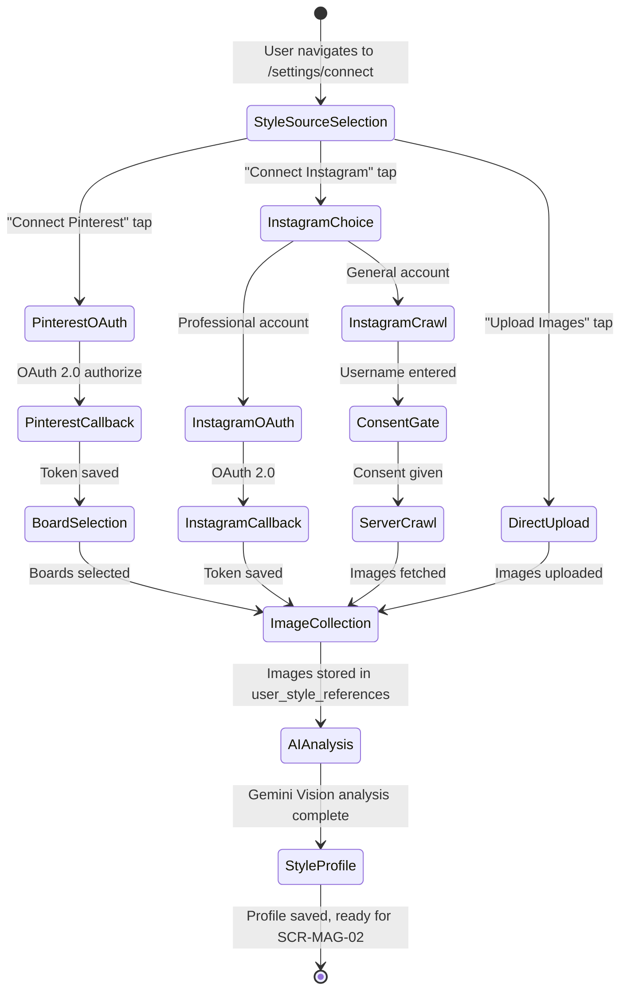

# FLW-07: SNS Data Ingestion Flow

> Journey: SNS Connect -> Image Collection -> AI Analysis -> Style Profile | Updated: 2026-03-05
> Cross-ref: [FLW-04 User Auth](FLW-04-user.md), [SCR-MAG-02 Personal Issue](../screens/magazine/SCR-MAG-02-personal-issue.md)
> Status: proposed | Milestone: M8 (SNS Integration & Style Personalization)

## Purpose

Collect user's style reference images from SNS platforms (Pinterest, Instagram) or direct upload, analyze them with AI vision, and build a personalized style profile that powers the magazine personalization engine (SCR-MAG-02 Decoding Ritual).

## Data Acquisition Strategy

### Platform Matrix

| Platform | Method | Account Requirement | Data | Risk |
|----------|--------|-------------------|------|------|
| Pinterest | Official API v5 | General account | Boards, Pins (image+desc) | LOW |
| Instagram | Official API (Tier 1) | Professional account | Media, hashtags | LOW |
| Instagram | Server-side crawling (Tier 2) | General account (consent) | Public posts | MEDIUM |
| Direct Upload | User upload | None | User-selected images | NONE |

### Instagram 3-Tier Acquisition

- **Tier 1 (Official):** Professional (Business/Creator) accounts use Instagram API with Instagram Login. OAuth 2.0 flow, same as Pinterest.
- **Tier 2 (Crawling):** General accounts provide username + explicit consent. Server-side Edge Function scrapes public post images via IG internal GraphQL endpoints with residential proxy.
- **Tier 3 (Managed):** Fallback to managed scraping service (Apify) if Tier 2 is blocked. Higher cost, external dependency.

Priority: Tier 1 > Tier 2 > Direct Upload fallback.

## Flow Diagram

## Transition Table

| From | Trigger | To | Store Changes | Data |
|------|---------|----|---------------|------|
| Settings / Profile | "Connect SNS" tap | SCR-USER-04 | - | - |
| SCR-USER-04 | "Connect Pinterest" | Pinterest OAuth redirect | `socialStore.connecting = 'pinterest'` | - |
| Pinterest OAuth | User authorizes | /api/v1/auth/pinterest/callback | Token saved to DB | access_token, refresh_token |
| Callback success | Auto | Board selector | `socialStore.connections += pinterest` | boards list |
| Board selector | User selects boards | Sync trigger | `socialStore.selectedBoards = [...]` | board_ids |
| SCR-USER-04 | "Connect Instagram" | Account type check | - | - |
| Account check | Professional | Instagram OAuth redirect | `socialStore.connecting = 'instagram'` | - |
| Account check | General | Username input + consent | - | - |
| Username + consent | Submit | Server crawl trigger | `socialStore.syncStatus = 'syncing'` | username |
| Any source | Images collected | AI analysis | `socialStore.syncStatus = 'analyzing'` | image URLs |
| AI analysis | Complete | Style profile saved | `socialStore.styleProfile = result` | keywords, vectors |

## Pinterest OAuth Flow

1. Frontend calls `GET /api/v1/auth/pinterest` -> returns authorization URL
2. User redirected to `https://api.pinterest.com/oauth/?response_type=code&client_id=...&scope=boards:read,pins:read,user_accounts:read`
3. User authorizes -> redirected to `/api/v1/auth/pinterest/callback?code=...`
4. Server exchanges code for tokens via `POST https://api.pinterest.com/v5/oauth/token`
5. Tokens encrypted (AES-256) and stored in `user_social_tokens`
6. Server fetches boards via `GET https://api.pinterest.com/v5/boards` -> returns to client
7. User selects style-relevant boards
8. Server fetches pins from selected boards via `GET https://api.pinterest.com/v5/boards/{id}/pins`
9. Pin image URLs + descriptions saved to `user_style_references`

## Instagram Crawling Flow (Tier 2)

1. User enters their Instagram username on SCR-USER-04
2. User checks explicit consent: "I authorize decoded to analyze my public posts for style profiling"
3. Frontend calls `POST /api/v1/users/me/social/sync` with `{ provider: 'instagram', username: '...' }`
4. Edge Function `fetch-instagram-media`:
   a. Sends request to IG internal GraphQL endpoint with residential proxy
   b. Headers: session cookie, CSRF token, rotated User-Agent
   c. Rate limit: 3-5s between requests (random jitter)
   d. Fetches latest 12-50 IMAGE type posts
   e. On 429: exponential backoff (2s -> 4s -> 8s -> 16s)
   f. On block: fallback to Tier 3 (Apify) or return partial results
5. Extracted data: image URLs, captions, hashtags
6. Hashtag pre-filter: prioritize posts with fashion-related tags (#OOTD, #fashion, #style, etc.)
7. Results saved to `user_style_references` with `source: 'instagram'`

### Anti-Detection Measures

| Measure | Implementation |
|---------|---------------|
| Proxy | Residential proxy pool (10+ IPs), rotation per request |
| User-Agent | 5+ real Chrome UA strings, random selection |
| TLS Fingerprint | Chrome-matching via stealth plugin |
| Request interval | 3-5s random delay between requests |
| Rate limit (429) | Exponential backoff: 2s -> 4s -> 8s -> 16s |
| Daily limit | Max 200 requests/day total, 1 sync/user/24h |
| Session | Rotating session cookies |

## AI Style Analysis Pipeline

1. Triggered after image collection from any source
2. Batch images (max 100) sent to Gemini Vision API
3. Per-image analysis prompt: extract style keywords, dominant colors, brand identifiers, aesthetic category
4. Aggregate results across all images:
   - `persona_keywords`: top 5-8 recurring style descriptors
   - `color_palette`: top 5 dominant hex colors
   - `brand_affinities`: brand frequency map with confidence scores
5. Generate embedding vector (768-dim) for similarity search
6. Save to `user_style_profiles`
7. Trigger SCR-MAG-02 Decoding Ritual readiness

## Privacy & Security

### Token Storage
- All OAuth tokens AES-256 encrypted at rest in Supabase
- Decryption only in server-side Edge Functions
- RLS: `user_id = auth.uid()` on all social tables

### Data Minimization
- No original images downloaded/stored (URL reference only)
- AI analysis results (keywords, vectors) retained; source URLs disposable
- Instagram crawled data: no login credentials stored, username only
- User can delete all social data via "Disconnect" action -> CASCADE delete

### Consent Requirements
- Pinterest: OAuth consent screen (standard)
- Instagram Official: OAuth consent screen (standard)
- Instagram Crawling: Custom consent UI with explicit checkbox + privacy policy link
- All: "Your data will be used solely for style analysis" disclosure

## Error States

| Error | Trigger | Recovery |
|-------|---------|----------|
| OAuth denied | User cancels Pinterest/IG auth | Return to SCR-USER-04, show info toast |
| Token expired | Pinterest/IG token TTL exceeded | Auto-refresh via refresh_token, or prompt re-auth |
| Crawl blocked | IG returns 403/429 persistently | Fallback to Tier 3, or suggest direct upload |
| Crawl timeout | No response in 30s | Retry once, then suggest direct upload |
| Insufficient images | < 5 images found | Warn user, suggest adding more via direct upload |
| AI analysis fail | Gemini API error | Retry with exponential backoff, max 3 attempts |
| Profile exists | User already has style profile | Offer "Re-analyze" with merge/replace option |

## API References

| Endpoint | Method | Purpose |
|----------|--------|---------|
| `/api/v1/auth/pinterest` | GET | Generate Pinterest OAuth URL |
| `/api/v1/auth/pinterest/callback` | GET | Exchange code for tokens |
| `/api/v1/auth/instagram` | GET | Generate Instagram OAuth URL (Tier 1) |
| `/api/v1/auth/instagram/callback` | GET | Exchange code for tokens (Tier 1) |
| `/api/v1/users/me/social` | GET | List connected platforms |
| `/api/v1/users/me/social/:provider` | DELETE | Disconnect platform + delete data |
| `/api/v1/users/me/social/sync` | POST | Trigger image sync (any source) |
| `/api/v1/users/me/style-profile` | GET | Get AI style analysis result |
| `/api/v1/users/me/style-references` | POST | Direct upload images |
| `/api/v1/pinterest/boards` | GET | List user's Pinterest boards |

---

See: [SCR-USER-04](../screens/user/SCR-USER-04-sns-connect.md) -- SNS connect screen
See: [SCR-MAG-02](../screens/magazine/SCR-MAG-02-personal-issue.md) -- Personal issue (consumer of style profile)
See: [FLW-04](FLW-04-user.md) -- User auth flow (prerequisite)
